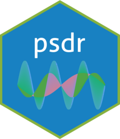

<!-- README.md is generated from README.Rmd. Please edit that file -->

# psdr <a href='https://yhhc2.github.io/psdr/'></a>

<!-- badges: start -->
  [](https://github.com/yhhc2/psdr/actions)
  [](https://CRAN.R-project.org/package=psdr)
<!-- badges: end -->

## Overview

Author: Yong-Han Hank Cheng

This package allows you to generate and compare power spectral density (PSD)
plots given time series data. Fast Fourier Transform (FFT) is used to take a time 
series data, analyze the oscillations, and then output the frequencies of these 
oscillations in the time series in the form of a PSD plot.

Thus given a time series, the dominant frequencies in the time series can be 
identified. Additional functions in this package allow the dominant frequencies 
of multiple groups of time series to be compared with each other. 

To see example usage with the main functions of this package, please visit
this site: <https://yhhc2.github.io/psdr/articles/Introduction.html>

The mathematical operations used to generate the PSDs are described here:

“Fft.” Fast Fourier transform - MATLAB. Accessed May 25, 2021. 
<https://www.mathworks.com/help/matlab/ref/fft.html>. 

“Signal Analyzer.” MATLAB &amp; Simulink. Accessed May 25, 2021. <https://www.mathworks.com/help/signal/ug/power-spectral-density-estimates-using-fft.html>. 

## Installation

```{r, eval = FALSE, warning = FALSE}
# Install the package from GitHub
devtools::install_github("yhhc2/psdr")
```

```{r, warning = FALSE}
# Load package
library("psdr")

```

## Usage

Source code: <https://github.com/yhhc2/psdr>

Visit the package's website: <https://yhhc2.github.io/psdr/>

Visit this vignette for example usage: <https://yhhc2.github.io/psdr/articles/Introduction.html>

Visit this vignette for example output for each function usage: <https://yhhc2.github.io/psdr/articles/Examples.html>

## License
The psdr package is licensed under the GPL (>=3) license. The logo is licensed under the <a href='https://creativecommons.org/licenses/by/4.0/'> CC BY 4.0 license</a>.

## Thanks
This package was developed in part during my time at the NIH as a postbac researcher. Acknowledgements to: 

+ Kory Johnson and Yang Fann at the NINDS Bioinformatics Section for mentorship. 

+ Jonathan Pomeraniec at the NIH Clinical Center for providing datasets to validate usage of package.  

+ John Kakareka and Randy Pursley at the NIH CIT, Signal Processing and Instrumentation Section for guidance on signal processing.  

+ Tianxia Wu at the NINDS Clinical Trials Unit for guidance on statistical testing.  

+ NIH Undergraduate Scholarship Program and the NINDS Section of Infections of the Nervous System for supporting postbac. 
