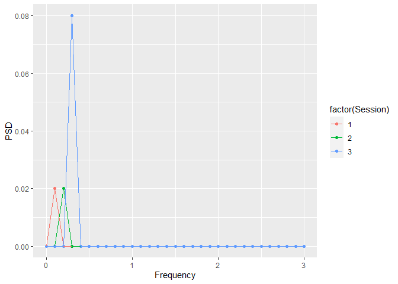
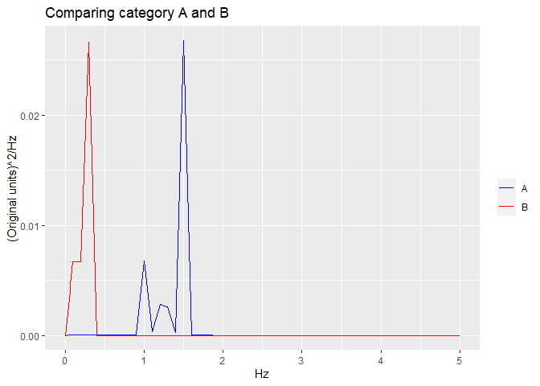
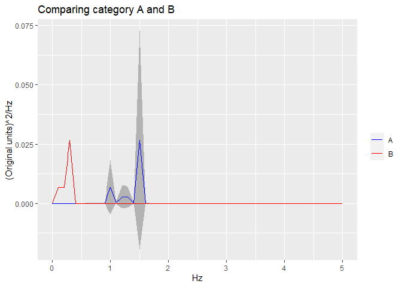
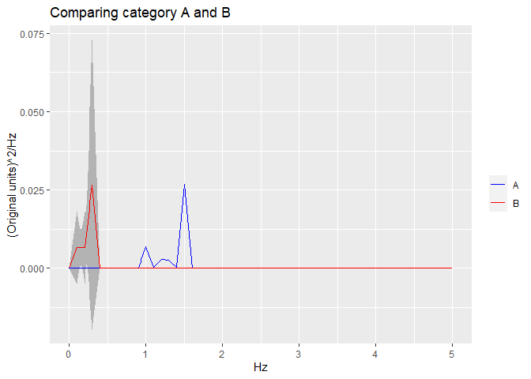

<!-- README.md is generated from README.Rmd. Please edit that file -->

## Overview

Author: Yong-Han Hank Cheng

This package allows you to generate and compare power spectral density
(PSD) plots given timeseries data.

## Installation

``` r
# Install the package from GitHub
devtools::install_github("yhhc2/psdr")
```

``` r
# Load package
library("psdr")
```

## Usage

Visit the package’s website for function reference:
<https://yhhc2.github.io/psdr/>

## Examples

All functions with example code is run in this section. The functions
are listed below in alphabetical order with example code to illustrate
how each function should be used. The example code should be very
similar to the example code in the function reference.

To see detailed descriptions for each function, please visit the
package’s website.

### AutomatedCompositePlotting()

``` r
#I want to create a plot that shows two curves:
#1. Composite of time series signals 1, 2, and 3.
#2. Composite of time series signals 3 and 4.

#Create a vector of time that represent times where data are sampled.
Fs = 100; #sampling frequency in Hz
T = 1/Fs; #sampling period
L = 1000; #length of time vector
t = (0:L-1)*T; #time vector

#First signal
#1. 1 Hz with amplitude of 2
S1 <- 2*sin(2*pi*1*t)
level1.vals <- rep("a", length(S1))
level2.vals <- rep("1", length(S1))
S1.data.frame <- as.data.frame(cbind(t, S1, level1.vals, level2.vals))
colnames(S1.data.frame) <- c("Time", "Signal", "level1.ID", "level2.ID")
S1.data.frame[,"Signal"] <- as.numeric(S1.data.frame[,"Signal"])

#Second signal
#1. 1 Hz with amplitude of -4
#2. 2 Hz with amplitude of -2
S2 <- (-4)*sin(2*pi*1*t) - 2*sin(2*pi*2*t);
level1.vals <- rep("a", length(S2))
level2.vals <- rep("2", length(S2))
S2.data.frame <- as.data.frame(cbind(t, S2, level1.vals, level2.vals))
colnames(S2.data.frame) <- c("Time", "Signal", "level1.ID", "level2.ID")
S2.data.frame[,"Signal"] <- as.numeric(S2.data.frame[,"Signal"])

#Third signal
#1. 1 Hz with amplitude of 2
#2. 2 Hz with amplitude of 2
S3 <- 2*sin(2*pi*1*t) + 2*sin(2*pi*2*t);
level1.vals <- rep("a", length(S3))
level2.vals <- rep("3", length(S3))
S3.data.frame <- as.data.frame(cbind(t, S3, level1.vals, level2.vals))
colnames(S3.data.frame) <- c("Time", "Signal", "level1.ID", "level2.ID")
S3.data.frame[,"Signal"] <- as.numeric(S3.data.frame[,"Signal"])

#Fourth signal
#1. 1 Hz with amplitude of -2
S4 <- -2*sin(2*pi*1*t)
level1.vals <- rep("b", length(S4))
level2.vals <- rep("3", length(S4))
S4.data.frame <- as.data.frame(cbind(t, S4, level1.vals, level2.vals))
colnames(S4.data.frame) <- c("Time", "Signal", "level1.ID", "level2.ID")
S4.data.frame[,"Signal"] <- as.numeric(S4.data.frame[,"Signal"])

windows <- list(S1.data.frame, S2.data.frame, S3.data.frame, S4.data.frame)

#Gets the composite of the first, second, and third signal. Should result in a flat signal.
FirstComboToUse <- list( c("a"), c(1, 2, 3) )

#Gets the composite of the third and fourth signal
SecondComboToUse <- list( c("a", "b"), c(3) )


#Timeseries-----------------------------------------------------------------

timeseries.results <- AutomatedCompositePlotting(list.of.windows = windows,
                           name.of.col.containing.time.series = "Signal",
                           x_start = 0,
                           x_end = 999,
                           x_increment = 1,
                           level1.column.name = "level1.ID",
                           level2.column.name = "level2.ID",
                           level.combinations = list(FirstComboToUse, SecondComboToUse),
                           level.combinations.labels = c("Signal 1 + 2 + 3", "Signal 3 + 4"),
                           plot.title = "Example",
                           plot.xlab = "Time",
                           plot.ylab = "Original units",
                           combination.index.for.envelope = NULL,
                           TimeSeries.PSD.LogPSD = "TimeSeries",
                           sampling_frequency = NULL)
```

    ## [1] 1
    ## [1] 2
    ## [1] 3
    ## [1] 1
    ## [1] 2

``` r
ggplot.obj.timeseries <- timeseries.results[[2]]

#Plot. Will see the 1+2+3 curve as a flat line. The 3+4 curve will only have 2 Hz.
#dev.new()
ggplot.obj.timeseries
```

<!-- -->

``` r
#PSD-------------------------------------------------------------------------

#Note that the PSDs are not generated directly from the "Signal 1 + 2 + 3" and
#the "Signal 3 + 4" time series. Instead, PSDs are generated individually
#for signals 1, 2, 3, and 4, and then then are summed together. 

PSD.results <- AutomatedCompositePlotting(list.of.windows = windows,
                           name.of.col.containing.time.series = "Signal",
                           x_start = 0,
                           x_end = 50,
                           x_increment = 0.01,
                           level1.column.name = "level1.ID",
                           level2.column.name = "level2.ID",
                           level.combinations = list(FirstComboToUse, SecondComboToUse),
                           level.combinations.labels = c("Signal 1 + 2 + 3", "Signal 3 + 4"),
                           plot.title = "Example",
                           plot.xlab = "Hz",
                           plot.ylab = "(Original units)^2/Hz",
                           combination.index.for.envelope = 2,
                           TimeSeries.PSD.LogPSD = "PSD",
                           sampling_frequency = 100)
```

    ## [1] 1
    ## [1] 2
    ## [1] 3
    ## [1] 1
    ## [1] 2

``` r
ggplot.obj.PSD <- PSD.results[[2]]

#Plot. For both plots, two peaks will be present, 1 Hz and 2 Hz. 1 Hz should be
#stronger in both cases because more signals have this frequency (even if amp is negative).
#Error envelope is specified for the second (red) curve. Envelope should only
#be present for 2 Hz signal.
#dev.new()
ggplot.obj.PSD
```

    ## Warning: Removed 5 row(s) containing missing values (geom_path).
    
    ## Warning: Removed 5 row(s) containing missing values (geom_path).

<!-- -->

``` r
 #PSD Zoomed in---------------------------------------------------------------

 PSD.results <- AutomatedCompositePlotting(list.of.windows = windows,
                            name.of.col.containing.time.series = "Signal",
                            x_start = 0,
                            x_end = 5,
                            x_increment = 0.01,
                            level1.column.name = "level1.ID",
                            level2.column.name = "level2.ID",
                            level.combinations = list(FirstComboToUse, SecondComboToUse),
                            level.combinations.labels = c("Signal 1 + 2 + 3", "Signal 3 + 4"),
                            plot.title = "Example",
                            plot.xlab = "Hz",
                            plot.ylab = "(Original units)^2/Hz",
                            combination.index.for.envelope = 2,
                            TimeSeries.PSD.LogPSD = "PSD",
                            sampling_frequency = 100)
```

    ## [1] 1
    ## [1] 2
    ## [1] 3
    ## [1] 1
    ## [1] 2

``` r
 ggplot.obj.PSD <- PSD.results[[2]]

 #Plot. For both plots, two peaks will be present, 1 Hz and 2 Hz. 1 Hz should be
 #stronger in both cases because more signals have this frequency (even if amp is negative).
 #Error envelope is specified for the second (red) curve. Envelope should only
 #be present for 2 Hz signal.
 #dev.new()
 ggplot.obj.PSD
```

<!-- -->

``` r
#LogPSD-------------------------------------------------------------------------

LogPSD.results <- AutomatedCompositePlotting(list.of.windows = windows,
                           name.of.col.containing.time.series = "Signal",
                           x_start = 0,
                           x_end = 50,
                           x_increment = 0.01,
                           level1.column.name = "level1.ID",
                           level2.column.name = "level2.ID",
                           level.combinations = list(FirstComboToUse, SecondComboToUse),
                           level.combinations.labels = c("Signal 1 + 2 + 3", "Signal 3 + 4"),
                           plot.title = "Example",
                           plot.xlab = "Hz",
                           plot.ylab = "log((Original units)^2/Hz)",
                           combination.index.for.envelope = NULL,
                           TimeSeries.PSD.LogPSD = "LogPSD",
                           sampling_frequency = 100)
```

    ## [1] 1
    ## [1] 2
    ## [1] 3
    ## [1] 1
    ## [1] 2

``` r
ggplot.obj.LogPSD <- LogPSD.results[[2]]

#Plot. For both plots, two peaks will be present, 1 Hz and 2 Hz. 1 Hz should
#be stronger in both cases because more signals have this frequency (even if amp is negative).
#Error envelope is specified for the second (red) curve. Envelope should only
#be present for 1 Hz signal.
#dev.new()
ggplot.obj.LogPSD
```

    ## Warning: Removed 5 row(s) containing missing values (geom_path).
    
    ## Warning: Removed 5 row(s) containing missing values (geom_path).

<!-- -->

### CountWindows()

``` r
#Example using a dataframe with 5 homogeneous windows.

#Windows are homogeneous if looking at col.two and col.three values.
window.name.column <- c(10, 10, 10, 20, 20, 20, 30, 30, 30, 30, 40, 40, 50, 50, 50, 50)
col.two <- c("a", "a", "a", "a", "a", "a", "a", "a", "a", "a", "b", "b", "a", "a", "a", "a")
col.three <- c(1, 1, 1, 1, 1, 1, 2, 2, 2, 2, 1, 1, 3, 3, 3, 3)

multi.window.data <- data.frame(window.name.column, col.two, col.three)

list.of.homogeneous.windows <- GetHomogeneousWindows(multi.window.data,
"window.name.column", c("col.two", "col.three"))
```

    ## [1] 1
    ## [1] 2
    ## [1] 3
    ## [1] 4
    ## [1] 5

``` r
matrix <- CountWindows(list.of.homogeneous.windows, "col.two", "col.three",
c("a", "b"), c("1", "2", "3"))

matrix
```

    ##   1 2 3
    ## a 2 1 1
    ## b 1 0 0

### FindHomogeneousWindows()

``` r
col.one <- c(1, 2, 3, 4, 5)
col.two <- c("a", "a", "a", "a", "a")
col.three <- c(1, 1, 1, 1, 1)

single.window.data <- data.frame(col.one, col.two, col.three)

#Example of inhomogeneous window if looking at col.one and col.two because
#col.one does not only have a single unique value.
result <- FindHomogeneousWindows(single.window.data , c("col.one", "col.two"))

result
```

    ## [1] FALSE

``` r
#Example of homogeneous window if looking at col.two and col.three because
#col.two and col.three both only have a single unique value.
result <- FindHomogeneousWindows(single.window.data , c("col.two", "col.three"))

result
```

    ## [1] TRUE

### GetHomogeneousWindows

``` r
#Example using a dataframe with 3 windows.

#Windows 20 and 30 are homogeneous if looking at col.two and col.three values.
window.name.column <- c(10, 10, 10, 20, 20, 20, 30, 30, 30, 30)
col.two <- c("a", "a", "a", "a", "a", "a", "a", "a", "a", "a")
col.three <- c(1, 1, 0, 1, 1, 1, 2, 2, 2, 2)

multi.window.data <- data.frame(window.name.column, col.two, col.three)

result <- GetHomogeneousWindows(multi.window.data, "window.name.column", c("col.two", "col.three"))
```

    ## [1] 1
    ## [1] 2
    ## [1] 3

``` r
#As expected, it looks like two windows are homogeneous.
str(result)
```

    ## List of 2
    ##  $ :'data.frame':    3 obs. of  3 variables:
    ##   ..$ window.name.column: num [1:3] 20 20 20
    ##   ..$ col.two           : chr [1:3] "a" "a" "a"
    ##   ..$ col.three         : num [1:3] 1 1 1
    ##  $ :'data.frame':    4 obs. of  3 variables:
    ##   ..$ window.name.column: num [1:4] 30 30 30 30
    ##   ..$ col.two           : chr [1:4] "a" "a" "a" "a"
    ##   ..$ col.three         : num [1:4] 2 2 2 2

``` r
result[[1]]
```

    ##   window.name.column col.two col.three
    ## 4                 20       a         1
    ## 5                 20       a         1
    ## 6                 20       a         1

``` r
result[[2]]
```

    ##    window.name.column col.two col.three
    ## 7                  30       a         2
    ## 8                  30       a         2
    ## 9                  30       a         2
    ## 10                 30       a         2

### GetSubsetOfWindows()

``` r
#Example using a dataframe with 3 windows.

#Windows 20 and 30 are homogeneous if looking at col.two and col.three values.
window.name.column <- c(10, 10, 10, 20, 20, 20, 30, 30, 30, 30)
col.two <- c("a", "a", "a", "a", "a", "a", "a", "a", "a", "a")
col.three <- c(1, 1, 0, 1, 1, 1, 2, 2, 2, 2)

multi.window.data <- data.frame(window.name.column, col.two, col.three)

list.of.homogeneous.windows <- GetHomogeneousWindows(multi.window.data,
"window.name.column", c("col.two", "col.three"))
```

    ## [1] 1
    ## [1] 2
    ## [1] 3

``` r
#Get a subset of windows where col.three has a value of 2
subset.list.of.homogeneous.windows <- GetSubsetOfWindows(list.of.homogeneous.windows,
"col.three", "2")

str(subset.list.of.homogeneous.windows)
```

    ## List of 1
    ##  $ :'data.frame':    4 obs. of  3 variables:
    ##   ..$ window.name.column: num [1:4] 30 30 30 30
    ##   ..$ col.two           : chr [1:4] "a" "a" "a" "a"
    ##   ..$ col.three         : num [1:4] 2 2 2 2

``` r
subset.list.of.homogeneous.windows[[1]]
```

    ##    window.name.column col.two col.three
    ## 7                  30       a         2
    ## 8                  30       a         2
    ## 9                  30       a         2
    ## 10                 30       a         2

### GetSubsetOfWindowsTwoLevels()

``` r
#Example using a dataframe with 5 homogeneous windows.

#Windows are homogeneous if looking at col.two and col.three values.
window.name.column <- c(10, 10, 10, 20, 20, 20, 30, 30, 30, 30, 40, 40, 50, 50, 50, 50)
col.two <- c("a", "a", "a", "a", "a", "a", "a", "a", "a", "a", "b", "b", "a", "a", "a", "a")
col.three <- c(1, 1, 1, 1, 1, 1, 2, 2, 2, 2, 1, 1, 3, 3, 3, 3)

multi.window.data <- data.frame(window.name.column, col.two, col.three)

list.of.homogeneous.windows <- GetHomogeneousWindows(multi.window.data,
"window.name.column", c("col.two", "col.three"))
```

    ## [1] 1
    ## [1] 2
    ## [1] 3
    ## [1] 4
    ## [1] 5

``` r
result <- GetSubsetOfWindowsTwoLevels(list.of.homogeneous.windows, "col.two", "col.three",
c("a"), c("1", "2"))

#Should contain windows 10, 20, 30 because col.two is "a" and col.three can be "1" or "2"
result
```

    ## [[1]]
    ##   window.name.column col.two col.three
    ## 1                 10       a         1
    ## 2                 10       a         1
    ## 3                 10       a         1
    ## 
    ## [[2]]
    ##   window.name.column col.two col.three
    ## 4                 20       a         1
    ## 5                 20       a         1
    ## 6                 20       a         1
    ## 
    ## [[3]]
    ##    window.name.column col.two col.three
    ## 7                  30       a         2
    ## 8                  30       a         2
    ## 9                  30       a         2
    ## 10                 30       a         2

### IdentifyMaxOnXY()

``` r
#I want to create a plot that shows two curves:
#1. Composite of time series signals 1, 2, and 3.
#2. Composite of time series signals 3 and 4.

#Create a vector of time that represent times where data are sampled.
Fs = 100; #sampling frequency in Hz
T = 1/Fs; #sampling period
L = 1000; #length of time vector
t = (0:L-1)*T; #time vector

#First signal
#1. 1 Hz with amplitude of 2
S1 <- 2*sin(2*pi*1*t)
level1.vals <- rep("a", length(S1))
level2.vals <- rep("1", length(S1))
S1.data.frame <- as.data.frame(cbind(t, S1, level1.vals, level2.vals))
colnames(S1.data.frame) <- c("Time", "Signal", "level1.ID", "level2.ID")
S1.data.frame[,"Signal"] <- as.numeric(S1.data.frame[,"Signal"])

#Second signal
#1. 1 Hz with amplitude of -4
#2. 2 Hz with amplitude of -2
S2 <- (-4)*sin(2*pi*1*t) - 2*sin(2*pi*2*t);
level1.vals <- rep("a", length(S2))
level2.vals <- rep("2", length(S2))
S2.data.frame <- as.data.frame(cbind(t, S2, level1.vals, level2.vals))
colnames(S2.data.frame) <- c("Time", "Signal", "level1.ID", "level2.ID")
S2.data.frame[,"Signal"] <- as.numeric(S2.data.frame[,"Signal"])

#Third signal
#1. 1 Hz with amplitude of 2
#2. 2 Hz with amplitude of 2
S3 <- 2*sin(2*pi*1*t) + 2*sin(2*pi*2*t);
level1.vals <- rep("a", length(S3))
level2.vals <- rep("3", length(S3))
S3.data.frame <- as.data.frame(cbind(t, S3, level1.vals, level2.vals))
colnames(S3.data.frame) <- c("Time", "Signal", "level1.ID", "level2.ID")
S3.data.frame[,"Signal"] <- as.numeric(S3.data.frame[,"Signal"])

#Fourth signal
#1. 1 Hz with amplitude of -2
S4 <- -2*sin(2*pi*1*t)
level1.vals <- rep("b", length(S4))
level2.vals <- rep("3", length(S4))
S4.data.frame <- as.data.frame(cbind(t, S4, level1.vals, level2.vals))
colnames(S4.data.frame) <- c("Time", "Signal", "level1.ID", "level2.ID")
S4.data.frame[,"Signal"] <- as.numeric(S4.data.frame[,"Signal"])

#Extra representation of S2 dataframe to show an example that has enough samples
#to have significance for Kruskal-Wallis test
windows <- list(S1.data.frame, S2.data.frame, S2.data.frame, S2.data.frame, S2.data.frame,
S2.data.frame, S2.data.frame, S2.data.frame, S2.data.frame, S2.data.frame, S3.data.frame,
S4.data.frame)

#Gets the composite of the first, second, and third signal. Should result in a flat signal.
FirstComboToUse <- list( c("a"), c(1, 2, 3) )

#Gets the composite of the third and fourth signal
SecondComboToUse <- list( c("a", "b"), c(3) )


#PSD-------------------------------------------------------------------------

PSD.results <- AutomatedCompositePlotting(list.of.windows = windows,
                           name.of.col.containing.time.series = "Signal",
                           x_start = 0,
                           x_end = 10,
                           x_increment = 0.01,
                           level1.column.name = "level1.ID",
                           level2.column.name = "level2.ID",
                           level.combinations = list(FirstComboToUse, SecondComboToUse),
                           level.combinations.labels = c("Signal 1 + 2 + 3", "Signal 3 + 4"),
                           plot.title = "Example",
                           plot.xlab = "Hz",
                           plot.ylab = "(Original units)^2/Hz",
                           combination.index.for.envelope = 2,
                           TimeSeries.PSD.LogPSD = "PSD",
                           sampling_frequency = 100)
```

    ## [1] 1
    ## [1] 2
    ## [1] 3
    ## [1] 4
    ## [1] 5
    ## [1] 6
    ## [1] 7
    ## [1] 8
    ## [1] 9
    ## [1] 10
    ## [1] 11
    ## [1] 1
    ## [1] 2

``` r
ggplot.obj.PSD <- PSD.results[[2]]

#Plot
ggplot.obj.PSD
```

<!-- -->

``` r
dataframes.plotted <- PSD.results[[1]]
first.curve <- dataframes.plotted[[1]]
second.curve <- dataframes.plotted[[2]]

#Identify maximum
first.curve.max <- IdentifyMaxOnXY(first.curve$xvals, first.curve$yvals, 0, 10, 0.01)
second.curve.max <- IdentifyMaxOnXY(second.curve$xvals, second.curve$yvals, 0, 10, 0.01)

first.curve.max
```

    ##     xval      yval
    ## 101    1 0.0684011

``` r
second.curve.max
```

    ##     xval       yval
    ## 101    1 0.01980033

### MakeCompositePSDForAllWindows()

``` r
#Create a vector of time that represent times where data are sampled.
Fs = 100; #sampling frequency in Hz
T = 1/Fs; #sampling period
L = 1000; #length of time vector
t = (0:L-1)*T; #time vector

#First signal
#1. 10 Hz with amplitude of 4
#2. 25 Hz with amplitude of 4
S1 <- 1*sin(2*pi*10*t) + 2*sin(2*pi*25*t);
S1 <- S1 + rnorm(length(t)) #Add some noise
S1.data.frame <- as.data.frame(cbind(t, S1))
colnames(S1.data.frame) <- c("Time", "Signal")

#Second signal
#1. 5 Hz with amplitude of 2
#2. 8 Hz with amplitude of 2
S2 <- 2*sin(2*pi*5*t) + 2*sin(2*pi*8*t);
S2 <- S2 + rnorm(length(t)) #Add some noise
S2.data.frame <- as.data.frame(cbind(t, S2))
colnames(S2.data.frame) <- c("Time", "Signal")

#Third signal
#1. 5 Hz with amplitude of 2
#2. 8 Hz with amplitude of 2
S3 <- 2*sin(2*pi*5*t) + 2*sin(2*pi*8*t);
S3 <- S3 + rnorm(length(t)) #Add some noise
S3.data.frame <- as.data.frame(cbind(t, S3))
colnames(S3.data.frame) <- c("Time", "Signal")

#Add all signals to a List
list.of.windows <- list(S1.data.frame, S2.data.frame, S3.data.frame)

results <- MakeCompositePSDForAllWindows(list.of.windows, "Signal", Fs, 0, 30, 0.1)
```

    ## [1] 1
    ## [1] 2
    ## [1] 3

``` r
frequencies <- results[[1]]

averaged.PSD <- results[[2]]

stddev.PSD <- results[[3]]

plot(frequencies, averaged.PSD, type = "l")
```

<!-- -->

### MakeCompositeXYPlotForAllWindows

``` r
#Create a vector of time that represent times where data are sampled.
Fs = 100; #sampling frequency in Hz
T = 1/Fs; #sampling period
L = 1000; #length of time vector
t = (0:L-1)*T; #time vector

#First signal
#1. 1 Hz with amplitude of 4
S1 <- 4*sin(2*pi*1*t)
S1.data.frame <- as.data.frame(cbind(t, S1))
colnames(S1.data.frame) <- c("Time", "Signal")

#Second signal
#1. 1 Hz with amplitude of -2
#2. 2 Hz with amplitude of -2
S2 <- (-2)*sin(2*pi*1*t) - 2*sin(2*pi*2*t);
S2.data.frame <- as.data.frame(cbind(t, S2))
colnames(S2.data.frame) <- c("Time", "Signal")

#Third signal
#1. 1 Hz with amplitude of 2
#2. 2 Hz with amplitude of 2
S3 <- 2*sin(2*pi*1*t) + 2*sin(2*pi*2*t);
S3.data.frame <- as.data.frame(cbind(t, S3))
colnames(S3.data.frame) <- c("Time", "Signal")

#Add all signals to a List
list.of.windows <- list(S1.data.frame, S2.data.frame, S3.data.frame)

results <- MakeCompositeXYPlotForAllWindows(list.of.windows, "Signal", 0, 999, 1)
```

    ## [1] 1
    ## [1] 2
    ## [1] 3

``` r
x.values <- results[[1]]

y.values <- results[[2]]

stddev.y.values <- results[[3]]

#plot each xy plot individually
plot(t, S1, ylim = c(-5, 5), type = "l")
lines(t, S2, col="blue")
lines(t, S3, col="green")
```

<!-- -->

``` r
#plot the averaged plot
#The only curve remaining should be the 1Hz with amplitude of 4/3.
plot(x.values, y.values, type = "l")
```

<!-- -->

### MakeOneSidedAmplitudeSpectrum()

``` r
#Create a vector of time that represent times where data are sampled.
Fs = 100; #sampling frequency in Hz
T = 1/Fs; #sampling period
L = 1000; #length of time vector
t = (0:L-1)*T; #time vector

#Form a signal (time series) that contains two frequencies:
#1. 10 Hz with amplitude of 1
#2. 25 Hz with amplitude of 2
S <- 1*sin(2*pi*10*t) + 2*sin(2*pi*25*t);

results <- MakeOneSidedAmplitudeSpectrum(Fs, S)

frequencies <- results[[1]]

amplitudes <- results[[2]]

#dev.new()
plot(frequencies, amplitudes, type = "l")
```

<!-- -->

### MakePowerSpectralDensity()

``` r
#Create a vector of time that represent times where data are sampled.
Fs = 100; #sampling frequency in Hz (sampling/second)
T = 1/Fs; #sampling period
L = 1000; #length of time vector
t = (0:L-1)*T; #time vector in seconds

#Form a signal (time series) that contains two frequencies:
#1. 10 Hz with amplitude of 1
#2. 25 Hz with amplitude of 2
S <- 1*sin(2*pi*10*t) + 2*sin(2*pi*25*t);

#Plot the signal
plot(t[1:100], S[1:100], type = "l")
```

<!-- -->

``` r
#Make a PSD to see the frequencies in the signal
results <- MakePowerSpectralDensity(Fs, S)

frequencies <- results[[1]]

PSD <- results[[2]]

#dev.new()
plot(frequencies, PSD, type = "l")
```

<!-- -->

### PSDDominantFrequencyForMultipleWindows()

``` r
#Create a vector of time that represent times where data are sampled.
Fs = 100; #sampling frequency in Hz
T = 1/Fs; #sampling period
L = 1000; #length of time vector
t = (0:L-1)*T; #time vector

#First signal
#1. 1 Hz with amplitude of 2
S1 <- 2*sin(2*pi*1*t)
level1.vals <- rep("a", length(S1))
level2.vals <- rep("1", length(S1))
S1.data.frame <- as.data.frame(cbind(t, S1, level1.vals, level2.vals))
colnames(S1.data.frame) <- c("Time", "Signal", "level1.ID", "level2.ID")
S1.data.frame[,"Signal"] <- as.numeric(S1.data.frame[,"Signal"])

#Second signal
#1. 1 Hz with amplitude of -4
#2. 2 Hz with amplitude of -2
S2 <- (-4)*sin(2*pi*1*t) - 2*sin(2*pi*2*t);
level1.vals <- rep("a", length(S2))
level2.vals <- rep("2", length(S2))
S2.data.frame <- as.data.frame(cbind(t, S2, level1.vals, level2.vals))
colnames(S2.data.frame) <- c("Time", "Signal", "level1.ID", "level2.ID")
S2.data.frame[,"Signal"] <- as.numeric(S2.data.frame[,"Signal"])

#Third signal
#1. 1 Hz with amplitude of 2
#2. 2 Hz with amplitude of 2
S3 <- 2*sin(2*pi*1*t) + 2*sin(2*pi*2*t);
level1.vals <- rep("a", length(S3))
level2.vals <- rep("3", length(S3))
S3.data.frame <- as.data.frame(cbind(t, S3, level1.vals, level2.vals))
colnames(S3.data.frame) <- c("Time", "Signal", "level1.ID", "level2.ID")
S3.data.frame[,"Signal"] <- as.numeric(S3.data.frame[,"Signal"])

#Fourth signal
#1. 1 Hz with amplitude of -2
S4 <- -2*sin(2*pi*1*t)
level1.vals <- rep("b", length(S4))
level2.vals <- rep("3", length(S4))
S4.data.frame <- as.data.frame(cbind(t, S4, level1.vals, level2.vals))
colnames(S4.data.frame) <- c("Time", "Signal", "level1.ID", "level2.ID")
S4.data.frame[,"Signal"] <- as.numeric(S4.data.frame[,"Signal"])

windows <- list(S1.data.frame, S2.data.frame, S3.data.frame, S4.data.frame)

#Plot the PSD for each window
FirstComboToUse <- list( c("a"), c(1) )
SecondComboToUse <- list( c("a"), c(2) )
ThirdComboToUse <- list( c("a"), c(3) )
FourthComboToUse <- list( c("b"), c(3) )
PSD.results <- AutomatedCompositePlotting(list.of.windows = windows,
                           name.of.col.containing.time.series = "Signal",
                           x_start = 0,
                           x_end = 5,
                           x_increment = 0.01,
                           level1.column.name = "level1.ID",
                           level2.column.name = "level2.ID",
                           level.combinations = list(FirstComboToUse, SecondComboToUse, 
                                                     ThirdComboToUse, FourthComboToUse),
                           level.combinations.labels = c("Signal 1", "Signal 2", 
                                                         "Signal 3", "Signal 4"),
                           plot.title = "Example",
                           plot.xlab = "Hz",
                           plot.ylab = "(Original units)^2/Hz",
                           combination.index.for.envelope = 2,
                           TimeSeries.PSD.LogPSD = "PSD",
                           sampling_frequency = 100)
```

    ## [1] 1
    ## [1] 1
    ## [1] 1
    ## [1] 1

``` r
ggplot.obj.PSD <- PSD.results[[2]]

#Plot
ggplot.obj.PSD
```

<!-- -->

``` r
#Calculate the dominant frequency for each window
results <- PSDDominantFrequencyForMultipleWindows(windows, "Signal", Fs, 0, 5, 0.01)
```

    ## [1] 1
    ## [1] 2
    ## [1] 3
    ## [1] 4

``` r
results
```

    ## [1] 1 1 1 1

### PSDIdentifyDominantFrequency()

``` r
#Create a vector of time that represent times where data are sampled.
Fs = 100; #sampling frequency in Hz
T = 1/Fs; #sampling period
L = 1000; #length of time vector
t = (0:L-1)*T; #time vector

#First signal
#1. 1 Hz with amplitude of 2
S1 <- 2*sin(2*pi*1*t)
level1.vals <- rep("a", length(S1))
level2.vals <- rep("1", length(S1))
S1.data.frame <- as.data.frame(cbind(t, S1, level1.vals, level2.vals))
colnames(S1.data.frame) <- c("Time", "Signal", "level1.ID", "level2.ID")
S1.data.frame[,"Signal"] <- as.numeric(S1.data.frame[,"Signal"])

results <- PSDIdentifyDominantFrequency(Fs, S1.data.frame[,"Signal"], 0, 10, 0.01)

results
```

    ##     xval       yval
    ## 101    1 0.01977387

### PSDIntegrationPerFreqBin()

``` r
#Create a vector of time that represent times where data are sampled.
Fs = 100; #sampling frequency in Hz
T = 1/Fs; #sampling period
L = 1000; #length of time vector
t = (0:L-1)*T; #time vector

#Form a signal (time series) that contains two frequencies:
#1. 10 Hz with amplitude of 1
#2. 25 Hz with amplitude of 2
S <- 1*sin(2*pi*10*t) + 2*sin(2*pi*25*t);

results <- MakePowerSpectralDensity(Fs, S)

frequencies <- results[[1]]

PSD <- results[[2]]

plot(frequencies, PSD, type = "l")
```

<!-- -->

``` r
bins <- list(
c(9, 11),
c(24,26),
c(9,26),
c(30,40)
)

integration.results <- PSDIntegrationPerFreqBin(Fs, S, bins)

for(i in 1:length(integration.results)){

   message <- paste("Area in bin ", integration.results[[i]][[1]], " is ",
                   integration.results[[i]][[2]])

   print(message)

}
```

    ## [1] "Area in bin  9 - 11  is  0.000501171241533908"
    ## [1] "Area in bin  24 - 26  is  0.00197935842439243"
    ## [1] "Area in bin  9 - 26  is  0.00248759865247614"
    ## [1] "Area in bin  30 - 40  is  8.00563378584211e-07"

### SingleBinPSDIntegrationForMultipleWindows()

``` r
#Create a vector of time that represent times where data are sampled.
Fs = 100; #sampling frequency in Hz
T = 1/Fs; #sampling period
L = 1000; #length of time vector
t = (0:L-1)*T; #time vector

#First signal
#1. 1 Hz with amplitude of 2
S1 <- 2*sin(2*pi*1*t)
level1.vals <- rep("a", length(S1))
level2.vals <- rep("1", length(S1))
S1.data.frame <- as.data.frame(cbind(t, S1, level1.vals, level2.vals))
colnames(S1.data.frame) <- c("Time", "Signal", "level1.ID", "level2.ID")
S1.data.frame[,"Signal"] <- as.numeric(S1.data.frame[,"Signal"])

#Second signal
#1. 1 Hz with amplitude of -4
#2. 2 Hz with amplitude of -2
S2 <- (-4)*sin(2*pi*1*t) - 2*sin(2*pi*2*t);
level1.vals <- rep("a", length(S2))
level2.vals <- rep("2", length(S2))
S2.data.frame <- as.data.frame(cbind(t, S2, level1.vals, level2.vals))
colnames(S2.data.frame) <- c("Time", "Signal", "level1.ID", "level2.ID")
S2.data.frame[,"Signal"] <- as.numeric(S2.data.frame[,"Signal"])

#Third signal
#1. 1 Hz with amplitude of 2
#2. 2 Hz with amplitude of 2
S3 <- 2*sin(2*pi*1*t) + 2*sin(2*pi*2*t);
level1.vals <- rep("a", length(S3))
level2.vals <- rep("3", length(S3))
S3.data.frame <- as.data.frame(cbind(t, S3, level1.vals, level2.vals))
colnames(S3.data.frame) <- c("Time", "Signal", "level1.ID", "level2.ID")
S3.data.frame[,"Signal"] <- as.numeric(S3.data.frame[,"Signal"])

#Fourth signal
#1. 1 Hz with amplitude of -2
S4 <- -2*sin(2*pi*1*t)
level1.vals <- rep("b", length(S4))
level2.vals <- rep("3", length(S4))
S4.data.frame <- as.data.frame(cbind(t, S4, level1.vals, level2.vals))
colnames(S4.data.frame) <- c("Time", "Signal", "level1.ID", "level2.ID")
S4.data.frame[,"Signal"] <- as.numeric(S4.data.frame[,"Signal"])

windows <- list(S1.data.frame, S2.data.frame, S3.data.frame, S4.data.frame)

#Plot the PSD for each window
FirstComboToUse <- list( c("a"), c(1) )
SecondComboToUse <- list( c("a"), c(2) )
ThirdComboToUse <- list( c("a"), c(3) )
FourthComboToUse <- list( c("b"), c(3) )
PSD.results <- AutomatedCompositePlotting(list.of.windows = windows,
                           name.of.col.containing.time.series = "Signal",
                           x_start = 0,
                           x_end = 5,
                           x_increment = 0.01,
                           level1.column.name = "level1.ID",
                           level2.column.name = "level2.ID",
                           level.combinations = list(FirstComboToUse, SecondComboToUse, 
                                                     ThirdComboToUse, FourthComboToUse),
                           level.combinations.labels = c("Signal 1", "Signal 2", 
                                                         "Signal 3", "Signal 4"),
                           plot.title = "Example",
                           plot.xlab = "Hz",
                           plot.ylab = "(Original units)^2/Hz",
                           combination.index.for.envelope = 2,
                           TimeSeries.PSD.LogPSD = "PSD",
                           sampling_frequency = 100)
```

    ## [1] 1
    ## [1] 1
    ## [1] 1
    ## [1] 1

``` r
ggplot.obj.PSD <- PSD.results[[2]]

#Plot
ggplot.obj.PSD
```

<!-- -->

``` r
#For each of the 4 windows, calculate the area under the PSD from 0-2 Hz
results <- SingleBinPSDIntegrationForMultipleWindows(windows, "Signal", Fs, c(0,2))
```

    ## [1] 1
    ## [1] 2
    ## [1] 3
    ## [1] 4

``` r
results
```

    ## [1] 0.001996220 0.009026575 0.003036128 0.001996220

### SingleBinPSDIntegrationOrDominantFreqComparison()

``` r
#Create a vector of time that represent times where data are sampled.
Fs = 100; #sampling frequency in Hz
T = 1/Fs; #sampling period
L = 1000; #length of time vector
t = (0:L-1)*T; #time vector

#First signal
#1. 1 Hz with amplitude of 2
S1 <- 2*sin(2*pi*1*t)
level1.vals <- rep("a", length(S1))
level2.vals <- rep("1", length(S1))
S1.data.frame <- as.data.frame(cbind(t, S1, level1.vals, level2.vals))
colnames(S1.data.frame) <- c("Time", "Signal", "level1.ID", "level2.ID")
S1.data.frame[,"Signal"] <- as.numeric(S1.data.frame[,"Signal"])

#Second signal
#1. 1 Hz with amplitude of -4
#2. 2 Hz with amplitude of -2
S2 <- (-4)*sin(2*pi*1*t) - 2*sin(2*pi*2*t);
level1.vals <- rep("a", length(S2))
level2.vals <- rep("2", length(S2))
S2.data.frame <- as.data.frame(cbind(t, S2, level1.vals, level2.vals))
colnames(S2.data.frame) <- c("Time", "Signal", "level1.ID", "level2.ID")
S2.data.frame[,"Signal"] <- as.numeric(S2.data.frame[,"Signal"])

#Third signal
#1. 1 Hz with amplitude of 2
#2. 2 Hz with amplitude of 2
S3 <- 2*sin(2*pi*1*t) + 2*sin(2*pi*2*t);
level1.vals <- rep("a", length(S3))
level2.vals <- rep("3", length(S3))
S3.data.frame <- as.data.frame(cbind(t, S3, level1.vals, level2.vals))
colnames(S3.data.frame) <- c("Time", "Signal", "level1.ID", "level2.ID")
S3.data.frame[,"Signal"] <- as.numeric(S3.data.frame[,"Signal"])

#Fourth signal
#1. 1 Hz with amplitude of -2
S4 <- -2*sin(2*pi*1*t)
level1.vals <- rep("b", length(S4))
level2.vals <- rep("3", length(S4))
S4.data.frame <- as.data.frame(cbind(t, S4, level1.vals, level2.vals))
colnames(S4.data.frame) <- c("Time", "Signal", "level1.ID", "level2.ID")
S4.data.frame[,"Signal"] <- as.numeric(S4.data.frame[,"Signal"])

#Fifth signal
#1. 5 Hz with amplitude of -2
S5 <- -2*sin(2*pi*5*t)
level1.vals <- rep("c", length(S5))
level2.vals <- rep("1", length(S5))
S5.data.frame <- as.data.frame(cbind(t, S5, level1.vals, level2.vals))
colnames(S5.data.frame) <- c("Time", "Signal", "level1.ID", "level2.ID")
S5.data.frame[,"Signal"] <- as.numeric(S5.data.frame[,"Signal"])

#Extra representation of S2 dataframe to show an example that has enough samples
#to have significance for Kruskal-Wallis test
windows <- list(S1.data.frame, S2.data.frame, S2.data.frame, S2.data.frame, S2.data.frame,
S2.data.frame, S2.data.frame, S2.data.frame, S2.data.frame, S2.data.frame, S3.data.frame,
S4.data.frame,
S5.data.frame, S5.data.frame, S5.data.frame, S5.data.frame, S5.data.frame)

#Gets the composite of the first, second, and third signal. Should result in a flat signal.
FirstComboToUse <- list( c("a"), c(1, 2, 3) )

#Gets the composite of the third and fourth signal
SecondComboToUse <- list( c("a", "b"), c(3) )

#Gets the composite of fifth signal
ThirdComboToUse <- list( c("c"), c(1) )


#PSD-------------------------------------------------------------------------

PSD.results <- AutomatedCompositePlotting(list.of.windows = windows,
                           name.of.col.containing.time.series = "Signal",
                           x_start = 0,
                           x_end = 10,
                           x_increment = 0.01,
                           level1.column.name = "level1.ID",
                           level2.column.name = "level2.ID",
                           level.combinations = list(FirstComboToUse,
                                                    SecondComboToUse,
                                                    ThirdComboToUse),
                           level.combinations.labels = c("Signal 1 + 2 + 3",
                                                         "Signal 3 + 4",
                                                         "Signal 5"),
                           plot.title = "Example",
                           plot.xlab = "Hz",
                           plot.ylab = "(Original units)^2/Hz",
                           combination.index.for.envelope = 2,
                           TimeSeries.PSD.LogPSD = "PSD",
                           sampling_frequency = 100)
```

    ## [1] 1
    ## [1] 2
    ## [1] 3
    ## [1] 4
    ## [1] 5
    ## [1] 6
    ## [1] 7
    ## [1] 8
    ## [1] 9
    ## [1] 10
    ## [1] 11
    ## [1] 1
    ## [1] 2
    ## [1] 1
    ## [1] 2
    ## [1] 3
    ## [1] 4
    ## [1] 5

``` r
ggplot.obj.PSD <- PSD.results[[2]]

ggplot.obj.PSD
```

<!-- -->

``` r
#Integration-------------------------------------------------------------------------

#Compare integration for the 1.5-2.5 Hz bin. P-value should not indicate
#significant difference
integration.compare.res <- SingleBinPSDIntegrationOrDominantFreqComparison(
list.of.windows = windows,
name.of.col.containing.time.series = "Signal",
level1.column.name = "level1.ID",
level2.column.name = "level2.ID",
level.combinations = list(FirstComboToUse, SecondComboToUse),
level.combinations.labels = c("Signal 1 + 2 + 3", "Signal 3 + 4"),
sampling_frequency = 100,
single.bin.boundary = c(1.5, 2.5),
integration.or.dominant.freq = "integration")
```

    ## [1] 1
    ## [1] 2
    ## [1] 3
    ## [1] 4
    ## [1] 5
    ## [1] 6
    ## [1] 7
    ## [1] 8
    ## [1] 9
    ## [1] 10
    ## [1] 11
    ## [1] 1
    ## [1] 2

``` r
#Kruskal-Wallis test results
integration.compare.res[[2]]
```

    ## 
    ##  Kruskal-Wallis rank sum test
    ## 
    ## data:  vals.to.compare.combined by combo.labels.combined
    ## Kruskal-Wallis chi-squared = 0, df = 1, p-value = 1

``` r
#Compare integration for the 0.5-1.5 Hz bin. P-value should indicate
#significant difference
integration.compare.res2 <- SingleBinPSDIntegrationOrDominantFreqComparison(
list.of.windows = windows,
name.of.col.containing.time.series = "Signal",
level1.column.name = "level1.ID",
level2.column.name = "level2.ID",
level.combinations = list(FirstComboToUse, SecondComboToUse),
level.combinations.labels = c("Signal 1 + 2 + 3", "Signal 3 + 4"),
sampling_frequency = 100,
single.bin.boundary = c(0.5,1.5),
integration.or.dominant.freq = "integration")
```

    ## [1] 1
    ## [1] 2
    ## [1] 3
    ## [1] 4
    ## [1] 5
    ## [1] 6
    ## [1] 7
    ## [1] 8
    ## [1] 9
    ## [1] 10
    ## [1] 11
    ## [1] 1
    ## [1] 2

``` r
#Kruskal-Wallis test results
integration.compare.res2[[2]]
```

    ## 
    ##  Kruskal-Wallis rank sum test
    ## 
    ## data:  vals.to.compare.combined by combo.labels.combined
    ## Kruskal-Wallis chi-squared = 4.7468, df = 1, p-value = 0.02935

``` r
#Dominant Frequency---------------------------------------------------------------------

#Compare dominant frequency P-value should not indicate
#significant difference
integration.compare.res3 <- SingleBinPSDIntegrationOrDominantFreqComparison(
list.of.windows = windows,
name.of.col.containing.time.series = "Signal",
level1.column.name = "level1.ID",
level2.column.name = "level2.ID",
level.combinations = list(FirstComboToUse, SecondComboToUse),
level.combinations.labels = c("Signal 1 + 2 + 3", "Signal 3 + 4"),
sampling_frequency = 100,
x_start = 0,
x_end = 10,
x_increment = 0.01,
integration.or.dominant.freq = "dominant_freq")
```

    ## [1] 1
    ## [1] 2
    ## [1] 3
    ## [1] 4
    ## [1] 5
    ## [1] 6
    ## [1] 7
    ## [1] 8
    ## [1] 9
    ## [1] 10
    ## [1] 11
    ## [1] 1
    ## [1] 2

``` r
#Kruskal-Wallis test results
integration.compare.res3[[2]]
```

    ## 
    ##  Kruskal-Wallis rank sum test
    ## 
    ## data:  vals.to.compare.combined by combo.labels.combined
    ## Kruskal-Wallis chi-squared = NaN, df = 1, p-value = NA

``` r
#Compare dominant frequency P-value should indicate
#significant difference
integration.compare.res4 <- SingleBinPSDIntegrationOrDominantFreqComparison(
list.of.windows = windows,
name.of.col.containing.time.series = "Signal",
level1.column.name = "level1.ID",
level2.column.name = "level2.ID",
level.combinations = list(SecondComboToUse, ThirdComboToUse),
level.combinations.labels = c("Signal 3 + 4", "Signal 5"),
sampling_frequency = 100,
x_start = 0,
x_end = 10,
x_increment = 0.01,
integration.or.dominant.freq = "dominant_freq")
```

    ## [1] 1
    ## [1] 2
    ## [1] 1
    ## [1] 2
    ## [1] 3
    ## [1] 4
    ## [1] 5

``` r
#Kruskal-Wallis test results
integration.compare.res4[[2]]
```

    ## 
    ##  Kruskal-Wallis rank sum test
    ## 
    ## data:  vals.to.compare.combined by combo.labels.combined
    ## Kruskal-Wallis chi-squared = 6, df = 1, p-value = 0.01431

``` r
#Values used in Kruskal-Wallis test
integration.compare.res4[[1]]
```

    ##              vals.to.compare.combined
    ## Signal 3 + 4                        1
    ## Signal 3 + 4                        1
    ## Signal 5                            5
    ## Signal 5                            5
    ## Signal 5                            5
    ## Signal 5                            5
    ## Signal 5                            5
