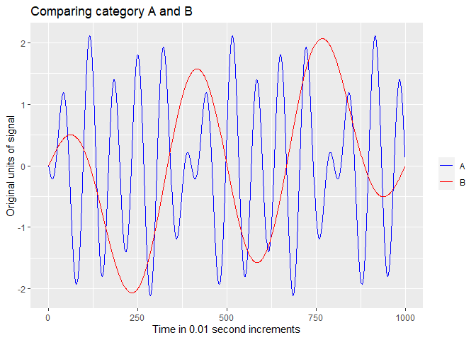
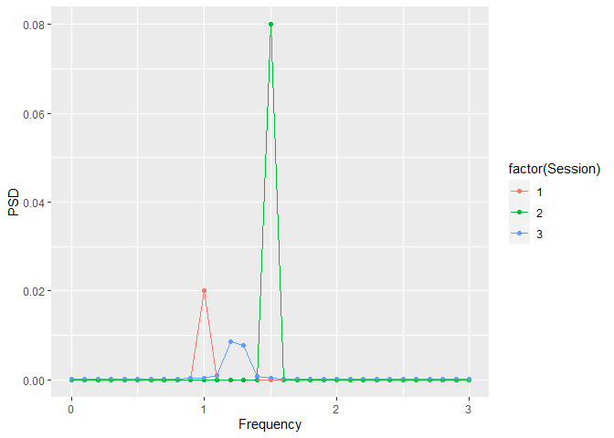

<!-- README.md is generated from README.Rmd. Please edit that file -->

## Overview

Author: Yong-Han Hank Cheng

This package allows you to generate and compare power spectral density
(PSD) plots given time series data. FFT is used to take a time series
data, analyze the oscillations, and then output the frequencies of these
oscillations in the time series in the form of a PSD plot.

## Installation

``` r
# Install the package from GitHub
devtools::install_github("yhhc2/psdr")
```

``` r
# Load package
library("psdr")
```

## Usage

Visit the package’s website for function reference:
<https://yhhc2.github.io/psdr/>

## Installation

``` r
# Install the package from GitHub
devtools::install_github("yhhc2/psdr")
```

``` r
# Load package
library("psdr")
```

## Example

This is an example of how this package can be used to take a dataframe
with multiple separate time series belonging to 2 categories (A and B),
separate out the time series, and use the time series to make PSDs and
compare the dominant frequencies between the two categories of signals.

### Load in example dataset

In this example dataset, there are 3 time series for each category (6
signals total). Here is how the package can be used to take a dataframe
and split it into multiple dataframes, with each dataframe as a separate
time series.

``` r
example_data <- GenerateExampleData()

print(example_data)
```

    ##       Time        Signal Session Category
    ## 1    -0.01 -1.255810e-01       1        A
    ## 2        0  0.000000e+00       1        A
    ## 3     0.01  1.255810e-01       1        A
    ## 4     0.02  2.506665e-01       1        A
    ## 5     0.03  3.747626e-01       1        A
    ## 6     0.04  4.973798e-01       1        A
    ## 7     0.05  6.180340e-01       1        A
    ## 8     0.06  7.362491e-01       1        A
    ## 9     0.07  8.515586e-01       1        A
    ## 10    0.08  9.635073e-01       1        A
    ## 11    0.09  1.071654e+00       1        A
    ## 12     0.1  1.175571e+00       1        A
    ## 13    0.11  1.274848e+00       1        A
    ## 14    0.12  1.369094e+00       1        A
    ## 15    0.13  1.457937e+00       1        A
    ## 16    0.14  1.541026e+00       1        A
    ## 17    0.15  1.618034e+00       1        A
    ## 18    0.16  1.688656e+00       1        A
    ## 19    0.17  1.752613e+00       1        A
    ## 20    0.18  1.809654e+00       1        A
    ## 21    0.19  1.859553e+00       1        A
    ## 22     0.2  1.902113e+00       1        A
    ## 23    0.21  1.937166e+00       1        A
    ## 24    0.22  1.964575e+00       1        A
    ## 25    0.23  1.984229e+00       1        A
    ## 26    0.24  1.996053e+00       1        A
    ## 27    0.25  2.000000e+00       1        A
    ## 28    0.26  1.996053e+00       1        A
    ## 29    0.27  1.984229e+00       1        A
    ## 30    0.28  1.964575e+00       1        A
    ## 31    0.29  1.937166e+00       1        A
    ## 32     0.3  1.902113e+00       1        A
    ## 33    0.31  1.859553e+00       1        A
    ## 34    0.32  1.809654e+00       1        A
    ## 35    0.33  1.752613e+00       1        A
    ## 36    0.34  1.688656e+00       1        A
    ## 37    0.35  1.618034e+00       1        A
    ## 38    0.36  1.541026e+00       1        A
    ## 39    0.37  1.457937e+00       1        A
    ## 40    0.38  1.369094e+00       1        A
    ## 41    0.39  1.274848e+00       1        A
    ## 42     0.4  1.175571e+00       1        A
    ## 43    0.41  1.071654e+00       1        A
    ## 44    0.42  9.635073e-01       1        A
    ## 45    0.43  8.515586e-01       1        A
    ## 46    0.44  7.362491e-01       1        A
    ## 47    0.45  6.180340e-01       1        A
    ## 48    0.46  4.973798e-01       1        A
    ## 49    0.47  3.747626e-01       1        A
    ## 50    0.48  2.506665e-01       1        A
    ## 51    0.49  1.255810e-01       1        A
    ## 52     0.5  2.449213e-16       1        A
    ## 53    0.51 -1.255810e-01       1        A
    ## 54    0.52 -2.506665e-01       1        A
    ## 55    0.53 -3.747626e-01       1        A
    ## 56    0.54 -4.973798e-01       1        A
    ## 57    0.55 -6.180340e-01       1        A
    ## 58    0.56 -7.362491e-01       1        A
    ## 59    0.57 -8.515586e-01       1        A
    ## 60    0.58 -9.635073e-01       1        A
    ## 61    0.59 -1.071654e+00       1        A
    ## 62     0.6 -1.175571e+00       1        A
    ## 63    0.61 -1.274848e+00       1        A
    ## 64    0.62 -1.369094e+00       1        A
    ## 65    0.63 -1.457937e+00       1        A
    ## 66    0.64 -1.541026e+00       1        A
    ## 67    0.65 -1.618034e+00       1        A
    ## 68    0.66 -1.688656e+00       1        A
    ## 69    0.67 -1.752613e+00       1        A
    ## 70    0.68 -1.809654e+00       1        A
    ## 71    0.69 -1.859553e+00       1        A
    ## 72     0.7 -1.902113e+00       1        A
    ## 73    0.71 -1.937166e+00       1        A
    ## 74    0.72 -1.964575e+00       1        A
    ## 75    0.73 -1.984229e+00       1        A
    ## 76    0.74 -1.996053e+00       1        A
    ## 77    0.75 -2.000000e+00       1        A
    ## 78    0.76 -1.996053e+00       1        A
    ## 79    0.77 -1.984229e+00       1        A
    ## 80    0.78 -1.964575e+00       1        A
    ## 81    0.79 -1.937166e+00       1        A
    ## 82     0.8 -1.902113e+00       1        A
    ## 83    0.81 -1.859553e+00       1        A
    ## 84    0.82 -1.809654e+00       1        A
    ## 85    0.83 -1.752613e+00       1        A
    ## 86    0.84 -1.688656e+00       1        A
    ## 87    0.85 -1.618034e+00       1        A
    ## 88    0.86 -1.541026e+00       1        A
    ## 89    0.87 -1.457937e+00       1        A
    ## 90    0.88 -1.369094e+00       1        A
    ## 91    0.89 -1.274848e+00       1        A
    ## 92     0.9 -1.175571e+00       1        A
    ## 93    0.91 -1.071654e+00       1        A
    ## 94    0.92 -9.635073e-01       1        A
    ## 95    0.93 -8.515586e-01       1        A
    ## 96    0.94 -7.362491e-01       1        A
    ## 97    0.95 -6.180340e-01       1        A
    ## 98    0.96 -4.973798e-01       1        A
    ## 99    0.97 -3.747626e-01       1        A
    ## 100   0.98 -2.506665e-01       1        A
    ## 101   0.99 -1.255810e-01       1        A
    ## 102      1 -4.898425e-16       1        A
    ## 103   1.01  1.255810e-01       1        A
    ## 104   1.02  2.506665e-01       1        A
    ## 105   1.03  3.747626e-01       1        A
    ## 106   1.04  4.973798e-01       1        A
    ## 107   1.05  6.180340e-01       1        A
    ## 108   1.06  7.362491e-01       1        A
    ## 109   1.07  8.515586e-01       1        A
    ## 110   1.08  9.635073e-01       1        A
    ## 111   1.09  1.071654e+00       1        A
    ## 112    1.1  1.175571e+00       1        A
    ## 113   1.11  1.274848e+00       1        A
    ## 114   1.12  1.369094e+00       1        A
    ## 115   1.13  1.457937e+00       1        A
    ## 116   1.14  1.541026e+00       1        A
    ## 117   1.15  1.618034e+00       1        A
    ## 118   1.16  1.688656e+00       1        A
    ## 119   1.17  1.752613e+00       1        A
    ## 120   1.18  1.809654e+00       1        A
    ## 121   1.19  1.859553e+00       1        A
    ## 122    1.2  1.902113e+00       1        A
    ## 123   1.21  1.937166e+00       1        A
    ## 124   1.22  1.964575e+00       1        A
    ## 125   1.23  1.984229e+00       1        A
    ## 126   1.24  1.996053e+00       1        A
    ## 127   1.25  2.000000e+00       1        A
    ## 128   1.26  1.996053e+00       1        A
    ## 129   1.27  1.984229e+00       1        A
    ## 130   1.28  1.964575e+00       1        A
    ## 131   1.29  1.937166e+00       1        A
    ## 132    1.3  1.902113e+00       1        A
    ## 133   1.31  1.859553e+00       1        A
    ## 134   1.32  1.809654e+00       1        A
    ## 135   1.33  1.752613e+00       1        A
    ## 136   1.34  1.688656e+00       1        A
    ## 137   1.35  1.618034e+00       1        A
    ## 138   1.36  1.541026e+00       1        A
    ## 139   1.37  1.457937e+00       1        A
    ## 140   1.38  1.369094e+00       1        A
    ## 141   1.39  1.274848e+00       1        A
    ## 142    1.4  1.175571e+00       1        A
    ## 143   1.41  1.071654e+00       1        A
    ## 144   1.42  9.635073e-01       1        A
    ## 145   1.43  8.515586e-01       1        A
    ## 146   1.44  7.362491e-01       1        A
    ## 147   1.45  6.180340e-01       1        A
    ## 148   1.46  4.973798e-01       1        A
    ## 149   1.47  3.747626e-01       1        A
    ## 150   1.48  2.506665e-01       1        A
    ## 151   1.49  1.255810e-01       1        A
    ## 152    1.5  7.347638e-16       1        A
    ## 153   1.51 -1.255810e-01       1        A
    ## 154   1.52 -2.506665e-01       1        A
    ## 155   1.53 -3.747626e-01       1        A
    ## 156   1.54 -4.973798e-01       1        A
    ## 157   1.55 -6.180340e-01       1        A
    ## 158   1.56 -7.362491e-01       1        A
    ## 159   1.57 -8.515586e-01       1        A
    ## 160   1.58 -9.635073e-01       1        A
    ## 161   1.59 -1.071654e+00       1        A
    ## 162    1.6 -1.175571e+00       1        A
    ## 163   1.61 -1.274848e+00       1        A
    ## 164   1.62 -1.369094e+00       1        A
    ## 165   1.63 -1.457937e+00       1        A
    ## 166   1.64 -1.541026e+00       1        A
    ## 167   1.65 -1.618034e+00       1        A
    ## 168   1.66 -1.688656e+00       1        A
    ## 169   1.67 -1.752613e+00       1        A
    ## 170   1.68 -1.809654e+00       1        A
    ## 171   1.69 -1.859553e+00       1        A
    ## 172    1.7 -1.902113e+00       1        A
    ## 173   1.71 -1.937166e+00       1        A
    ## 174   1.72 -1.964575e+00       1        A
    ## 175   1.73 -1.984229e+00       1        A
    ## 176   1.74 -1.996053e+00       1        A
    ## 177   1.75 -2.000000e+00       1        A
    ## 178   1.76 -1.996053e+00       1        A
    ## 179   1.77 -1.984229e+00       1        A
    ## 180   1.78 -1.964575e+00       1        A
    ## 181   1.79 -1.937166e+00       1        A
    ## 182    1.8 -1.902113e+00       1        A
    ## 183   1.81 -1.859553e+00       1        A
    ## 184   1.82 -1.809654e+00       1        A
    ## 185   1.83 -1.752613e+00       1        A
    ## 186   1.84 -1.688656e+00       1        A
    ## 187   1.85 -1.618034e+00       1        A
    ## 188   1.86 -1.541026e+00       1        A
    ## 189   1.87 -1.457937e+00       1        A
    ## 190   1.88 -1.369094e+00       1        A
    ## 191   1.89 -1.274848e+00       1        A
    ## 192    1.9 -1.175571e+00       1        A
    ## 193   1.91 -1.071654e+00       1        A
    ## 194   1.92 -9.635073e-01       1        A
    ## 195   1.93 -8.515586e-01       1        A
    ## 196   1.94 -7.362491e-01       1        A
    ## 197   1.95 -6.180340e-01       1        A
    ## 198   1.96 -4.973798e-01       1        A
    ## 199   1.97 -3.747626e-01       1        A
    ## 200   1.98 -2.506665e-01       1        A
    ## 201   1.99 -1.255810e-01       1        A
    ## 202      2 -9.796851e-16       1        A
    ## 203   2.01  1.255810e-01       1        A
    ## 204   2.02  2.506665e-01       1        A
    ## 205   2.03  3.747626e-01       1        A
    ## 206   2.04  4.973798e-01       1        A
    ## 207   2.05  6.180340e-01       1        A
    ## 208   2.06  7.362491e-01       1        A
    ## 209   2.07  8.515586e-01       1        A
    ## 210   2.08  9.635073e-01       1        A
    ## 211   2.09  1.071654e+00       1        A
    ## 212    2.1  1.175571e+00       1        A
    ## 213   2.11  1.274848e+00       1        A
    ## 214   2.12  1.369094e+00       1        A
    ## 215   2.13  1.457937e+00       1        A
    ## 216   2.14  1.541026e+00       1        A
    ## 217   2.15  1.618034e+00       1        A
    ## 218   2.16  1.688656e+00       1        A
    ## 219   2.17  1.752613e+00       1        A
    ## 220   2.18  1.809654e+00       1        A
    ## 221   2.19  1.859553e+00       1        A
    ## 222    2.2  1.902113e+00       1        A
    ## 223   2.21  1.937166e+00       1        A
    ## 224   2.22  1.964575e+00       1        A
    ## 225   2.23  1.984229e+00       1        A
    ## 226   2.24  1.996053e+00       1        A
    ## 227   2.25  2.000000e+00       1        A
    ## 228   2.26  1.996053e+00       1        A
    ## 229   2.27  1.984229e+00       1        A
    ## 230   2.28  1.964575e+00       1        A
    ## 231   2.29  1.937166e+00       1        A
    ## 232    2.3  1.902113e+00       1        A
    ## 233   2.31  1.859553e+00       1        A
    ## 234   2.32  1.809654e+00       1        A
    ## 235   2.33  1.752613e+00       1        A
    ## 236   2.34  1.688656e+00       1        A
    ## 237   2.35  1.618034e+00       1        A
    ## 238   2.36  1.541026e+00       1        A
    ## 239   2.37  1.457937e+00       1        A
    ## 240   2.38  1.369094e+00       1        A
    ## 241   2.39  1.274848e+00       1        A
    ## 242    2.4  1.175571e+00       1        A
    ## 243   2.41  1.071654e+00       1        A
    ## 244   2.42  9.635073e-01       1        A
    ## 245   2.43  8.515586e-01       1        A
    ## 246   2.44  7.362491e-01       1        A
    ## 247   2.45  6.180340e-01       1        A
    ## 248   2.46  4.973798e-01       1        A
    ## 249   2.47  3.747626e-01       1        A
    ## 250   2.48  2.506665e-01       1        A
    ## 251   2.49  1.255810e-01       1        A
    ## 252    2.5  1.224606e-15       1        A
    ## 253   2.51 -1.255810e-01       1        A
    ## 254   2.52 -2.506665e-01       1        A
    ## 255   2.53 -3.747626e-01       1        A
    ## 256   2.54 -4.973798e-01       1        A
    ## 257   2.55 -6.180340e-01       1        A
    ## 258   2.56 -7.362491e-01       1        A
    ## 259   2.57 -8.515586e-01       1        A
    ## 260   2.58 -9.635073e-01       1        A
    ## 261   2.59 -1.071654e+00       1        A
    ## 262    2.6 -1.175571e+00       1        A
    ## 263   2.61 -1.274848e+00       1        A
    ## 264   2.62 -1.369094e+00       1        A
    ## 265   2.63 -1.457937e+00       1        A
    ## 266   2.64 -1.541026e+00       1        A
    ## 267   2.65 -1.618034e+00       1        A
    ## 268   2.66 -1.688656e+00       1        A
    ## 269   2.67 -1.752613e+00       1        A
    ## 270   2.68 -1.809654e+00       1        A
    ## 271   2.69 -1.859553e+00       1        A
    ## 272    2.7 -1.902113e+00       1        A
    ## 273   2.71 -1.937166e+00       1        A
    ## 274   2.72 -1.964575e+00       1        A
    ## 275   2.73 -1.984229e+00       1        A
    ## 276   2.74 -1.996053e+00       1        A
    ## 277   2.75 -2.000000e+00       1        A
    ## 278   2.76 -1.996053e+00       1        A
    ## 279   2.77 -1.984229e+00       1        A
    ## 280   2.78 -1.964575e+00       1        A
    ## 281   2.79 -1.937166e+00       1        A
    ## 282    2.8 -1.902113e+00       1        A
    ## 283   2.81 -1.859553e+00       1        A
    ## 284   2.82 -1.809654e+00       1        A
    ## 285   2.83 -1.752613e+00       1        A
    ## 286   2.84 -1.688656e+00       1        A
    ## 287   2.85 -1.618034e+00       1        A
    ## 288   2.86 -1.541026e+00       1        A
    ## 289   2.87 -1.457937e+00       1        A
    ## 290   2.88 -1.369094e+00       1        A
    ## 291   2.89 -1.274848e+00       1        A
    ## 292    2.9 -1.175571e+00       1        A
    ## 293   2.91 -1.071654e+00       1        A
    ## 294   2.92 -9.635073e-01       1        A
    ## 295   2.93 -8.515586e-01       1        A
    ## 296   2.94 -7.362491e-01       1        A
    ## 297   2.95 -6.180340e-01       1        A
    ## 298   2.96 -4.973798e-01       1        A
    ## 299   2.97 -3.747626e-01       1        A
    ## 300   2.98 -2.506665e-01       1        A
    ## 301   2.99 -1.255810e-01       1        A
    ## 302      3 -1.469528e-15       1        A
    ## 303   3.01  1.255810e-01       1        A
    ## 304   3.02  2.506665e-01       1        A
    ## 305   3.03  3.747626e-01       1        A
    ## 306   3.04  4.973798e-01       1        A
    ## 307   3.05  6.180340e-01       1        A
    ## 308   3.06  7.362491e-01       1        A
    ## 309   3.07  8.515586e-01       1        A
    ## 310   3.08  9.635073e-01       1        A
    ## 311   3.09  1.071654e+00       1        A
    ## 312    3.1  1.175571e+00       1        A
    ## 313   3.11  1.274848e+00       1        A
    ## 314   3.12  1.369094e+00       1        A
    ## 315   3.13  1.457937e+00       1        A
    ## 316   3.14  1.541026e+00       1        A
    ## 317   3.15  1.618034e+00       1        A
    ## 318   3.16  1.688656e+00       1        A
    ## 319   3.17  1.752613e+00       1        A
    ## 320   3.18  1.809654e+00       1        A
    ## 321   3.19  1.859553e+00       1        A
    ## 322    3.2  1.902113e+00       1        A
    ## 323   3.21  1.937166e+00       1        A
    ## 324   3.22  1.964575e+00       1        A
    ## 325   3.23  1.984229e+00       1        A
    ## 326   3.24  1.996053e+00       1        A
    ## 327   3.25  2.000000e+00       1        A
    ## 328   3.26  1.996053e+00       1        A
    ## 329   3.27  1.984229e+00       1        A
    ## 330   3.28  1.964575e+00       1        A
    ## 331   3.29  1.937166e+00       1        A
    ## 332    3.3  1.902113e+00       1        A
    ## 333   3.31  1.859553e+00       1        A
    ## 334   3.32  1.809654e+00       1        A
    ## 335   3.33  1.752613e+00       1        A
    ## 336   3.34  1.688656e+00       1        A
    ## 337   3.35  1.618034e+00       1        A
    ## 338   3.36  1.541026e+00       1        A
    ## 339   3.37  1.457937e+00       1        A
    ## 340   3.38  1.369094e+00       1        A
    ## 341   3.39  1.274848e+00       1        A
    ## 342    3.4  1.175571e+00       1        A
    ## 343   3.41  1.071654e+00       1        A
    ## 344   3.42  9.635073e-01       1        A
    ## 345   3.43  8.515586e-01       1        A
    ## 346   3.44  7.362491e-01       1        A
    ## 347   3.45  6.180340e-01       1        A
    ## 348   3.46  4.973798e-01       1        A
    ## 349   3.47  3.747626e-01       1        A
    ## 350   3.48  2.506665e-01       1        A
    ## 351   3.49  1.255810e-01       1        A
    ## 352    3.5  1.714449e-15       1        A
    ## 353   3.51 -1.255810e-01       1        A
    ## 354   3.52 -2.506665e-01       1        A
    ## 355   3.53 -3.747626e-01       1        A
    ## 356   3.54 -4.973798e-01       1        A
    ## 357   3.55 -6.180340e-01       1        A
    ## 358   3.56 -7.362491e-01       1        A
    ## 359   3.57 -8.515586e-01       1        A
    ## 360   3.58 -9.635073e-01       1        A
    ## 361   3.59 -1.071654e+00       1        A
    ## 362    3.6 -1.175571e+00       1        A
    ## 363   3.61 -1.274848e+00       1        A
    ## 364   3.62 -1.369094e+00       1        A
    ## 365   3.63 -1.457937e+00       1        A
    ## 366   3.64 -1.541026e+00       1        A
    ## 367   3.65 -1.618034e+00       1        A
    ## 368   3.66 -1.688656e+00       1        A
    ## 369   3.67 -1.752613e+00       1        A
    ## 370   3.68 -1.809654e+00       1        A
    ## 371   3.69 -1.859553e+00       1        A
    ## 372    3.7 -1.902113e+00       1        A
    ## 373   3.71 -1.937166e+00       1        A
    ## 374   3.72 -1.964575e+00       1        A
    ## 375   3.73 -1.984229e+00       1        A
    ## 376   3.74 -1.996053e+00       1        A
    ## 377   3.75 -2.000000e+00       1        A
    ## 378   3.76 -1.996053e+00       1        A
    ## 379   3.77 -1.984229e+00       1        A
    ## 380   3.78 -1.964575e+00       1        A
    ## 381   3.79 -1.937166e+00       1        A
    ## 382    3.8 -1.902113e+00       1        A
    ## 383   3.81 -1.859553e+00       1        A
    ## 384   3.82 -1.809654e+00       1        A
    ## 385   3.83 -1.752613e+00       1        A
    ## 386   3.84 -1.688656e+00       1        A
    ## 387   3.85 -1.618034e+00       1        A
    ## 388   3.86 -1.541026e+00       1        A
    ## 389   3.87 -1.457937e+00       1        A
    ## 390   3.88 -1.369094e+00       1        A
    ## 391   3.89 -1.274848e+00       1        A
    ## 392    3.9 -1.175571e+00       1        A
    ## 393   3.91 -1.071654e+00       1        A
    ## 394   3.92 -9.635073e-01       1        A
    ## 395   3.93 -8.515586e-01       1        A
    ## 396   3.94 -7.362491e-01       1        A
    ## 397   3.95 -6.180340e-01       1        A
    ## 398   3.96 -4.973798e-01       1        A
    ## 399   3.97 -3.747626e-01       1        A
    ## 400   3.98 -2.506665e-01       1        A
    ## 401   3.99 -1.255810e-01       1        A
    ## 402      4 -1.959370e-15       1        A
    ## 403   4.01  1.255810e-01       1        A
    ## 404   4.02  2.506665e-01       1        A
    ## 405   4.03  3.747626e-01       1        A
    ## 406   4.04  4.973798e-01       1        A
    ## 407   4.05  6.180340e-01       1        A
    ## 408   4.06  7.362491e-01       1        A
    ## 409   4.07  8.515586e-01       1        A
    ## 410   4.08  9.635073e-01       1        A
    ## 411   4.09  1.071654e+00       1        A
    ## 412    4.1  1.175571e+00       1        A
    ## 413   4.11  1.274848e+00       1        A
    ## 414   4.12  1.369094e+00       1        A
    ## 415   4.13  1.457937e+00       1        A
    ## 416   4.14  1.541026e+00       1        A
    ## 417   4.15  1.618034e+00       1        A
    ## 418   4.16  1.688656e+00       1        A
    ## 419   4.17  1.752613e+00       1        A
    ## 420   4.18  1.809654e+00       1        A
    ## 421   4.19  1.859553e+00       1        A
    ## 422    4.2  1.902113e+00       1        A
    ## 423   4.21  1.937166e+00       1        A
    ## 424   4.22  1.964575e+00       1        A
    ## 425   4.23  1.984229e+00       1        A
    ## 426   4.24  1.996053e+00       1        A
    ## 427   4.25  2.000000e+00       1        A
    ## 428   4.26  1.996053e+00       1        A
    ## 429   4.27  1.984229e+00       1        A
    ## 430   4.28  1.964575e+00       1        A
    ## 431   4.29  1.937166e+00       1        A
    ## 432    4.3  1.902113e+00       1        A
    ## 433   4.31  1.859553e+00       1        A
    ## 434   4.32  1.809654e+00       1        A
    ## 435   4.33  1.752613e+00       1        A
    ## 436   4.34  1.688656e+00       1        A
    ## 437   4.35  1.618034e+00       1        A
    ## 438   4.36  1.541026e+00       1        A
    ## 439   4.37  1.457937e+00       1        A
    ## 440   4.38  1.369094e+00       1        A
    ## 441   4.39  1.274848e+00       1        A
    ## 442    4.4  1.175571e+00       1        A
    ## 443   4.41  1.071654e+00       1        A
    ## 444   4.42  9.635073e-01       1        A
    ## 445   4.43  8.515586e-01       1        A
    ## 446   4.44  7.362491e-01       1        A
    ## 447   4.45  6.180340e-01       1        A
    ## 448   4.46  4.973798e-01       1        A
    ## 449   4.47  3.747626e-01       1        A
    ## 450   4.48  2.506665e-01       1        A
    ## 451   4.49  1.255810e-01       1        A
    ## 452    4.5  2.204291e-15       1        A
    ## 453   4.51 -1.255810e-01       1        A
    ## 454   4.52 -2.506665e-01       1        A
    ## 455   4.53 -3.747626e-01       1        A
    ## 456   4.54 -4.973798e-01       1        A
    ## 457   4.55 -6.180340e-01       1        A
    ## 458   4.56 -7.362491e-01       1        A
    ## 459   4.57 -8.515586e-01       1        A
    ## 460   4.58 -9.635073e-01       1        A
    ## 461   4.59 -1.071654e+00       1        A
    ## 462    4.6 -1.175571e+00       1        A
    ## 463   4.61 -1.274848e+00       1        A
    ## 464   4.62 -1.369094e+00       1        A
    ## 465   4.63 -1.457937e+00       1        A
    ## 466   4.64 -1.541026e+00       1        A
    ## 467   4.65 -1.618034e+00       1        A
    ## 468   4.66 -1.688656e+00       1        A
    ## 469   4.67 -1.752613e+00       1        A
    ## 470   4.68 -1.809654e+00       1        A
    ## 471   4.69 -1.859553e+00       1        A
    ## 472    4.7 -1.902113e+00       1        A
    ## 473   4.71 -1.937166e+00       1        A
    ## 474   4.72 -1.964575e+00       1        A
    ## 475   4.73 -1.984229e+00       1        A
    ## 476   4.74 -1.996053e+00       1        A
    ## 477   4.75 -2.000000e+00       1        A
    ## 478   4.76 -1.996053e+00       1        A
    ## 479   4.77 -1.984229e+00       1        A
    ## 480   4.78 -1.964575e+00       1        A
    ## 481   4.79 -1.937166e+00       1        A
    ## 482    4.8 -1.902113e+00       1        A
    ## 483   4.81 -1.859553e+00       1        A
    ## 484   4.82 -1.809654e+00       1        A
    ## 485   4.83 -1.752613e+00       1        A
    ## 486   4.84 -1.688656e+00       1        A
    ## 487   4.85 -1.618034e+00       1        A
    ## 488   4.86 -1.541026e+00       1        A
    ## 489   4.87 -1.457937e+00       1        A
    ## 490   4.88 -1.369094e+00       1        A
    ## 491   4.89 -1.274848e+00       1        A
    ## 492    4.9 -1.175571e+00       1        A
    ## 493   4.91 -1.071654e+00       1        A
    ## 494   4.92 -9.635073e-01       1        A
    ## 495   4.93 -8.515586e-01       1        A
    ## 496   4.94 -7.362491e-01       1        A
    ## 497   4.95 -6.180340e-01       1        A
    ## 498   4.96 -4.973798e-01       1        A
    ## 499   4.97 -3.747626e-01       1        A
    ## 500   4.98 -2.506665e-01       1        A
    ## 501   4.99 -1.255810e-01       1        A
    ## 502      5 -2.449213e-15       1        A
    ## 503   5.01  1.255810e-01       1        A
    ## 504   5.02  2.506665e-01       1        A
    ## 505   5.03  3.747626e-01       1        A
    ## 506   5.04  4.973798e-01       1        A
    ## 507   5.05  6.180340e-01       1        A
    ## 508   5.06  7.362491e-01       1        A
    ## 509   5.07  8.515586e-01       1        A
    ## 510   5.08  9.635073e-01       1        A
    ## 511   5.09  1.071654e+00       1        A
    ## 512    5.1  1.175571e+00       1        A
    ## 513   5.11  1.274848e+00       1        A
    ## 514   5.12  1.369094e+00       1        A
    ## 515   5.13  1.457937e+00       1        A
    ## 516   5.14  1.541026e+00       1        A
    ## 517   5.15  1.618034e+00       1        A
    ## 518   5.16  1.688656e+00       1        A
    ## 519   5.17  1.752613e+00       1        A
    ## 520   5.18  1.809654e+00       1        A
    ## 521   5.19  1.859553e+00       1        A
    ## 522    5.2  1.902113e+00       1        A
    ## 523   5.21  1.937166e+00       1        A
    ## 524   5.22  1.964575e+00       1        A
    ## 525   5.23  1.984229e+00       1        A
    ## 526   5.24  1.996053e+00       1        A
    ## 527   5.25  2.000000e+00       1        A
    ## 528   5.26  1.996053e+00       1        A
    ## 529   5.27  1.984229e+00       1        A
    ## 530   5.28  1.964575e+00       1        A
    ## 531   5.29  1.937166e+00       1        A
    ## 532    5.3  1.902113e+00       1        A
    ## 533   5.31  1.859553e+00       1        A
    ## 534   5.32  1.809654e+00       1        A
    ## 535   5.33  1.752613e+00       1        A
    ## 536   5.34  1.688656e+00       1        A
    ## 537   5.35  1.618034e+00       1        A
    ## 538   5.36  1.541026e+00       1        A
    ## 539   5.37  1.457937e+00       1        A
    ## 540   5.38  1.369094e+00       1        A
    ## 541   5.39  1.274848e+00       1        A
    ## 542    5.4  1.175571e+00       1        A
    ## 543   5.41  1.071654e+00       1        A
    ## 544   5.42  9.635073e-01       1        A
    ## 545   5.43  8.515586e-01       1        A
    ## 546   5.44  7.362491e-01       1        A
    ## 547   5.45  6.180340e-01       1        A
    ## 548   5.46  4.973798e-01       1        A
    ## 549   5.47  3.747626e-01       1        A
    ## 550   5.48  2.506665e-01       1        A
    ## 551   5.49  1.255810e-01       1        A
    ## 552    5.5  9.799561e-15       1        A
    ## 553   5.51 -1.255810e-01       1        A
    ## 554   5.52 -2.506665e-01       1        A
    ## 555   5.53 -3.747626e-01       1        A
    ## 556   5.54 -4.973798e-01       1        A
    ## 557   5.55 -6.180340e-01       1        A
    ## 558   5.56 -7.362491e-01       1        A
    ## 559   5.57 -8.515586e-01       1        A
    ## 560   5.58 -9.635073e-01       1        A
    ## 561   5.59 -1.071654e+00       1        A
    ## 562    5.6 -1.175571e+00       1        A
    ## 563   5.61 -1.274848e+00       1        A
    ## 564   5.62 -1.369094e+00       1        A
    ## 565   5.63 -1.457937e+00       1        A
    ## 566   5.64 -1.541026e+00       1        A
    ## 567   5.65 -1.618034e+00       1        A
    ## 568   5.66 -1.688656e+00       1        A
    ## 569   5.67 -1.752613e+00       1        A
    ## 570   5.68 -1.809654e+00       1        A
    ## 571   5.69 -1.859553e+00       1        A
    ## 572    5.7 -1.902113e+00       1        A
    ## 573   5.71 -1.937166e+00       1        A
    ## 574   5.72 -1.964575e+00       1        A
    ## 575   5.73 -1.984229e+00       1        A
    ## 576   5.74 -1.996053e+00       1        A
    ## 577   5.75 -2.000000e+00       1        A
    ## 578   5.76 -1.996053e+00       1        A
    ## 579   5.77 -1.984229e+00       1        A
    ## 580   5.78 -1.964575e+00       1        A
    ## 581   5.79 -1.937166e+00       1        A
    ## 582    5.8 -1.902113e+00       1        A
    ## 583   5.81 -1.859553e+00       1        A
    ## 584   5.82 -1.809654e+00       1        A
    ## 585   5.83 -1.752613e+00       1        A
    ## 586   5.84 -1.688656e+00       1        A
    ## 587   5.85 -1.618034e+00       1        A
    ## 588   5.86 -1.541026e+00       1        A
    ## 589   5.87 -1.457937e+00       1        A
    ## 590   5.88 -1.369094e+00       1        A
    ## 591   5.89 -1.274848e+00       1        A
    ## 592    5.9 -1.175571e+00       1        A
    ## 593   5.91 -1.071654e+00       1        A
    ## 594   5.92 -9.635073e-01       1        A
    ## 595   5.93 -8.515586e-01       1        A
    ## 596   5.94 -7.362491e-01       1        A
    ## 597   5.95 -6.180340e-01       1        A
    ## 598   5.96 -4.973798e-01       1        A
    ## 599   5.97 -3.747626e-01       1        A
    ## 600   5.98 -2.506665e-01       1        A
    ## 601   5.99 -1.255810e-01       1        A
    ## 602      6 -2.939055e-15       1        A
    ## 603   6.01  1.255810e-01       1        A
    ## 604   6.02  2.506665e-01       1        A
    ## 605   6.03  3.747626e-01       1        A
    ## 606   6.04  4.973798e-01       1        A
    ## 607   6.05  6.180340e-01       1        A
    ## 608   6.06  7.362491e-01       1        A
    ## 609   6.07  8.515586e-01       1        A
    ## 610   6.08  9.635073e-01       1        A
    ## 611   6.09  1.071654e+00       1        A
    ## 612    6.1  1.175571e+00       1        A
    ## 613   6.11  1.274848e+00       1        A
    ## 614   6.12  1.369094e+00       1        A
    ## 615   6.13  1.457937e+00       1        A
    ## 616   6.14  1.541026e+00       1        A
    ## 617   6.15  1.618034e+00       1        A
    ## 618   6.16  1.688656e+00       1        A
    ## 619   6.17  1.752613e+00       1        A
    ## 620   6.18  1.809654e+00       1        A
    ## 621   6.19  1.859553e+00       1        A
    ## 622    6.2  1.902113e+00       1        A
    ## 623   6.21  1.937166e+00       1        A
    ## 624   6.22  1.964575e+00       1        A
    ## 625   6.23  1.984229e+00       1        A
    ## 626   6.24  1.996053e+00       1        A
    ## 627   6.25  2.000000e+00       1        A
    ## 628   6.26  1.996053e+00       1        A
    ## 629   6.27  1.984229e+00       1        A
    ## 630   6.28  1.964575e+00       1        A
    ## 631   6.29  1.937166e+00       1        A
    ## 632    6.3  1.902113e+00       1        A
    ## 633   6.31  1.859553e+00       1        A
    ## 634   6.32  1.809654e+00       1        A
    ## 635   6.33  1.752613e+00       1        A
    ## 636   6.34  1.688656e+00       1        A
    ## 637   6.35  1.618034e+00       1        A
    ## 638   6.36  1.541026e+00       1        A
    ## 639   6.37  1.457937e+00       1        A
    ## 640   6.38  1.369094e+00       1        A
    ## 641   6.39  1.274848e+00       1        A
    ## 642    6.4  1.175571e+00       1        A
    ## 643   6.41  1.071654e+00       1        A
    ## 644   6.42  9.635073e-01       1        A
    ## 645   6.43  8.515586e-01       1        A
    ## 646   6.44  7.362491e-01       1        A
    ## 647   6.45  6.180340e-01       1        A
    ## 648   6.46  4.973798e-01       1        A
    ## 649   6.47  3.747626e-01       1        A
    ## 650   6.48  2.506665e-01       1        A
    ## 651   6.49  1.255810e-01       1        A
    ## 652    6.5 -3.921451e-15       1        A
    ## 653   6.51 -1.255810e-01       1        A
    ## 654   6.52 -2.506665e-01       1        A
    ## 655   6.53 -3.747626e-01       1        A
    ## 656   6.54 -4.973798e-01       1        A
    ## 657   6.55 -6.180340e-01       1        A
    ## 658   6.56 -7.362491e-01       1        A
    ## 659   6.57 -8.515586e-01       1        A
    ## 660   6.58 -9.635073e-01       1        A
    ## 661   6.59 -1.071654e+00       1        A
    ## 662    6.6 -1.175571e+00       1        A
    ## 663   6.61 -1.274848e+00       1        A
    ## 664   6.62 -1.369094e+00       1        A
    ## 665   6.63 -1.457937e+00       1        A
    ## 666   6.64 -1.541026e+00       1        A
    ## 667   6.65 -1.618034e+00       1        A
    ## 668   6.66 -1.688656e+00       1        A
    ## 669   6.67 -1.752613e+00       1        A
    ## 670   6.68 -1.809654e+00       1        A
    ## 671   6.69 -1.859553e+00       1        A
    ## 672    6.7 -1.902113e+00       1        A
    ## 673   6.71 -1.937166e+00       1        A
    ## 674   6.72 -1.964575e+00       1        A
    ## 675   6.73 -1.984229e+00       1        A
    ## 676   6.74 -1.996053e+00       1        A
    ## 677   6.75 -2.000000e+00       1        A
    ## 678   6.76 -1.996053e+00       1        A
    ## 679   6.77 -1.984229e+00       1        A
    ## 680   6.78 -1.964575e+00       1        A
    ## 681   6.79 -1.937166e+00       1        A
    ## 682    6.8 -1.902113e+00       1        A
    ## 683   6.81 -1.859553e+00       1        A
    ## 684   6.82 -1.809654e+00       1        A
    ## 685   6.83 -1.752613e+00       1        A
    ## 686   6.84 -1.688656e+00       1        A
    ## 687   6.85 -1.618034e+00       1        A
    ## 688   6.86 -1.541026e+00       1        A
    ## 689   6.87 -1.457937e+00       1        A
    ## 690   6.88 -1.369094e+00       1        A
    ## 691   6.89 -1.274848e+00       1        A
    ## 692    6.9 -1.175571e+00       1        A
    ## 693   6.91 -1.071654e+00       1        A
    ## 694   6.92 -9.635073e-01       1        A
    ## 695   6.93 -8.515586e-01       1        A
    ## 696   6.94 -7.362491e-01       1        A
    ## 697   6.95 -6.180340e-01       1        A
    ## 698   6.96 -4.973798e-01       1        A
    ## 699   6.97 -3.747626e-01       1        A
    ## 700   6.98 -2.506665e-01       1        A
    ## 701   6.99 -1.255810e-01       1        A
    ## 702      7 -3.428898e-15       1        A
    ## 703   7.01  1.255810e-01       1        A
    ## 704   7.02  2.506665e-01       1        A
    ## 705   7.03  3.747626e-01       1        A
    ## 706   7.04  4.973798e-01       1        A
    ## 707   7.05  6.180340e-01       1        A
    ## 708   7.06  7.362491e-01       1        A
    ## 709   7.07  8.515586e-01       1        A
    ## 710   7.08  9.635073e-01       1        A
    ## 711   7.09  1.071654e+00       1        A
    ## 712    7.1  1.175571e+00       1        A
    ## 713   7.11  1.274848e+00       1        A
    ## 714   7.12  1.369094e+00       1        A
    ## 715   7.13  1.457937e+00       1        A
    ## 716   7.14  1.541026e+00       1        A
    ## 717   7.15  1.618034e+00       1        A
    ## 718   7.16  1.688656e+00       1        A
    ## 719   7.17  1.752613e+00       1        A
    ## 720   7.18  1.809654e+00       1        A
    ## 721   7.19  1.859553e+00       1        A
    ## 722    7.2  1.902113e+00       1        A
    ## 723   7.21  1.937166e+00       1        A
    ## 724   7.22  1.964575e+00       1        A
    ## 725   7.23  1.984229e+00       1        A
    ## 726   7.24  1.996053e+00       1        A
    ## 727   7.25  2.000000e+00       1        A
    ## 728   7.26  1.996053e+00       1        A
    ## 729   7.27  1.984229e+00       1        A
    ## 730   7.28  1.964575e+00       1        A
    ## 731   7.29  1.937166e+00       1        A
    ## 732    7.3  1.902113e+00       1        A
    ## 733   7.31  1.859553e+00       1        A
    ## 734   7.32  1.809654e+00       1        A
    ## 735   7.33  1.752613e+00       1        A
    ## 736   7.34  1.688656e+00       1        A
    ## 737   7.35  1.618034e+00       1        A
    ## 738   7.36  1.541026e+00       1        A
    ## 739   7.37  1.457937e+00       1        A
    ## 740   7.38  1.369094e+00       1        A
    ## 741   7.39  1.274848e+00       1        A
    ## 742    7.4  1.175571e+00       1        A
    ## 743   7.41  1.071654e+00       1        A
    ## 744   7.42  9.635073e-01       1        A
    ## 745   7.43  8.515586e-01       1        A
    ## 746   7.44  7.362491e-01       1        A
    ## 747   7.45  6.180340e-01       1        A
    ## 748   7.46  4.973798e-01       1        A
    ## 749   7.47  3.747626e-01       1        A
    ## 750   7.48  2.506665e-01       1        A
    ## 751   7.49  1.255810e-01       1        A
    ## 752    7.5  1.077925e-14       1        A
    ## 753   7.51 -1.255810e-01       1        A
    ## 754   7.52 -2.506665e-01       1        A
    ## 755   7.53 -3.747626e-01       1        A
    ## 756   7.54 -4.973798e-01       1        A
    ## 757   7.55 -6.180340e-01       1        A
    ## 758   7.56 -7.362491e-01       1        A
    ## 759   7.57 -8.515586e-01       1        A
    ## 760   7.58 -9.635073e-01       1        A
    ## 761   7.59 -1.071654e+00       1        A
    ## 762    7.6 -1.175571e+00       1        A
    ## 763   7.61 -1.274848e+00       1        A
    ## 764   7.62 -1.369094e+00       1        A
    ## 765   7.63 -1.457937e+00       1        A
    ## 766   7.64 -1.541026e+00       1        A
    ## 767   7.65 -1.618034e+00       1        A
    ## 768   7.66 -1.688656e+00       1        A
    ## 769   7.67 -1.752613e+00       1        A
    ## 770   7.68 -1.809654e+00       1        A
    ## 771   7.69 -1.859553e+00       1        A
    ## 772    7.7 -1.902113e+00       1        A
    ## 773   7.71 -1.937166e+00       1        A
    ## 774   7.72 -1.964575e+00       1        A
    ## 775   7.73 -1.984229e+00       1        A
    ## 776   7.74 -1.996053e+00       1        A
    ## 777   7.75 -2.000000e+00       1        A
    ## 778   7.76 -1.996053e+00       1        A
    ## 779   7.77 -1.984229e+00       1        A
    ## 780   7.78 -1.964575e+00       1        A
    ## 781   7.79 -1.937166e+00       1        A
    ## 782    7.8 -1.902113e+00       1        A
    ## 783   7.81 -1.859553e+00       1        A
    ## 784   7.82 -1.809654e+00       1        A
    ## 785   7.83 -1.752613e+00       1        A
    ## 786   7.84 -1.688656e+00       1        A
    ## 787   7.85 -1.618034e+00       1        A
    ## 788   7.86 -1.541026e+00       1        A
    ## 789   7.87 -1.457937e+00       1        A
    ## 790   7.88 -1.369094e+00       1        A
    ## 791   7.89 -1.274848e+00       1        A
    ## 792    7.9 -1.175571e+00       1        A
    ## 793   7.91 -1.071654e+00       1        A
    ## 794   7.92 -9.635073e-01       1        A
    ## 795   7.93 -8.515586e-01       1        A
    ## 796   7.94 -7.362491e-01       1        A
    ## 797   7.95 -6.180340e-01       1        A
    ## 798   7.96 -4.973798e-01       1        A
    ## 799   7.97 -3.747626e-01       1        A
    ## 800   7.98 -2.506665e-01       1        A
    ## 801   7.99 -1.255810e-01       1        A
    ## 802      8 -3.918740e-15       1        A
    ## 803   8.01  1.255810e-01       1        A
    ## 804   8.02  2.506665e-01       1        A
    ## 805   8.03  3.747626e-01       1        A
    ## 806   8.04  4.973798e-01       1        A
    ## 807   8.05  6.180340e-01       1        A
    ## 808   8.06  7.362491e-01       1        A
    ## 809   8.07  8.515586e-01       1        A
    ## 810   8.08  9.635073e-01       1        A
    ## 811   8.09  1.071654e+00       1        A
    ## 812    8.1  1.175571e+00       1        A
    ## 813   8.11  1.274848e+00       1        A
    ## 814   8.12  1.369094e+00       1        A
    ## 815   8.13  1.457937e+00       1        A
    ## 816   8.14  1.541026e+00       1        A
    ## 817   8.15  1.618034e+00       1        A
    ## 818   8.16  1.688656e+00       1        A
    ## 819   8.17  1.752613e+00       1        A
    ## 820   8.18  1.809654e+00       1        A
    ## 821   8.19  1.859553e+00       1        A
    ## 822    8.2  1.902113e+00       1        A
    ## 823   8.21  1.937166e+00       1        A
    ## 824   8.22  1.964575e+00       1        A
    ## 825   8.23  1.984229e+00       1        A
    ## 826   8.24  1.996053e+00       1        A
    ## 827   8.25  2.000000e+00       1        A
    ## 828   8.26  1.996053e+00       1        A
    ## 829   8.27  1.984229e+00       1        A
    ## 830   8.28  1.964575e+00       1        A
    ## 831   8.29  1.937166e+00       1        A
    ## 832    8.3  1.902113e+00       1        A
    ## 833   8.31  1.859553e+00       1        A
    ## 834   8.32  1.809654e+00       1        A
    ## 835   8.33  1.752613e+00       1        A
    ## 836   8.34  1.688656e+00       1        A
    ## 837   8.35  1.618034e+00       1        A
    ## 838   8.36  1.541026e+00       1        A
    ## 839   8.37  1.457937e+00       1        A
    ## 840   8.38  1.369094e+00       1        A
    ## 841   8.39  1.274848e+00       1        A
    ## 842    8.4  1.175571e+00       1        A
    ## 843   8.41  1.071654e+00       1        A
    ## 844   8.42  9.635073e-01       1        A
    ## 845   8.43  8.515586e-01       1        A
    ## 846   8.44  7.362491e-01       1        A
    ## 847   8.45  6.180340e-01       1        A
    ## 848   8.46  4.973798e-01       1        A
    ## 849   8.47  3.747626e-01       1        A
    ## 850   8.48  2.506665e-01       1        A
    ## 851   8.49  1.255810e-01       1        A
    ## 852    8.5 -2.941766e-15       1        A
    ## 853   8.51 -1.255810e-01       1        A
    ## 854   8.52 -2.506665e-01       1        A
    ## 855   8.53 -3.747626e-01       1        A
    ## 856   8.54 -4.973798e-01       1        A
    ## 857   8.55 -6.180340e-01       1        A
    ## 858   8.56 -7.362491e-01       1        A
    ## 859   8.57 -8.515586e-01       1        A
    ## 860   8.58 -9.635073e-01       1        A
    ## 861   8.59 -1.071654e+00       1        A
    ## 862    8.6 -1.175571e+00       1        A
    ## 863   8.61 -1.274848e+00       1        A
    ## 864   8.62 -1.369094e+00       1        A
    ## 865   8.63 -1.457937e+00       1        A
    ## 866   8.64 -1.541026e+00       1        A
    ## 867   8.65 -1.618034e+00       1        A
    ## 868   8.66 -1.688656e+00       1        A
    ## 869   8.67 -1.752613e+00       1        A
    ## 870   8.68 -1.809654e+00       1        A
    ## 871   8.69 -1.859553e+00       1        A
    ## 872    8.7 -1.902113e+00       1        A
    ## 873   8.71 -1.937166e+00       1        A
    ## 874   8.72 -1.964575e+00       1        A
    ## 875   8.73 -1.984229e+00       1        A
    ## 876   8.74 -1.996053e+00       1        A
    ## 877   8.75 -2.000000e+00       1        A
    ## 878   8.76 -1.996053e+00       1        A
    ## 879   8.77 -1.984229e+00       1        A
    ## 880   8.78 -1.964575e+00       1        A
    ## 881   8.79 -1.937166e+00       1        A
    ## 882    8.8 -1.902113e+00       1        A
    ## 883   8.81 -1.859553e+00       1        A
    ## 884   8.82 -1.809654e+00       1        A
    ## 885   8.83 -1.752613e+00       1        A
    ## 886   8.84 -1.688656e+00       1        A
    ## 887   8.85 -1.618034e+00       1        A
    ## 888   8.86 -1.541026e+00       1        A
    ## 889   8.87 -1.457937e+00       1        A
    ## 890   8.88 -1.369094e+00       1        A
    ## 891   8.89 -1.274848e+00       1        A
    ## 892    8.9 -1.175571e+00       1        A
    ## 893   8.91 -1.071654e+00       1        A
    ## 894   8.92 -9.635073e-01       1        A
    ## 895   8.93 -8.515586e-01       1        A
    ## 896   8.94 -7.362491e-01       1        A
    ## 897   8.95 -6.180340e-01       1        A
    ## 898   8.96 -4.973798e-01       1        A
    ## 899   8.97 -3.747626e-01       1        A
    ## 900   8.98 -2.506665e-01       1        A
    ## 901   8.99 -1.255810e-01       1        A
    ## 902      9 -4.408583e-15       1        A
    ## 903   9.01  1.255810e-01       1        A
    ## 904   9.02  2.506665e-01       1        A
    ## 905   9.03  3.747626e-01       1        A
    ## 906   9.04  4.973798e-01       1        A
    ## 907   9.05  6.180340e-01       1        A
    ## 908   9.06  7.362491e-01       1        A
    ## 909   9.07  8.515586e-01       1        A
    ## 910   9.08  9.635073e-01       1        A
    ## 911   9.09  1.071654e+00       1        A
    ## 912    9.1  1.175571e+00       1        A
    ## 913   9.11  1.274848e+00       1        A
    ## 914   9.12  1.369094e+00       1        A
    ## 915   9.13  1.457937e+00       1        A
    ## 916   9.14  1.541026e+00       1        A
    ## 917   9.15  1.618034e+00       1        A
    ## 918   9.16  1.688656e+00       1        A
    ## 919   9.17  1.752613e+00       1        A
    ## 920   9.18  1.809654e+00       1        A
    ## 921   9.19  1.859553e+00       1        A
    ## 922    9.2  1.902113e+00       1        A
    ## 923   9.21  1.937166e+00       1        A
    ## 924   9.22  1.964575e+00       1        A
    ## 925   9.23  1.984229e+00       1        A
    ## 926   9.24  1.996053e+00       1        A
    ## 927   9.25  2.000000e+00       1        A
    ## 928   9.26  1.996053e+00       1        A
    ## 929   9.27  1.984229e+00       1        A
    ## 930   9.28  1.964575e+00       1        A
    ## 931   9.29  1.937166e+00       1        A
    ## 932    9.3  1.902113e+00       1        A
    ## 933   9.31  1.859553e+00       1        A
    ## 934   9.32  1.809654e+00       1        A
    ## 935   9.33  1.752613e+00       1        A
    ## 936   9.34  1.688656e+00       1        A
    ## 937   9.35  1.618034e+00       1        A
    ## 938   9.36  1.541026e+00       1        A
    ## 939   9.37  1.457937e+00       1        A
    ## 940   9.38  1.369094e+00       1        A
    ## 941   9.39  1.274848e+00       1        A
    ## 942    9.4  1.175571e+00       1        A
    ## 943   9.41  1.071654e+00       1        A
    ## 944   9.42  9.635073e-01       1        A
    ## 945   9.43  8.515586e-01       1        A
    ## 946   9.44  7.362491e-01       1        A
    ## 947   9.45  6.180340e-01       1        A
    ## 948   9.46  4.973798e-01       1        A
    ## 949   9.47  3.747626e-01       1        A
    ## 950   9.48  2.506665e-01       1        A
    ## 951   9.49  1.255810e-01       1        A
    ## 952    9.5  1.175893e-14       1        A
    ## 953   9.51 -1.255810e-01       1        A
    ## 954   9.52 -2.506665e-01       1        A
    ## 955   9.53 -3.747626e-01       1        A
    ## 956   9.54 -4.973798e-01       1        A
    ## 957   9.55 -6.180340e-01       1        A
    ## 958   9.56 -7.362491e-01       1        A
    ## 959   9.57 -8.515586e-01       1        A
    ## 960   9.58 -9.635073e-01       1        A
    ## 961   9.59 -1.071654e+00       1        A
    ## 962    9.6 -1.175571e+00       1        A
    ## 963   9.61 -1.274848e+00       1        A
    ## 964   9.62 -1.369094e+00       1        A
    ## 965   9.63 -1.457937e+00       1        A
    ## 966   9.64 -1.541026e+00       1        A
    ## 967   9.65 -1.618034e+00       1        A
    ## 968   9.66 -1.688656e+00       1        A
    ## 969   9.67 -1.752613e+00       1        A
    ## 970   9.68 -1.809654e+00       1        A
    ## 971   9.69 -1.859553e+00       1        A
    ## 972    9.7 -1.902113e+00       1        A
    ## 973   9.71 -1.937166e+00       1        A
    ## 974   9.72 -1.964575e+00       1        A
    ## 975   9.73 -1.984229e+00       1        A
    ## 976   9.74 -1.996053e+00       1        A
    ## 977   9.75 -2.000000e+00       1        A
    ## 978   9.76 -1.996053e+00       1        A
    ## 979   9.77 -1.984229e+00       1        A
    ## 980   9.78 -1.964575e+00       1        A
    ## 981   9.79 -1.937166e+00       1        A
    ## 982    9.8 -1.902113e+00       1        A
    ## 983   9.81 -1.859553e+00       1        A
    ## 984   9.82 -1.809654e+00       1        A
    ## 985   9.83 -1.752613e+00       1        A
    ## 986   9.84 -1.688656e+00       1        A
    ## 987   9.85 -1.618034e+00       1        A
    ## 988   9.86 -1.541026e+00       1        A
    ## 989   9.87 -1.457937e+00       1        A
    ## 990   9.88 -1.369094e+00       1        A
    ## 991   9.89 -1.274848e+00       1        A
    ## 992    9.9 -1.175571e+00       1        A
    ## 993   9.91 -1.071654e+00       1        A
    ## 994   9.92 -9.635073e-01       1        A
    ## 995   9.93 -8.515586e-01       1        A
    ## 996   9.94 -7.362491e-01       1        A
    ## 997   9.95 -6.180340e-01       1        A
    ## 998   9.96 -4.973798e-01       1        A
    ## 999   9.97 -3.747626e-01       1        A
    ## 1000  9.98 -2.506665e-01       1        A
    ## 1001  9.99 -1.255810e-01       1        A
    ## 1002 -0.01  3.764333e-01       2        A
    ## 1003     0  0.000000e+00       2        A
    ## 1004  0.01 -3.764333e-01       2        A
    ## 1005  0.02 -7.495253e-01       2        A
    ## 1006  0.03 -1.115964e+00       2        A
    ## 1007  0.04 -1.472498e+00       2        A
    ## 1008  0.05 -1.815962e+00       2        A
    ## 1009  0.06 -2.143307e+00       2        A
    ## 1010  0.07 -2.451628e+00       2        A
    ## 1011  0.08 -2.738188e+00       2        A
    ## 1012  0.09 -3.000444e+00       2        A
    ## 1013   0.1 -3.236068e+00       2        A
    ## 1014  0.11 -3.442968e+00       2        A
    ## 1015  0.12 -3.619308e+00       2        A
    ## 1016  0.13 -3.763523e+00       2        A
    ## 1017  0.14 -3.874333e+00       2        A
    ## 1018  0.15 -3.950753e+00       2        A
    ## 1019  0.16 -3.992107e+00       2        A
    ## 1020  0.17 -3.998026e+00       2        A
    ## 1021  0.18 -3.968459e+00       2        A
    ## 1022  0.19 -3.903667e+00       2        A
    ## 1023   0.2 -3.804226e+00       2        A
    ## 1024  0.21 -3.671019e+00       2        A
    ## 1025  0.22 -3.505227e+00       2        A
    ## 1026  0.23 -3.308322e+00       2        A
    ## 1027  0.24 -3.082053e+00       2        A
    ## 1028  0.25 -2.828427e+00       2        A
    ## 1029  0.26 -2.549696e+00       2        A
    ## 1030  0.27 -2.248334e+00       2        A
    ## 1031  0.28 -1.927015e+00       2        A
    ## 1032  0.29 -1.588592e+00       2        A
    ## 1033   0.3 -1.236068e+00       2        A
    ## 1034  0.31 -8.725730e-01       2        A
    ## 1035  0.32 -5.013329e-01       2        A
    ## 1036  0.33 -1.256430e-01       2        A
    ## 1037  0.34  2.511621e-01       2        A
    ## 1038  0.35  6.257379e-01       2        A
    ## 1039  0.36  9.947595e-01       2        A
    ## 1040  0.37  1.354952e+00       2        A
    ## 1041  0.38  1.703117e+00       2        A
    ## 1042  0.39  2.036166e+00       2        A
    ## 1043   0.4  2.351141e+00       2        A
    ## 1044  0.41  2.645247e+00       2        A
    ## 1045  0.42  2.915875e+00       2        A
    ## 1046  0.43  3.160620e+00       2        A
    ## 1047  0.44  3.377312e+00       2        A
    ## 1048  0.45  3.564026e+00       2        A
    ## 1049  0.46  3.719106e+00       2        A
    ## 1050  0.47  3.841175e+00       2        A
    ## 1051  0.48  3.929149e+00       2        A
    ## 1052  0.49  3.982248e+00       2        A
    ## 1053   0.5  4.000000e+00       2        A
    ## 1054  0.51  3.982248e+00       2        A
    ## 1055  0.52  3.929149e+00       2        A
    ## 1056  0.53  3.841175e+00       2        A
    ## 1057  0.54  3.719106e+00       2        A
    ## 1058  0.55  3.564026e+00       2        A
    ## 1059  0.56  3.377312e+00       2        A
    ## 1060  0.57  3.160620e+00       2        A
    ## 1061  0.58  2.915875e+00       2        A
    ## 1062  0.59  2.645247e+00       2        A
    ## 1063   0.6  2.351141e+00       2        A
    ## 1064  0.61  2.036166e+00       2        A
    ## 1065  0.62  1.703117e+00       2        A
    ## 1066  0.63  1.354952e+00       2        A
    ## 1067  0.64  9.947595e-01       2        A
    ## 1068  0.65  6.257379e-01       2        A
    ## 1069  0.66  2.511621e-01       2        A
    ## 1070  0.67 -1.256430e-01       2        A
    ## 1071  0.68 -5.013329e-01       2        A
    ## 1072  0.69 -8.725730e-01       2        A
    ## 1073   0.7 -1.236068e+00       2        A
    ## 1074  0.71 -1.588592e+00       2        A
    ## 1075  0.72 -1.927015e+00       2        A
    ## 1076  0.73 -2.248334e+00       2        A
    ## 1077  0.74 -2.549696e+00       2        A
    ## 1078  0.75 -2.828427e+00       2        A
    ## 1079  0.76 -3.082053e+00       2        A
    ## 1080  0.77 -3.308322e+00       2        A
    ## 1081  0.78 -3.505227e+00       2        A
    ## 1082  0.79 -3.671019e+00       2        A
    ## 1083   0.8 -3.804226e+00       2        A
    ## 1084  0.81 -3.903667e+00       2        A
    ## 1085  0.82 -3.968459e+00       2        A
    ## 1086  0.83 -3.998026e+00       2        A
    ## 1087  0.84 -3.992107e+00       2        A
    ## 1088  0.85 -3.950753e+00       2        A
    ## 1089  0.86 -3.874333e+00       2        A
    ## 1090  0.87 -3.763523e+00       2        A
    ## 1091  0.88 -3.619308e+00       2        A
    ## 1092  0.89 -3.442968e+00       2        A
    ## 1093   0.9 -3.236068e+00       2        A
    ## 1094  0.91 -3.000444e+00       2        A
    ## 1095  0.92 -2.738188e+00       2        A
    ## 1096  0.93 -2.451628e+00       2        A
    ## 1097  0.94 -2.143307e+00       2        A
    ## 1098  0.95 -1.815962e+00       2        A
    ## 1099  0.96 -1.472498e+00       2        A
    ## 1100  0.97 -1.115964e+00       2        A
    ## 1101  0.98 -7.495253e-01       2        A
    ## 1102  0.99 -3.764333e-01       2        A
    ## 1103     1 -1.469528e-15       2        A
    ## 1104  1.01  3.764333e-01       2        A
    ## 1105  1.02  7.495253e-01       2        A
    ## 1106  1.03  1.115964e+00       2        A
    ## 1107  1.04  1.472498e+00       2        A
    ## 1108  1.05  1.815962e+00       2        A
    ## 1109  1.06  2.143307e+00       2        A
    ## 1110  1.07  2.451628e+00       2        A
    ## 1111  1.08  2.738188e+00       2        A
    ## 1112  1.09  3.000444e+00       2        A
    ## 1113   1.1  3.236068e+00       2        A
    ## 1114  1.11  3.442968e+00       2        A
    ## 1115  1.12  3.619308e+00       2        A
    ## 1116  1.13  3.763523e+00       2        A
    ## 1117  1.14  3.874333e+00       2        A
    ## 1118  1.15  3.950753e+00       2        A
    ## 1119  1.16  3.992107e+00       2        A
    ## 1120  1.17  3.998026e+00       2        A
    ## 1121  1.18  3.968459e+00       2        A
    ## 1122  1.19  3.903667e+00       2        A
    ## 1123   1.2  3.804226e+00       2        A
    ## 1124  1.21  3.671019e+00       2        A
    ## 1125  1.22  3.505227e+00       2        A
    ## 1126  1.23  3.308322e+00       2        A
    ## 1127  1.24  3.082053e+00       2        A
    ## 1128  1.25  2.828427e+00       2        A
    ## 1129  1.26  2.549696e+00       2        A
    ## 1130  1.27  2.248334e+00       2        A
    ## 1131  1.28  1.927015e+00       2        A
    ## 1132  1.29  1.588592e+00       2        A
    ## 1133   1.3  1.236068e+00       2        A
    ## 1134  1.31  8.725730e-01       2        A
    ## 1135  1.32  5.013329e-01       2        A
    ## 1136  1.33  1.256430e-01       2        A
    ## 1137  1.34 -2.511621e-01       2        A
    ## 1138  1.35 -6.257379e-01       2        A
    ## 1139  1.36 -9.947595e-01       2        A
    ## 1140  1.37 -1.354952e+00       2        A
    ## 1141  1.38 -1.703117e+00       2        A
    ## 1142  1.39 -2.036166e+00       2        A
    ## 1143   1.4 -2.351141e+00       2        A
    ## 1144  1.41 -2.645247e+00       2        A
    ## 1145  1.42 -2.915875e+00       2        A
    ## 1146  1.43 -3.160620e+00       2        A
    ## 1147  1.44 -3.377312e+00       2        A
    ## 1148  1.45 -3.564026e+00       2        A
    ## 1149  1.46 -3.719106e+00       2        A
    ## 1150  1.47 -3.841175e+00       2        A
    ## 1151  1.48 -3.929149e+00       2        A
    ## 1152  1.49 -3.982248e+00       2        A
    ## 1153   1.5 -4.000000e+00       2        A
    ## 1154  1.51 -3.982248e+00       2        A
    ## 1155  1.52 -3.929149e+00       2        A
    ## 1156  1.53 -3.841175e+00       2        A
    ## 1157  1.54 -3.719106e+00       2        A
    ## 1158  1.55 -3.564026e+00       2        A
    ## 1159  1.56 -3.377312e+00       2        A
    ## 1160  1.57 -3.160620e+00       2        A
    ## 1161  1.58 -2.915875e+00       2        A
    ## 1162  1.59 -2.645247e+00       2        A
    ## 1163   1.6 -2.351141e+00       2        A
    ## 1164  1.61 -2.036166e+00       2        A
    ## 1165  1.62 -1.703117e+00       2        A
    ## 1166  1.63 -1.354952e+00       2        A
    ## 1167  1.64 -9.947595e-01       2        A
    ## 1168  1.65 -6.257379e-01       2        A
    ## 1169  1.66 -2.511621e-01       2        A
    ## 1170  1.67  1.256430e-01       2        A
    ## 1171  1.68  5.013329e-01       2        A
    ## 1172  1.69  8.725730e-01       2        A
    ## 1173   1.7  1.236068e+00       2        A
    ## 1174  1.71  1.588592e+00       2        A
    ## 1175  1.72  1.927015e+00       2        A
    ## 1176  1.73  2.248334e+00       2        A
    ## 1177  1.74  2.549696e+00       2        A
    ## 1178  1.75  2.828427e+00       2        A
    ## 1179  1.76  3.082053e+00       2        A
    ## 1180  1.77  3.308322e+00       2        A
    ## 1181  1.78  3.505227e+00       2        A
    ## 1182  1.79  3.671019e+00       2        A
    ## 1183   1.8  3.804226e+00       2        A
    ## 1184  1.81  3.903667e+00       2        A
    ## 1185  1.82  3.968459e+00       2        A
    ## 1186  1.83  3.998026e+00       2        A
    ## 1187  1.84  3.992107e+00       2        A
    ## 1188  1.85  3.950753e+00       2        A
    ## 1189  1.86  3.874333e+00       2        A
    ## 1190  1.87  3.763523e+00       2        A
    ## 1191  1.88  3.619308e+00       2        A
    ## 1192  1.89  3.442968e+00       2        A
    ## 1193   1.9  3.236068e+00       2        A
    ## 1194  1.91  3.000444e+00       2        A
    ## 1195  1.92  2.738188e+00       2        A
    ## 1196  1.93  2.451628e+00       2        A
    ## 1197  1.94  2.143307e+00       2        A
    ## 1198  1.95  1.815962e+00       2        A
    ## 1199  1.96  1.472498e+00       2        A
    ## 1200  1.97  1.115964e+00       2        A
    ## 1201  1.98  7.495253e-01       2        A
    ## 1202  1.99  3.764333e-01       2        A
    ## 1203     2  2.939055e-15       2        A
    ## 1204  2.01 -3.764333e-01       2        A
    ## 1205  2.02 -7.495253e-01       2        A
    ## 1206  2.03 -1.115964e+00       2        A
    ## 1207  2.04 -1.472498e+00       2        A
    ## 1208  2.05 -1.815962e+00       2        A
    ## 1209  2.06 -2.143307e+00       2        A
    ## 1210  2.07 -2.451628e+00       2        A
    ## 1211  2.08 -2.738188e+00       2        A
    ## 1212  2.09 -3.000444e+00       2        A
    ## 1213   2.1 -3.236068e+00       2        A
    ## 1214  2.11 -3.442968e+00       2        A
    ## 1215  2.12 -3.619308e+00       2        A
    ## 1216  2.13 -3.763523e+00       2        A
    ## 1217  2.14 -3.874333e+00       2        A
    ## 1218  2.15 -3.950753e+00       2        A
    ## 1219  2.16 -3.992107e+00       2        A
    ## 1220  2.17 -3.998026e+00       2        A
    ## 1221  2.18 -3.968459e+00       2        A
    ## 1222  2.19 -3.903667e+00       2        A
    ## 1223   2.2 -3.804226e+00       2        A
    ## 1224  2.21 -3.671019e+00       2        A
    ## 1225  2.22 -3.505227e+00       2        A
    ## 1226  2.23 -3.308322e+00       2        A
    ## 1227  2.24 -3.082053e+00       2        A
    ## 1228  2.25 -2.828427e+00       2        A
    ## 1229  2.26 -2.549696e+00       2        A
    ## 1230  2.27 -2.248334e+00       2        A
    ## 1231  2.28 -1.927015e+00       2        A
    ## 1232  2.29 -1.588592e+00       2        A
    ## 1233   2.3 -1.236068e+00       2        A
    ## 1234  2.31 -8.725730e-01       2        A
    ## 1235  2.32 -5.013329e-01       2        A
    ## 1236  2.33 -1.256430e-01       2        A
    ## 1237  2.34  2.511621e-01       2        A
    ## 1238  2.35  6.257379e-01       2        A
    ## 1239  2.36  9.947595e-01       2        A
    ## 1240  2.37  1.354952e+00       2        A
    ## 1241  2.38  1.703117e+00       2        A
    ## 1242  2.39  2.036166e+00       2        A
    ## 1243   2.4  2.351141e+00       2        A
    ## 1244  2.41  2.645247e+00       2        A
    ## 1245  2.42  2.915875e+00       2        A
    ## 1246  2.43  3.160620e+00       2        A
    ## 1247  2.44  3.377312e+00       2        A
    ## 1248  2.45  3.564026e+00       2        A
    ## 1249  2.46  3.719106e+00       2        A
    ## 1250  2.47  3.841175e+00       2        A
    ## 1251  2.48  3.929149e+00       2        A
    ## 1252  2.49  3.982248e+00       2        A
    ## 1253   2.5  4.000000e+00       2        A
    ## 1254  2.51  3.982248e+00       2        A
    ## 1255  2.52  3.929149e+00       2        A
    ## 1256  2.53  3.841175e+00       2        A
    ## 1257  2.54  3.719106e+00       2        A
    ## 1258  2.55  3.564026e+00       2        A
    ## 1259  2.56  3.377312e+00       2        A
    ## 1260  2.57  3.160620e+00       2        A
    ## 1261  2.58  2.915875e+00       2        A
    ## 1262  2.59  2.645247e+00       2        A
    ## 1263   2.6  2.351141e+00       2        A
    ## 1264  2.61  2.036166e+00       2        A
    ## 1265  2.62  1.703117e+00       2        A
    ## 1266  2.63  1.354952e+00       2        A
    ## 1267  2.64  9.947595e-01       2        A
    ## 1268  2.65  6.257379e-01       2        A
    ## 1269  2.66  2.511621e-01       2        A
    ## 1270  2.67 -1.256430e-01       2        A
    ## 1271  2.68 -5.013329e-01       2        A
    ## 1272  2.69 -8.725730e-01       2        A
    ## 1273   2.7 -1.236068e+00       2        A
    ## 1274  2.71 -1.588592e+00       2        A
    ## 1275  2.72 -1.927015e+00       2        A
    ## 1276  2.73 -2.248334e+00       2        A
    ## 1277  2.74 -2.549696e+00       2        A
    ## 1278  2.75 -2.828427e+00       2        A
    ## 1279  2.76 -3.082053e+00       2        A
    ## 1280  2.77 -3.308322e+00       2        A
    ## 1281  2.78 -3.505227e+00       2        A
    ## 1282  2.79 -3.671019e+00       2        A
    ## 1283   2.8 -3.804226e+00       2        A
    ## 1284  2.81 -3.903667e+00       2        A
    ## 1285  2.82 -3.968459e+00       2        A
    ## 1286  2.83 -3.998026e+00       2        A
    ## 1287  2.84 -3.992107e+00       2        A
    ## 1288  2.85 -3.950753e+00       2        A
    ## 1289  2.86 -3.874333e+00       2        A
    ## 1290  2.87 -3.763523e+00       2        A
    ## 1291  2.88 -3.619308e+00       2        A
    ## 1292  2.89 -3.442968e+00       2        A
    ## 1293   2.9 -3.236068e+00       2        A
    ## 1294  2.91 -3.000444e+00       2        A
    ## 1295  2.92 -2.738188e+00       2        A
    ## 1296  2.93 -2.451628e+00       2        A
    ## 1297  2.94 -2.143307e+00       2        A
    ## 1298  2.95 -1.815962e+00       2        A
    ## 1299  2.96 -1.472498e+00       2        A
    ## 1300  2.97 -1.115964e+00       2        A
    ## 1301  2.98 -7.495253e-01       2        A
    ## 1302  2.99 -3.764333e-01       2        A
    ## 1303     3 -4.408583e-15       2        A
    ## 1304  3.01  3.764333e-01       2        A
    ## 1305  3.02  7.495253e-01       2        A
    ## 1306  3.03  1.115964e+00       2        A
    ## 1307  3.04  1.472498e+00       2        A
    ## 1308  3.05  1.815962e+00       2        A
    ## 1309  3.06  2.143307e+00       2        A
    ## 1310  3.07  2.451628e+00       2        A
    ## 1311  3.08  2.738188e+00       2        A
    ## 1312  3.09  3.000444e+00       2        A
    ## 1313   3.1  3.236068e+00       2        A
    ## 1314  3.11  3.442968e+00       2        A
    ## 1315  3.12  3.619308e+00       2        A
    ## 1316  3.13  3.763523e+00       2        A
    ## 1317  3.14  3.874333e+00       2        A
    ## 1318  3.15  3.950753e+00       2        A
    ## 1319  3.16  3.992107e+00       2        A
    ## 1320  3.17  3.998026e+00       2        A
    ## 1321  3.18  3.968459e+00       2        A
    ## 1322  3.19  3.903667e+00       2        A
    ## 1323   3.2  3.804226e+00       2        A
    ## 1324  3.21  3.671019e+00       2        A
    ## 1325  3.22  3.505227e+00       2        A
    ## 1326  3.23  3.308322e+00       2        A
    ## 1327  3.24  3.082053e+00       2        A
    ## 1328  3.25  2.828427e+00       2        A
    ## 1329  3.26  2.549696e+00       2        A
    ## 1330  3.27  2.248334e+00       2        A
    ## 1331  3.28  1.927015e+00       2        A
    ## 1332  3.29  1.588592e+00       2        A
    ## 1333   3.3  1.236068e+00       2        A
    ## 1334  3.31  8.725730e-01       2        A
    ## 1335  3.32  5.013329e-01       2        A
    ## 1336  3.33  1.256430e-01       2        A
    ## 1337  3.34 -2.511621e-01       2        A
    ## 1338  3.35 -6.257379e-01       2        A
    ## 1339  3.36 -9.947595e-01       2        A
    ## 1340  3.37 -1.354952e+00       2        A
    ## 1341  3.38 -1.703117e+00       2        A
    ## 1342  3.39 -2.036166e+00       2        A
    ## 1343   3.4 -2.351141e+00       2        A
    ## 1344  3.41 -2.645247e+00       2        A
    ## 1345  3.42 -2.915875e+00       2        A
    ## 1346  3.43 -3.160620e+00       2        A
    ## 1347  3.44 -3.377312e+00       2        A
    ## 1348  3.45 -3.564026e+00       2        A
    ## 1349  3.46 -3.719106e+00       2        A
    ## 1350  3.47 -3.841175e+00       2        A
    ## 1351  3.48 -3.929149e+00       2        A
    ## 1352  3.49 -3.982248e+00       2        A
    ## 1353   3.5 -4.000000e+00       2        A
    ## 1354  3.51 -3.982248e+00       2        A
    ## 1355  3.52 -3.929149e+00       2        A
    ## 1356  3.53 -3.841175e+00       2        A
    ## 1357  3.54 -3.719106e+00       2        A
    ## 1358  3.55 -3.564026e+00       2        A
    ## 1359  3.56 -3.377312e+00       2        A
    ## 1360  3.57 -3.160620e+00       2        A
    ## 1361  3.58 -2.915875e+00       2        A
    ## 1362  3.59 -2.645247e+00       2        A
    ## 1363   3.6 -2.351141e+00       2        A
    ## 1364  3.61 -2.036166e+00       2        A
    ## 1365  3.62 -1.703117e+00       2        A
    ## 1366  3.63 -1.354952e+00       2        A
    ## 1367  3.64 -9.947595e-01       2        A
    ## 1368  3.65 -6.257379e-01       2        A
    ## 1369  3.66 -2.511621e-01       2        A
    ## 1370  3.67  1.256430e-01       2        A
    ## 1371  3.68  5.013329e-01       2        A
    ## 1372  3.69  8.725730e-01       2        A
    ## 1373   3.7  1.236068e+00       2        A
    ## 1374  3.71  1.588592e+00       2        A
    ## 1375  3.72  1.927015e+00       2        A
    ## 1376  3.73  2.248334e+00       2        A
    ## 1377  3.74  2.549696e+00       2        A
    ## 1378  3.75  2.828427e+00       2        A
    ## 1379  3.76  3.082053e+00       2        A
    ## 1380  3.77  3.308322e+00       2        A
    ## 1381  3.78  3.505227e+00       2        A
    ## 1382  3.79  3.671019e+00       2        A
    ## 1383   3.8  3.804226e+00       2        A
    ## 1384  3.81  3.903667e+00       2        A
    ## 1385  3.82  3.968459e+00       2        A
    ## 1386  3.83  3.998026e+00       2        A
    ## 1387  3.84  3.992107e+00       2        A
    ## 1388  3.85  3.950753e+00       2        A
    ## 1389  3.86  3.874333e+00       2        A
    ## 1390  3.87  3.763523e+00       2        A
    ## 1391  3.88  3.619308e+00       2        A
    ## 1392  3.89  3.442968e+00       2        A
    ## 1393   3.9  3.236068e+00       2        A
    ## 1394  3.91  3.000444e+00       2        A
    ## 1395  3.92  2.738188e+00       2        A
    ## 1396  3.93  2.451628e+00       2        A
    ## 1397  3.94  2.143307e+00       2        A
    ## 1398  3.95  1.815962e+00       2        A
    ## 1399  3.96  1.472498e+00       2        A
    ## 1400  3.97  1.115964e+00       2        A
    ## 1401  3.98  7.495253e-01       2        A
    ## 1402  3.99  3.764333e-01       2        A
    ## 1403     4  5.878110e-15       2        A
    ## 1404  4.01 -3.764333e-01       2        A
    ## 1405  4.02 -7.495253e-01       2        A
    ## 1406  4.03 -1.115964e+00       2        A
    ## 1407  4.04 -1.472498e+00       2        A
    ## 1408  4.05 -1.815962e+00       2        A
    ## 1409  4.06 -2.143307e+00       2        A
    ## 1410  4.07 -2.451628e+00       2        A
    ## 1411  4.08 -2.738188e+00       2        A
    ## 1412  4.09 -3.000444e+00       2        A
    ## 1413   4.1 -3.236068e+00       2        A
    ## 1414  4.11 -3.442968e+00       2        A
    ## 1415  4.12 -3.619308e+00       2        A
    ## 1416  4.13 -3.763523e+00       2        A
    ## 1417  4.14 -3.874333e+00       2        A
    ## 1418  4.15 -3.950753e+00       2        A
    ## 1419  4.16 -3.992107e+00       2        A
    ## 1420  4.17 -3.998026e+00       2        A
    ## 1421  4.18 -3.968459e+00       2        A
    ## 1422  4.19 -3.903667e+00       2        A
    ## 1423   4.2 -3.804226e+00       2        A
    ## 1424  4.21 -3.671019e+00       2        A
    ## 1425  4.22 -3.505227e+00       2        A
    ## 1426  4.23 -3.308322e+00       2        A
    ## 1427  4.24 -3.082053e+00       2        A
    ## 1428  4.25 -2.828427e+00       2        A
    ## 1429  4.26 -2.549696e+00       2        A
    ## 1430  4.27 -2.248334e+00       2        A
    ## 1431  4.28 -1.927015e+00       2        A
    ## 1432  4.29 -1.588592e+00       2        A
    ## 1433   4.3 -1.236068e+00       2        A
    ## 1434  4.31 -8.725730e-01       2        A
    ## 1435  4.32 -5.013329e-01       2        A
    ## 1436  4.33 -1.256430e-01       2        A
    ## 1437  4.34  2.511621e-01       2        A
    ## 1438  4.35  6.257379e-01       2        A
    ## 1439  4.36  9.947595e-01       2        A
    ## 1440  4.37  1.354952e+00       2        A
    ## 1441  4.38  1.703117e+00       2        A
    ## 1442  4.39  2.036166e+00       2        A
    ## 1443   4.4  2.351141e+00       2        A
    ## 1444  4.41  2.645247e+00       2        A
    ## 1445  4.42  2.915875e+00       2        A
    ## 1446  4.43  3.160620e+00       2        A
    ## 1447  4.44  3.377312e+00       2        A
    ## 1448  4.45  3.564026e+00       2        A
    ## 1449  4.46  3.719106e+00       2        A
    ## 1450  4.47  3.841175e+00       2        A
    ## 1451  4.48  3.929149e+00       2        A
    ## 1452  4.49  3.982248e+00       2        A
    ## 1453   4.5  4.000000e+00       2        A
    ## 1454  4.51  3.982248e+00       2        A
    ## 1455  4.52  3.929149e+00       2        A
    ## 1456  4.53  3.841175e+00       2        A
    ## 1457  4.54  3.719106e+00       2        A
    ## 1458  4.55  3.564026e+00       2        A
    ## 1459  4.56  3.377312e+00       2        A
    ## 1460  4.57  3.160620e+00       2        A
    ## 1461  4.58  2.915875e+00       2        A
    ## 1462  4.59  2.645247e+00       2        A
    ## 1463   4.6  2.351141e+00       2        A
    ## 1464  4.61  2.036166e+00       2        A
    ## 1465  4.62  1.703117e+00       2        A
    ## 1466  4.63  1.354952e+00       2        A
    ## 1467  4.64  9.947595e-01       2        A
    ## 1468  4.65  6.257379e-01       2        A
    ## 1469  4.66  2.511621e-01       2        A
    ## 1470  4.67 -1.256430e-01       2        A
    ## 1471  4.68 -5.013329e-01       2        A
    ## 1472  4.69 -8.725730e-01       2        A
    ## 1473   4.7 -1.236068e+00       2        A
    ## 1474  4.71 -1.588592e+00       2        A
    ## 1475  4.72 -1.927015e+00       2        A
    ## 1476  4.73 -2.248334e+00       2        A
    ## 1477  4.74 -2.549696e+00       2        A
    ## 1478  4.75 -2.828427e+00       2        A
    ## 1479  4.76 -3.082053e+00       2        A
    ## 1480  4.77 -3.308322e+00       2        A
    ## 1481  4.78 -3.505227e+00       2        A
    ## 1482  4.79 -3.671019e+00       2        A
    ## 1483   4.8 -3.804226e+00       2        A
    ## 1484  4.81 -3.903667e+00       2        A
    ## 1485  4.82 -3.968459e+00       2        A
    ## 1486  4.83 -3.998026e+00       2        A
    ## 1487  4.84 -3.992107e+00       2        A
    ## 1488  4.85 -3.950753e+00       2        A
    ## 1489  4.86 -3.874333e+00       2        A
    ## 1490  4.87 -3.763523e+00       2        A
    ## 1491  4.88 -3.619308e+00       2        A
    ## 1492  4.89 -3.442968e+00       2        A
    ## 1493   4.9 -3.236068e+00       2        A
    ## 1494  4.91 -3.000444e+00       2        A
    ## 1495  4.92 -2.738188e+00       2        A
    ## 1496  4.93 -2.451628e+00       2        A
    ## 1497  4.94 -2.143307e+00       2        A
    ## 1498  4.95 -1.815962e+00       2        A
    ## 1499  4.96 -1.472498e+00       2        A
    ## 1500  4.97 -1.115964e+00       2        A
    ## 1501  4.98 -7.495253e-01       2        A
    ## 1502  4.99 -3.764333e-01       2        A
    ## 1503     5 -2.155849e-14       2        A
    ## 1504  5.01  3.764333e-01       2        A
    ## 1505  5.02  7.495253e-01       2        A
    ## 1506  5.03  1.115964e+00       2        A
    ## 1507  5.04  1.472498e+00       2        A
    ## 1508  5.05  1.815962e+00       2        A
    ## 1509  5.06  2.143307e+00       2        A
    ## 1510  5.07  2.451628e+00       2        A
    ## 1511  5.08  2.738188e+00       2        A
    ## 1512  5.09  3.000444e+00       2        A
    ## 1513   5.1  3.236068e+00       2        A
    ## 1514  5.11  3.442968e+00       2        A
    ## 1515  5.12  3.619308e+00       2        A
    ## 1516  5.13  3.763523e+00       2        A
    ## 1517  5.14  3.874333e+00       2        A
    ## 1518  5.15  3.950753e+00       2        A
    ## 1519  5.16  3.992107e+00       2        A
    ## 1520  5.17  3.998026e+00       2        A
    ## 1521  5.18  3.968459e+00       2        A
    ## 1522  5.19  3.903667e+00       2        A
    ## 1523   5.2  3.804226e+00       2        A
    ## 1524  5.21  3.671019e+00       2        A
    ## 1525  5.22  3.505227e+00       2        A
    ## 1526  5.23  3.308322e+00       2        A
    ## 1527  5.24  3.082053e+00       2        A
    ## 1528  5.25  2.828427e+00       2        A
    ## 1529  5.26  2.549696e+00       2        A
    ## 1530  5.27  2.248334e+00       2        A
    ## 1531  5.28  1.927015e+00       2        A
    ## 1532  5.29  1.588592e+00       2        A
    ## 1533   5.3  1.236068e+00       2        A
    ## 1534  5.31  8.725730e-01       2        A
    ## 1535  5.32  5.013329e-01       2        A
    ## 1536  5.33  1.256430e-01       2        A
    ## 1537  5.34 -2.511621e-01       2        A
    ## 1538  5.35 -6.257379e-01       2        A
    ## 1539  5.36 -9.947595e-01       2        A
    ## 1540  5.37 -1.354952e+00       2        A
    ## 1541  5.38 -1.703117e+00       2        A
    ## 1542  5.39 -2.036166e+00       2        A
    ## 1543   5.4 -2.351141e+00       2        A
    ## 1544  5.41 -2.645247e+00       2        A
    ## 1545  5.42 -2.915875e+00       2        A
    ## 1546  5.43 -3.160620e+00       2        A
    ## 1547  5.44 -3.377312e+00       2        A
    ## 1548  5.45 -3.564026e+00       2        A
    ## 1549  5.46 -3.719106e+00       2        A
    ## 1550  5.47 -3.841175e+00       2        A
    ## 1551  5.48 -3.929149e+00       2        A
    ## 1552  5.49 -3.982248e+00       2        A
    ## 1553   5.5 -4.000000e+00       2        A
    ## 1554  5.51 -3.982248e+00       2        A
    ## 1555  5.52 -3.929149e+00       2        A
    ## 1556  5.53 -3.841175e+00       2        A
    ## 1557  5.54 -3.719106e+00       2        A
    ## 1558  5.55 -3.564026e+00       2        A
    ## 1559  5.56 -3.377312e+00       2        A
    ## 1560  5.57 -3.160620e+00       2        A
    ## 1561  5.58 -2.915875e+00       2        A
    ## 1562  5.59 -2.645247e+00       2        A
    ## 1563   5.6 -2.351141e+00       2        A
    ## 1564  5.61 -2.036166e+00       2        A
    ## 1565  5.62 -1.703117e+00       2        A
    ## 1566  5.63 -1.354952e+00       2        A
    ## 1567  5.64 -9.947595e-01       2        A
    ## 1568  5.65 -6.257379e-01       2        A
    ## 1569  5.66 -2.511621e-01       2        A
    ## 1570  5.67  1.256430e-01       2        A
    ## 1571  5.68  5.013329e-01       2        A
    ## 1572  5.69  8.725730e-01       2        A
    ## 1573   5.7  1.236068e+00       2        A
    ## 1574  5.71  1.588592e+00       2        A
    ## 1575  5.72  1.927015e+00       2        A
    ## 1576  5.73  2.248334e+00       2        A
    ## 1577  5.74  2.549696e+00       2        A
    ## 1578  5.75  2.828427e+00       2        A
    ## 1579  5.76  3.082053e+00       2        A
    ## 1580  5.77  3.308322e+00       2        A
    ## 1581  5.78  3.505227e+00       2        A
    ## 1582  5.79  3.671019e+00       2        A
    ## 1583   5.8  3.804226e+00       2        A
    ## 1584  5.81  3.903667e+00       2        A
    ## 1585  5.82  3.968459e+00       2        A
    ## 1586  5.83  3.998026e+00       2        A
    ## 1587  5.84  3.992107e+00       2        A
    ## 1588  5.85  3.950753e+00       2        A
    ## 1589  5.86  3.874333e+00       2        A
    ## 1590  5.87  3.763523e+00       2        A
    ## 1591  5.88  3.619308e+00       2        A
    ## 1592  5.89  3.442968e+00       2        A
    ## 1593   5.9  3.236068e+00       2        A
    ## 1594  5.91  3.000444e+00       2        A
    ## 1595  5.92  2.738188e+00       2        A
    ## 1596  5.93  2.451628e+00       2        A
    ## 1597  5.94  2.143307e+00       2        A
    ## 1598  5.95  1.815962e+00       2        A
    ## 1599  5.96  1.472498e+00       2        A
    ## 1600  5.97  1.115964e+00       2        A
    ## 1601  5.98  7.495253e-01       2        A
    ## 1602  5.99  3.764333e-01       2        A
    ## 1603     6  8.817166e-15       2        A
    ## 1604  6.01 -3.764333e-01       2        A
    ## 1605  6.02 -7.495253e-01       2        A
    ## 1606  6.03 -1.115964e+00       2        A
    ## 1607  6.04 -1.472498e+00       2        A
    ## 1608  6.05 -1.815962e+00       2        A
    ## 1609  6.06 -2.143307e+00       2        A
    ## 1610  6.07 -2.451628e+00       2        A
    ## 1611  6.08 -2.738188e+00       2        A
    ## 1612  6.09 -3.000444e+00       2        A
    ## 1613   6.1 -3.236068e+00       2        A
    ## 1614  6.11 -3.442968e+00       2        A
    ## 1615  6.12 -3.619308e+00       2        A
    ## 1616  6.13 -3.763523e+00       2        A
    ## 1617  6.14 -3.874333e+00       2        A
    ## 1618  6.15 -3.950753e+00       2        A
    ## 1619  6.16 -3.992107e+00       2        A
    ## 1620  6.17 -3.998026e+00       2        A
    ## 1621  6.18 -3.968459e+00       2        A
    ## 1622  6.19 -3.903667e+00       2        A
    ## 1623   6.2 -3.804226e+00       2        A
    ## 1624  6.21 -3.671019e+00       2        A
    ## 1625  6.22 -3.505227e+00       2        A
    ## 1626  6.23 -3.308322e+00       2        A
    ## 1627  6.24 -3.082053e+00       2        A
    ## 1628  6.25 -2.828427e+00       2        A
    ## 1629  6.26 -2.549696e+00       2        A
    ## 1630  6.27 -2.248334e+00       2        A
    ## 1631  6.28 -1.927015e+00       2        A
    ## 1632  6.29 -1.588592e+00       2        A
    ## 1633   6.3 -1.236068e+00       2        A
    ## 1634  6.31 -8.725730e-01       2        A
    ## 1635  6.32 -5.013329e-01       2        A
    ## 1636  6.33 -1.256430e-01       2        A
    ## 1637  6.34  2.511621e-01       2        A
    ## 1638  6.35  6.257379e-01       2        A
    ## 1639  6.36  9.947595e-01       2        A
    ## 1640  6.37  1.354952e+00       2        A
    ## 1641  6.38  1.703117e+00       2        A
    ## 1642  6.39  2.036166e+00       2        A
    ## 1643   6.4  2.351141e+00       2        A
    ## 1644  6.41  2.645247e+00       2        A
    ## 1645  6.42  2.915875e+00       2        A
    ## 1646  6.43  3.160620e+00       2        A
    ## 1647  6.44  3.377312e+00       2        A
    ## 1648  6.45  3.564026e+00       2        A
    ## 1649  6.46  3.719106e+00       2        A
    ## 1650  6.47  3.841175e+00       2        A
    ## 1651  6.48  3.929149e+00       2        A
    ## 1652  6.49  3.982248e+00       2        A
    ## 1653   6.5  4.000000e+00       2        A
    ## 1654  6.51  3.982248e+00       2        A
    ## 1655  6.52  3.929149e+00       2        A
    ## 1656  6.53  3.841175e+00       2        A
    ## 1657  6.54  3.719106e+00       2        A
    ## 1658  6.55  3.564026e+00       2        A
    ## 1659  6.56  3.377312e+00       2        A
    ## 1660  6.57  3.160620e+00       2        A
    ## 1661  6.58  2.915875e+00       2        A
    ## 1662  6.59  2.645247e+00       2        A
    ## 1663   6.6  2.351141e+00       2        A
    ## 1664  6.61  2.036166e+00       2        A
    ## 1665  6.62  1.703117e+00       2        A
    ## 1666  6.63  1.354952e+00       2        A
    ## 1667  6.64  9.947595e-01       2        A
    ## 1668  6.65  6.257379e-01       2        A
    ## 1669  6.66  2.511621e-01       2        A
    ## 1670  6.67 -1.256430e-01       2        A
    ## 1671  6.68 -5.013329e-01       2        A
    ## 1672  6.69 -8.725730e-01       2        A
    ## 1673   6.7 -1.236068e+00       2        A
    ## 1674  6.71 -1.588592e+00       2        A
    ## 1675  6.72 -1.927015e+00       2        A
    ## 1676  6.73 -2.248334e+00       2        A
    ## 1677  6.74 -2.549696e+00       2        A
    ## 1678  6.75 -2.828427e+00       2        A
    ## 1679  6.76 -3.082053e+00       2        A
    ## 1680  6.77 -3.308322e+00       2        A
    ## 1681  6.78 -3.505227e+00       2        A
    ## 1682  6.79 -3.671019e+00       2        A
    ## 1683   6.8 -3.804226e+00       2        A
    ## 1684  6.81 -3.903667e+00       2        A
    ## 1685  6.82 -3.968459e+00       2        A
    ## 1686  6.83 -3.998026e+00       2        A
    ## 1687  6.84 -3.992107e+00       2        A
    ## 1688  6.85 -3.950753e+00       2        A
    ## 1689  6.86 -3.874333e+00       2        A
    ## 1690  6.87 -3.763523e+00       2        A
    ## 1691  6.88 -3.619308e+00       2        A
    ## 1692  6.89 -3.442968e+00       2        A
    ## 1693   6.9 -3.236068e+00       2        A
    ## 1694  6.91 -3.000444e+00       2        A
    ## 1695  6.92 -2.738188e+00       2        A
    ## 1696  6.93 -2.451628e+00       2        A
    ## 1697  6.94 -2.143307e+00       2        A
    ## 1698  6.95 -1.815962e+00       2        A
    ## 1699  6.96 -1.472498e+00       2        A
    ## 1700  6.97 -1.115964e+00       2        A
    ## 1701  6.98 -7.495253e-01       2        A
    ## 1702  6.99 -3.764333e-01       2        A
    ## 1703     7  3.924161e-15       2        A
    ## 1704  7.01  3.764333e-01       2        A
    ## 1705  7.02  7.495253e-01       2        A
    ## 1706  7.03  1.115964e+00       2        A
    ## 1707  7.04  1.472498e+00       2        A
    ## 1708  7.05  1.815962e+00       2        A
    ## 1709  7.06  2.143307e+00       2        A
    ## 1710  7.07  2.451628e+00       2        A
    ## 1711  7.08  2.738188e+00       2        A
    ## 1712  7.09  3.000444e+00       2        A
    ## 1713   7.1  3.236068e+00       2        A
    ## 1714  7.11  3.442968e+00       2        A
    ## 1715  7.12  3.619308e+00       2        A
    ## 1716  7.13  3.763523e+00       2        A
    ## 1717  7.14  3.874333e+00       2        A
    ## 1718  7.15  3.950753e+00       2        A
    ## 1719  7.16  3.992107e+00       2        A
    ## 1720  7.17  3.998026e+00       2        A
    ## 1721  7.18  3.968459e+00       2        A
    ## 1722  7.19  3.903667e+00       2        A
    ## 1723   7.2  3.804226e+00       2        A
    ## 1724  7.21  3.671019e+00       2        A
    ## 1725  7.22  3.505227e+00       2        A
    ## 1726  7.23  3.308322e+00       2        A
    ## 1727  7.24  3.082053e+00       2        A
    ## 1728  7.25  2.828427e+00       2        A
    ## 1729  7.26  2.549696e+00       2        A
    ## 1730  7.27  2.248334e+00       2        A
    ## 1731  7.28  1.927015e+00       2        A
    ## 1732  7.29  1.588592e+00       2        A
    ## 1733   7.3  1.236068e+00       2        A
    ## 1734  7.31  8.725730e-01       2        A
    ## 1735  7.32  5.013329e-01       2        A
    ## 1736  7.33  1.256430e-01       2        A
    ## 1737  7.34 -2.511621e-01       2        A
    ## 1738  7.35 -6.257379e-01       2        A
    ## 1739  7.36 -9.947595e-01       2        A
    ## 1740  7.37 -1.354952e+00       2        A
    ## 1741  7.38 -1.703117e+00       2        A
    ## 1742  7.39 -2.036166e+00       2        A
    ## 1743   7.4 -2.351141e+00       2        A
    ## 1744  7.41 -2.645247e+00       2        A
    ## 1745  7.42 -2.915875e+00       2        A
    ## 1746  7.43 -3.160620e+00       2        A
    ## 1747  7.44 -3.377312e+00       2        A
    ## 1748  7.45 -3.564026e+00       2        A
    ## 1749  7.46 -3.719106e+00       2        A
    ## 1750  7.47 -3.841175e+00       2        A
    ## 1751  7.48 -3.929149e+00       2        A
    ## 1752  7.49 -3.982248e+00       2        A
    ## 1753   7.5 -4.000000e+00       2        A
    ## 1754  7.51 -3.982248e+00       2        A
    ## 1755  7.52 -3.929149e+00       2        A
    ## 1756  7.53 -3.841175e+00       2        A
    ## 1757  7.54 -3.719106e+00       2        A
    ## 1758  7.55 -3.564026e+00       2        A
    ## 1759  7.56 -3.377312e+00       2        A
    ## 1760  7.57 -3.160620e+00       2        A
    ## 1761  7.58 -2.915875e+00       2        A
    ## 1762  7.59 -2.645247e+00       2        A
    ## 1763   7.6 -2.351141e+00       2        A
    ## 1764  7.61 -2.036166e+00       2        A
    ## 1765  7.62 -1.703117e+00       2        A
    ## 1766  7.63 -1.354952e+00       2        A
    ## 1767  7.64 -9.947595e-01       2        A
    ## 1768  7.65 -6.257379e-01       2        A
    ## 1769  7.66 -2.511621e-01       2        A
    ## 1770  7.67  1.256430e-01       2        A
    ## 1771  7.68  5.013329e-01       2        A
    ## 1772  7.69  8.725730e-01       2        A
    ## 1773   7.7  1.236068e+00       2        A
    ## 1774  7.71  1.588592e+00       2        A
    ## 1775  7.72  1.927015e+00       2        A
    ## 1776  7.73  2.248334e+00       2        A
    ## 1777  7.74  2.549696e+00       2        A
    ## 1778  7.75  2.828427e+00       2        A
    ## 1779  7.76  3.082053e+00       2        A
    ## 1780  7.77  3.308322e+00       2        A
    ## 1781  7.78  3.505227e+00       2        A
    ## 1782  7.79  3.671019e+00       2        A
    ## 1783   7.8  3.804226e+00       2        A
    ## 1784  7.81  3.903667e+00       2        A
    ## 1785  7.82  3.968459e+00       2        A
    ## 1786  7.83  3.998026e+00       2        A
    ## 1787  7.84  3.992107e+00       2        A
    ## 1788  7.85  3.950753e+00       2        A
    ## 1789  7.86  3.874333e+00       2        A
    ## 1790  7.87  3.763523e+00       2        A
    ## 1791  7.88  3.619308e+00       2        A
    ## 1792  7.89  3.442968e+00       2        A
    ## 1793   7.9  3.236068e+00       2        A
    ## 1794  7.91  3.000444e+00       2        A
    ## 1795  7.92  2.738188e+00       2        A
    ## 1796  7.93  2.451628e+00       2        A
    ## 1797  7.94  2.143307e+00       2        A
    ## 1798  7.95  1.815962e+00       2        A
    ## 1799  7.96  1.472498e+00       2        A
    ## 1800  7.97  1.115964e+00       2        A
    ## 1801  7.98  7.495253e-01       2        A
    ## 1802  7.99  3.764333e-01       2        A
    ## 1803     8  1.175622e-14       2        A
    ## 1804  8.01 -3.764333e-01       2        A
    ## 1805  8.02 -7.495253e-01       2        A
    ## 1806  8.03 -1.115964e+00       2        A
    ## 1807  8.04 -1.472498e+00       2        A
    ## 1808  8.05 -1.815962e+00       2        A
    ## 1809  8.06 -2.143307e+00       2        A
    ## 1810  8.07 -2.451628e+00       2        A
    ## 1811  8.08 -2.738188e+00       2        A
    ## 1812  8.09 -3.000444e+00       2        A
    ## 1813   8.1 -3.236068e+00       2        A
    ## 1814  8.11 -3.442968e+00       2        A
    ## 1815  8.12 -3.619308e+00       2        A
    ## 1816  8.13 -3.763523e+00       2        A
    ## 1817  8.14 -3.874333e+00       2        A
    ## 1818  8.15 -3.950753e+00       2        A
    ## 1819  8.16 -3.992107e+00       2        A
    ## 1820  8.17 -3.998026e+00       2        A
    ## 1821  8.18 -3.968459e+00       2        A
    ## 1822  8.19 -3.903667e+00       2        A
    ## 1823   8.2 -3.804226e+00       2        A
    ## 1824  8.21 -3.671019e+00       2        A
    ## 1825  8.22 -3.505227e+00       2        A
    ## 1826  8.23 -3.308322e+00       2        A
    ## 1827  8.24 -3.082053e+00       2        A
    ## 1828  8.25 -2.828427e+00       2        A
    ## 1829  8.26 -2.549696e+00       2        A
    ## 1830  8.27 -2.248334e+00       2        A
    ## 1831  8.28 -1.927015e+00       2        A
    ## 1832  8.29 -1.588592e+00       2        A
    ## 1833   8.3 -1.236068e+00       2        A
    ## 1834  8.31 -8.725730e-01       2        A
    ## 1835  8.32 -5.013329e-01       2        A
    ## 1836  8.33 -1.256430e-01       2        A
    ## 1837  8.34  2.511621e-01       2        A
    ## 1838  8.35  6.257379e-01       2        A
    ## 1839  8.36  9.947595e-01       2        A
    ## 1840  8.37  1.354952e+00       2        A
    ## 1841  8.38  1.703117e+00       2        A
    ## 1842  8.39  2.036166e+00       2        A
    ## 1843   8.4  2.351141e+00       2        A
    ## 1844  8.41  2.645247e+00       2        A
    ## 1845  8.42  2.915875e+00       2        A
    ## 1846  8.43  3.160620e+00       2        A
    ## 1847  8.44  3.377312e+00       2        A
    ## 1848  8.45  3.564026e+00       2        A
    ## 1849  8.46  3.719106e+00       2        A
    ## 1850  8.47  3.841175e+00       2        A
    ## 1851  8.48  3.929149e+00       2        A
    ## 1852  8.49  3.982248e+00       2        A
    ## 1853   8.5  4.000000e+00       2        A
    ## 1854  8.51  3.982248e+00       2        A
    ## 1855  8.52  3.929149e+00       2        A
    ## 1856  8.53  3.841175e+00       2        A
    ## 1857  8.54  3.719106e+00       2        A
    ## 1858  8.55  3.564026e+00       2        A
    ## 1859  8.56  3.377312e+00       2        A
    ## 1860  8.57  3.160620e+00       2        A
    ## 1861  8.58  2.915875e+00       2        A
    ## 1862  8.59  2.645247e+00       2        A
    ## 1863   8.6  2.351141e+00       2        A
    ## 1864  8.61  2.036166e+00       2        A
    ## 1865  8.62  1.703117e+00       2        A
    ## 1866  8.63  1.354952e+00       2        A
    ## 1867  8.64  9.947595e-01       2        A
    ## 1868  8.65  6.257379e-01       2        A
    ## 1869  8.66  2.511621e-01       2        A
    ## 1870  8.67 -1.256430e-01       2        A
    ## 1871  8.68 -5.013329e-01       2        A
    ## 1872  8.69 -8.725730e-01       2        A
    ## 1873   8.7 -1.236068e+00       2        A
    ## 1874  8.71 -1.588592e+00       2        A
    ## 1875  8.72 -1.927015e+00       2        A
    ## 1876  8.73 -2.248334e+00       2        A
    ## 1877  8.74 -2.549696e+00       2        A
    ## 1878  8.75 -2.828427e+00       2        A
    ## 1879  8.76 -3.082053e+00       2        A
    ## 1880  8.77 -3.308322e+00       2        A
    ## 1881  8.78 -3.505227e+00       2        A
    ## 1882  8.79 -3.671019e+00       2        A
    ## 1883   8.8 -3.804226e+00       2        A
    ## 1884  8.81 -3.903667e+00       2        A
    ## 1885  8.82 -3.968459e+00       2        A
    ## 1886  8.83 -3.998026e+00       2        A
    ## 1887  8.84 -3.992107e+00       2        A
    ## 1888  8.85 -3.950753e+00       2        A
    ## 1889  8.86 -3.874333e+00       2        A
    ## 1890  8.87 -3.763523e+00       2        A
    ## 1891  8.88 -3.619308e+00       2        A
    ## 1892  8.89 -3.442968e+00       2        A
    ## 1893   8.9 -3.236068e+00       2        A
    ## 1894  8.91 -3.000444e+00       2        A
    ## 1895  8.92 -2.738188e+00       2        A
    ## 1896  8.93 -2.451628e+00       2        A
    ## 1897  8.94 -2.143307e+00       2        A
    ## 1898  8.95 -1.815962e+00       2        A
    ## 1899  8.96 -1.472498e+00       2        A
    ## 1900  8.97 -1.115964e+00       2        A
    ## 1901  8.98 -7.495253e-01       2        A
    ## 1902  8.99 -3.764333e-01       2        A
    ## 1903     9 -2.743660e-14       2        A
    ## 1904  9.01  3.764333e-01       2        A
    ## 1905  9.02  7.495253e-01       2        A
    ## 1906  9.03  1.115964e+00       2        A
    ## 1907  9.04  1.472498e+00       2        A
    ## 1908  9.05  1.815962e+00       2        A
    ## 1909  9.06  2.143307e+00       2        A
    ## 1910  9.07  2.451628e+00       2        A
    ## 1911  9.08  2.738188e+00       2        A
    ## 1912  9.09  3.000444e+00       2        A
    ## 1913   9.1  3.236068e+00       2        A
    ## 1914  9.11  3.442968e+00       2        A
    ## 1915  9.12  3.619308e+00       2        A
    ## 1916  9.13  3.763523e+00       2        A
    ## 1917  9.14  3.874333e+00       2        A
    ## 1918  9.15  3.950753e+00       2        A
    ## 1919  9.16  3.992107e+00       2        A
    ## 1920  9.17  3.998026e+00       2        A
    ## 1921  9.18  3.968459e+00       2        A
    ## 1922  9.19  3.903667e+00       2        A
    ## 1923   9.2  3.804226e+00       2        A
    ## 1924  9.21  3.671019e+00       2        A
    ## 1925  9.22  3.505227e+00       2        A
    ## 1926  9.23  3.308322e+00       2        A
    ## 1927  9.24  3.082053e+00       2        A
    ## 1928  9.25  2.828427e+00       2        A
    ## 1929  9.26  2.549696e+00       2        A
    ## 1930  9.27  2.248334e+00       2        A
    ## 1931  9.28  1.927015e+00       2        A
    ## 1932  9.29  1.588592e+00       2        A
    ## 1933   9.3  1.236068e+00       2        A
    ## 1934  9.31  8.725730e-01       2        A
    ## 1935  9.32  5.013329e-01       2        A
    ## 1936  9.33  1.256430e-01       2        A
    ## 1937  9.34 -2.511621e-01       2        A
    ## 1938  9.35 -6.257379e-01       2        A
    ## 1939  9.36 -9.947595e-01       2        A
    ## 1940  9.37 -1.354952e+00       2        A
    ## 1941  9.38 -1.703117e+00       2        A
    ## 1942  9.39 -2.036166e+00       2        A
    ## 1943   9.4 -2.351141e+00       2        A
    ## 1944  9.41 -2.645247e+00       2        A
    ## 1945  9.42 -2.915875e+00       2        A
    ## 1946  9.43 -3.160620e+00       2        A
    ## 1947  9.44 -3.377312e+00       2        A
    ## 1948  9.45 -3.564026e+00       2        A
    ## 1949  9.46 -3.719106e+00       2        A
    ## 1950  9.47 -3.841175e+00       2        A
    ## 1951  9.48 -3.929149e+00       2        A
    ## 1952  9.49 -3.982248e+00       2        A
    ## 1953   9.5 -4.000000e+00       2        A
    ## 1954  9.51 -3.982248e+00       2        A
    ## 1955  9.52 -3.929149e+00       2        A
    ## 1956  9.53 -3.841175e+00       2        A
    ## 1957  9.54 -3.719106e+00       2        A
    ## 1958  9.55 -3.564026e+00       2        A
    ## 1959  9.56 -3.377312e+00       2        A
    ## 1960  9.57 -3.160620e+00       2        A
    ## 1961  9.58 -2.915875e+00       2        A
    ## 1962  9.59 -2.645247e+00       2        A
    ## 1963   9.6 -2.351141e+00       2        A
    ## 1964  9.61 -2.036166e+00       2        A
    ## 1965  9.62 -1.703117e+00       2        A
    ## 1966  9.63 -1.354952e+00       2        A
    ## 1967  9.64 -9.947595e-01       2        A
    ## 1968  9.65 -6.257379e-01       2        A
    ## 1969  9.66 -2.511621e-01       2        A
    ## 1970  9.67  1.256430e-01       2        A
    ## 1971  9.68  5.013329e-01       2        A
    ## 1972  9.69  8.725730e-01       2        A
    ## 1973   9.7  1.236068e+00       2        A
    ## 1974  9.71  1.588592e+00       2        A
    ## 1975  9.72  1.927015e+00       2        A
    ## 1976  9.73  2.248334e+00       2        A
    ## 1977  9.74  2.549696e+00       2        A
    ## 1978  9.75  2.828427e+00       2        A
    ## 1979  9.76  3.082053e+00       2        A
    ## 1980  9.77  3.308322e+00       2        A
    ## 1981  9.78  3.505227e+00       2        A
    ## 1982  9.79  3.671019e+00       2        A
    ## 1983   9.8  3.804226e+00       2        A
    ## 1984  9.81  3.903667e+00       2        A
    ## 1985  9.82  3.968459e+00       2        A
    ## 1986  9.83  3.998026e+00       2        A
    ## 1987  9.84  3.992107e+00       2        A
    ## 1988  9.85  3.950753e+00       2        A
    ## 1989  9.86  3.874333e+00       2        A
    ## 1990  9.87  3.763523e+00       2        A
    ## 1991  9.88  3.619308e+00       2        A
    ## 1992  9.89  3.442968e+00       2        A
    ## 1993   9.9  3.236068e+00       2        A
    ## 1994  9.91  3.000444e+00       2        A
    ## 1995  9.92  2.738188e+00       2        A
    ## 1996  9.93  2.451628e+00       2        A
    ## 1997  9.94  2.143307e+00       2        A
    ## 1998  9.95  1.815962e+00       2        A
    ## 1999  9.96  1.472498e+00       2        A
    ## 2000  9.97  1.115964e+00       2        A
    ## 2001  9.98  7.495253e-01       2        A
    ## 2002  9.99  3.764333e-01       2        A
    ## 2003 -0.01 -1.569182e-01       3        A
    ## 2004     0  0.000000e+00       3        A
    ## 2005  0.01  1.569182e-01       3        A
    ## 2006  0.02  3.128689e-01       3        A
    ## 2007  0.03  4.668907e-01       3        A
    ## 2008  0.04  6.180340e-01       3        A
    ## 2009  0.05  7.653669e-01       3        A
    ## 2010  0.06  9.079810e-01       3        A
    ## 2011  0.07  1.044997e+00       3        A
    ## 2012  0.08  1.175571e+00       3        A
    ## 2013  0.09  1.298896e+00       3        A
    ## 2014   0.1  1.414214e+00       3        A
    ## 2015  0.11  1.520812e+00       3        A
    ## 2016  0.12  1.618034e+00       3        A
    ## 2017  0.13  1.705280e+00       3        A
    ## 2018  0.14  1.782013e+00       3        A
    ## 2019  0.15  1.847759e+00       3        A
    ## 2020  0.16  1.902113e+00       3        A
    ## 2021  0.17  1.944740e+00       3        A
    ## 2022  0.18  1.975377e+00       3        A
    ## 2023  0.19  1.993835e+00       3        A
    ## 2024   0.2  2.000000e+00       3        A
    ## 2025  0.21  1.993835e+00       3        A
    ## 2026  0.22  1.975377e+00       3        A
    ## 2027  0.23  1.944740e+00       3        A
    ## 2028  0.24  1.902113e+00       3        A
    ## 2029  0.25  1.847759e+00       3        A
    ## 2030  0.26  1.782013e+00       3        A
    ## 2031  0.27  1.705280e+00       3        A
    ## 2032  0.28  1.618034e+00       3        A
    ## 2033  0.29  1.520812e+00       3        A
    ## 2034   0.3  1.414214e+00       3        A
    ## 2035  0.31  1.298896e+00       3        A
    ## 2036  0.32  1.175571e+00       3        A
    ## 2037  0.33  1.044997e+00       3        A
    ## 2038  0.34  9.079810e-01       3        A
    ## 2039  0.35  7.653669e-01       3        A
    ## 2040  0.36  6.180340e-01       3        A
    ## 2041  0.37  4.668907e-01       3        A
    ## 2042  0.38  3.128689e-01       3        A
    ## 2043  0.39  1.569182e-01       3        A
    ## 2044   0.4  2.449213e-16       3        A
    ## 2045  0.41 -1.569182e-01       3        A
    ## 2046  0.42 -3.128689e-01       3        A
    ## 2047  0.43 -4.668907e-01       3        A
    ## 2048  0.44 -6.180340e-01       3        A
    ## 2049  0.45 -7.653669e-01       3        A
    ## 2050  0.46 -9.079810e-01       3        A
    ## 2051  0.47 -1.044997e+00       3        A
    ## 2052  0.48 -1.175571e+00       3        A
    ## 2053  0.49 -1.298896e+00       3        A
    ## 2054   0.5 -1.414214e+00       3        A
    ## 2055  0.51 -1.520812e+00       3        A
    ## 2056  0.52 -1.618034e+00       3        A
    ## 2057  0.53 -1.705280e+00       3        A
    ## 2058  0.54 -1.782013e+00       3        A
    ## 2059  0.55 -1.847759e+00       3        A
    ## 2060  0.56 -1.902113e+00       3        A
    ## 2061  0.57 -1.944740e+00       3        A
    ## 2062  0.58 -1.975377e+00       3        A
    ## 2063  0.59 -1.993835e+00       3        A
    ## 2064   0.6 -2.000000e+00       3        A
    ## 2065  0.61 -1.993835e+00       3        A
    ## 2066  0.62 -1.975377e+00       3        A
    ## 2067  0.63 -1.944740e+00       3        A
    ## 2068  0.64 -1.902113e+00       3        A
    ## 2069  0.65 -1.847759e+00       3        A
    ## 2070  0.66 -1.782013e+00       3        A
    ## 2071  0.67 -1.705280e+00       3        A
    ## 2072  0.68 -1.618034e+00       3        A
    ## 2073  0.69 -1.520812e+00       3        A
    ## 2074   0.7 -1.414214e+00       3        A
    ## 2075  0.71 -1.298896e+00       3        A
    ## 2076  0.72 -1.175571e+00       3        A
    ## 2077  0.73 -1.044997e+00       3        A
    ## 2078  0.74 -9.079810e-01       3        A
    ## 2079  0.75 -7.653669e-01       3        A
    ## 2080  0.76 -6.180340e-01       3        A
    ## 2081  0.77 -4.668907e-01       3        A
    ## 2082  0.78 -3.128689e-01       3        A
    ## 2083  0.79 -1.569182e-01       3        A
    ## 2084   0.8 -4.898425e-16       3        A
    ## 2085  0.81  1.569182e-01       3        A
    ## 2086  0.82  3.128689e-01       3        A
    ## 2087  0.83  4.668907e-01       3        A
    ## 2088  0.84  6.180340e-01       3        A
    ## 2089  0.85  7.653669e-01       3        A
    ## 2090  0.86  9.079810e-01       3        A
    ## 2091  0.87  1.044997e+00       3        A
    ## 2092  0.88  1.175571e+00       3        A
    ## 2093  0.89  1.298896e+00       3        A
    ## 2094   0.9  1.414214e+00       3        A
    ## 2095  0.91  1.520812e+00       3        A
    ## 2096  0.92  1.618034e+00       3        A
    ## 2097  0.93  1.705280e+00       3        A
    ## 2098  0.94  1.782013e+00       3        A
    ## 2099  0.95  1.847759e+00       3        A
    ## 2100  0.96  1.902113e+00       3        A
    ## 2101  0.97  1.944740e+00       3        A
    ## 2102  0.98  1.975377e+00       3        A
    ## 2103  0.99  1.993835e+00       3        A
    ## 2104     1  2.000000e+00       3        A
    ## 2105  1.01  1.993835e+00       3        A
    ## 2106  1.02  1.975377e+00       3        A
    ## 2107  1.03  1.944740e+00       3        A
    ## 2108  1.04  1.902113e+00       3        A
    ## 2109  1.05  1.847759e+00       3        A
    ## 2110  1.06  1.782013e+00       3        A
    ## 2111  1.07  1.705280e+00       3        A
    ## 2112  1.08  1.618034e+00       3        A
    ## 2113  1.09  1.520812e+00       3        A
    ## 2114   1.1  1.414214e+00       3        A
    ## 2115  1.11  1.298896e+00       3        A
    ## 2116  1.12  1.175571e+00       3        A
    ## 2117  1.13  1.044997e+00       3        A
    ## 2118  1.14  9.079810e-01       3        A
    ## 2119  1.15  7.653669e-01       3        A
    ## 2120  1.16  6.180340e-01       3        A
    ## 2121  1.17  4.668907e-01       3        A
    ## 2122  1.18  3.128689e-01       3        A
    ## 2123  1.19  1.569182e-01       3        A
    ## 2124   1.2  7.347638e-16       3        A
    ## 2125  1.21 -1.569182e-01       3        A
    ## 2126  1.22 -3.128689e-01       3        A
    ## 2127  1.23 -4.668907e-01       3        A
    ## 2128  1.24 -6.180340e-01       3        A
    ## 2129  1.25 -7.653669e-01       3        A
    ## 2130  1.26 -9.079810e-01       3        A
    ## 2131  1.27 -1.044997e+00       3        A
    ## 2132  1.28 -1.175571e+00       3        A
    ## 2133  1.29 -1.298896e+00       3        A
    ## 2134   1.3 -1.414214e+00       3        A
    ## 2135  1.31 -1.520812e+00       3        A
    ## 2136  1.32 -1.618034e+00       3        A
    ## 2137  1.33 -1.705280e+00       3        A
    ## 2138  1.34 -1.782013e+00       3        A
    ## 2139  1.35 -1.847759e+00       3        A
    ## 2140  1.36 -1.902113e+00       3        A
    ## 2141  1.37 -1.944740e+00       3        A
    ## 2142  1.38 -1.975377e+00       3        A
    ## 2143  1.39 -1.993835e+00       3        A
    ## 2144   1.4 -2.000000e+00       3        A
    ## 2145  1.41 -1.993835e+00       3        A
    ## 2146  1.42 -1.975377e+00       3        A
    ## 2147  1.43 -1.944740e+00       3        A
    ## 2148  1.44 -1.902113e+00       3        A
    ## 2149  1.45 -1.847759e+00       3        A
    ## 2150  1.46 -1.782013e+00       3        A
    ## 2151  1.47 -1.705280e+00       3        A
    ## 2152  1.48 -1.618034e+00       3        A
    ## 2153  1.49 -1.520812e+00       3        A
    ## 2154   1.5 -1.414214e+00       3        A
    ## 2155  1.51 -1.298896e+00       3        A
    ## 2156  1.52 -1.175571e+00       3        A
    ## 2157  1.53 -1.044997e+00       3        A
    ## 2158  1.54 -9.079810e-01       3        A
    ## 2159  1.55 -7.653669e-01       3        A
    ## 2160  1.56 -6.180340e-01       3        A
    ## 2161  1.57 -4.668907e-01       3        A
    ## 2162  1.58 -3.128689e-01       3        A
    ## 2163  1.59 -1.569182e-01       3        A
    ## 2164   1.6 -9.796851e-16       3        A
    ## 2165  1.61  1.569182e-01       3        A
    ## 2166  1.62  3.128689e-01       3        A
    ## 2167  1.63  4.668907e-01       3        A
    ## 2168  1.64  6.180340e-01       3        A
    ## 2169  1.65  7.653669e-01       3        A
    ## 2170  1.66  9.079810e-01       3        A
    ## 2171  1.67  1.044997e+00       3        A
    ## 2172  1.68  1.175571e+00       3        A
    ## 2173  1.69  1.298896e+00       3        A
    ## 2174   1.7  1.414214e+00       3        A
    ## 2175  1.71  1.520812e+00       3        A
    ## 2176  1.72  1.618034e+00       3        A
    ## 2177  1.73  1.705280e+00       3        A
    ## 2178  1.74  1.782013e+00       3        A
    ## 2179  1.75  1.847759e+00       3        A
    ## 2180  1.76  1.902113e+00       3        A
    ## 2181  1.77  1.944740e+00       3        A
    ## 2182  1.78  1.975377e+00       3        A
    ## 2183  1.79  1.993835e+00       3        A
    ## 2184   1.8  2.000000e+00       3        A
    ## 2185  1.81  1.993835e+00       3        A
    ## 2186  1.82  1.975377e+00       3        A
    ## 2187  1.83  1.944740e+00       3        A
    ## 2188  1.84  1.902113e+00       3        A
    ## 2189  1.85  1.847759e+00       3        A
    ## 2190  1.86  1.782013e+00       3        A
    ## 2191  1.87  1.705280e+00       3        A
    ## 2192  1.88  1.618034e+00       3        A
    ## 2193  1.89  1.520812e+00       3        A
    ## 2194   1.9  1.414214e+00       3        A
    ## 2195  1.91  1.298896e+00       3        A
    ## 2196  1.92  1.175571e+00       3        A
    ## 2197  1.93  1.044997e+00       3        A
    ## 2198  1.94  9.079810e-01       3        A
    ## 2199  1.95  7.653669e-01       3        A
    ## 2200  1.96  6.180340e-01       3        A
    ## 2201  1.97  4.668907e-01       3        A
    ## 2202  1.98  3.128689e-01       3        A
    ## 2203  1.99  1.569182e-01       3        A
    ## 2204     2  1.224606e-15       3        A
    ## 2205  2.01 -1.569182e-01       3        A
    ## 2206  2.02 -3.128689e-01       3        A
    ## 2207  2.03 -4.668907e-01       3        A
    ## 2208  2.04 -6.180340e-01       3        A
    ## 2209  2.05 -7.653669e-01       3        A
    ## 2210  2.06 -9.079810e-01       3        A
    ## 2211  2.07 -1.044997e+00       3        A
    ## 2212  2.08 -1.175571e+00       3        A
    ## 2213  2.09 -1.298896e+00       3        A
    ## 2214   2.1 -1.414214e+00       3        A
    ## 2215  2.11 -1.520812e+00       3        A
    ## 2216  2.12 -1.618034e+00       3        A
    ## 2217  2.13 -1.705280e+00       3        A
    ## 2218  2.14 -1.782013e+00       3        A
    ## 2219  2.15 -1.847759e+00       3        A
    ## 2220  2.16 -1.902113e+00       3        A
    ## 2221  2.17 -1.944740e+00       3        A
    ## 2222  2.18 -1.975377e+00       3        A
    ## 2223  2.19 -1.993835e+00       3        A
    ## 2224   2.2 -2.000000e+00       3        A
    ## 2225  2.21 -1.993835e+00       3        A
    ## 2226  2.22 -1.975377e+00       3        A
    ## 2227  2.23 -1.944740e+00       3        A
    ## 2228  2.24 -1.902113e+00       3        A
    ## 2229  2.25 -1.847759e+00       3        A
    ## 2230  2.26 -1.782013e+00       3        A
    ## 2231  2.27 -1.705280e+00       3        A
    ## 2232  2.28 -1.618034e+00       3        A
    ## 2233  2.29 -1.520812e+00       3        A
    ## 2234   2.3 -1.414214e+00       3        A
    ## 2235  2.31 -1.298896e+00       3        A
    ## 2236  2.32 -1.175571e+00       3        A
    ## 2237  2.33 -1.044997e+00       3        A
    ## 2238  2.34 -9.079810e-01       3        A
    ## 2239  2.35 -7.653669e-01       3        A
    ## 2240  2.36 -6.180340e-01       3        A
    ## 2241  2.37 -4.668907e-01       3        A
    ## 2242  2.38 -3.128689e-01       3        A
    ## 2243  2.39 -1.569182e-01       3        A
    ## 2244   2.4 -1.469528e-15       3        A
    ## 2245  2.41  1.569182e-01       3        A
    ## 2246  2.42  3.128689e-01       3        A
    ## 2247  2.43  4.668907e-01       3        A
    ## 2248  2.44  6.180340e-01       3        A
    ## 2249  2.45  7.653669e-01       3        A
    ## 2250  2.46  9.079810e-01       3        A
    ## 2251  2.47  1.044997e+00       3        A
    ## 2252  2.48  1.175571e+00       3        A
    ## 2253  2.49  1.298896e+00       3        A
    ## 2254   2.5  1.414214e+00       3        A
    ## 2255  2.51  1.520812e+00       3        A
    ## 2256  2.52  1.618034e+00       3        A
    ## 2257  2.53  1.705280e+00       3        A
    ## 2258  2.54  1.782013e+00       3        A
    ## 2259  2.55  1.847759e+00       3        A
    ## 2260  2.56  1.902113e+00       3        A
    ## 2261  2.57  1.944740e+00       3        A
    ## 2262  2.58  1.975377e+00       3        A
    ## 2263  2.59  1.993835e+00       3        A
    ## 2264   2.6  2.000000e+00       3        A
    ## 2265  2.61  1.993835e+00       3        A
    ## 2266  2.62  1.975377e+00       3        A
    ## 2267  2.63  1.944740e+00       3        A
    ## 2268  2.64  1.902113e+00       3        A
    ## 2269  2.65  1.847759e+00       3        A
    ## 2270  2.66  1.782013e+00       3        A
    ## 2271  2.67  1.705280e+00       3        A
    ## 2272  2.68  1.618034e+00       3        A
    ## 2273  2.69  1.520812e+00       3        A
    ## 2274   2.7  1.414214e+00       3        A
    ## 2275  2.71  1.298896e+00       3        A
    ## 2276  2.72  1.175571e+00       3        A
    ## 2277  2.73  1.044997e+00       3        A
    ## 2278  2.74  9.079810e-01       3        A
    ## 2279  2.75  7.653669e-01       3        A
    ## 2280  2.76  6.180340e-01       3        A
    ## 2281  2.77  4.668907e-01       3        A
    ## 2282  2.78  3.128689e-01       3        A
    ## 2283  2.79  1.569182e-01       3        A
    ## 2284   2.8 -5.390978e-15       3        A
    ## 2285  2.81 -1.569182e-01       3        A
    ## 2286  2.82 -3.128689e-01       3        A
    ## 2287  2.83 -4.668907e-01       3        A
    ## 2288  2.84 -6.180340e-01       3        A
    ## 2289  2.85 -7.653669e-01       3        A
    ## 2290  2.86 -9.079810e-01       3        A
    ## 2291  2.87 -1.044997e+00       3        A
    ## 2292  2.88 -1.175571e+00       3        A
    ## 2293  2.89 -1.298896e+00       3        A
    ## 2294   2.9 -1.414214e+00       3        A
    ## 2295  2.91 -1.520812e+00       3        A
    ## 2296  2.92 -1.618034e+00       3        A
    ## 2297  2.93 -1.705280e+00       3        A
    ## 2298  2.94 -1.782013e+00       3        A
    ## 2299  2.95 -1.847759e+00       3        A
    ## 2300  2.96 -1.902113e+00       3        A
    ## 2301  2.97 -1.944740e+00       3        A
    ## 2302  2.98 -1.975377e+00       3        A
    ## 2303  2.99 -1.993835e+00       3        A
    ## 2304     3 -2.000000e+00       3        A
    ## 2305  3.01 -1.993835e+00       3        A
    ## 2306  3.02 -1.975377e+00       3        A
    ## 2307  3.03 -1.944740e+00       3        A
    ## 2308  3.04 -1.902113e+00       3        A
    ## 2309  3.05 -1.847759e+00       3        A
    ## 2310  3.06 -1.782013e+00       3        A
    ## 2311  3.07 -1.705280e+00       3        A
    ## 2312  3.08 -1.618034e+00       3        A
    ## 2313  3.09 -1.520812e+00       3        A
    ## 2314   3.1 -1.414214e+00       3        A
    ## 2315  3.11 -1.298896e+00       3        A
    ## 2316  3.12 -1.175571e+00       3        A
    ## 2317  3.13 -1.044997e+00       3        A
    ## 2318  3.14 -9.079810e-01       3        A
    ## 2319  3.15 -7.653669e-01       3        A
    ## 2320  3.16 -6.180340e-01       3        A
    ## 2321  3.17 -4.668907e-01       3        A
    ## 2322  3.18 -3.128689e-01       3        A
    ## 2323  3.19 -1.569182e-01       3        A
    ## 2324   3.2 -1.959370e-15       3        A
    ## 2325  3.21  1.569182e-01       3        A
    ## 2326  3.22  3.128689e-01       3        A
    ## 2327  3.23  4.668907e-01       3        A
    ## 2328  3.24  6.180340e-01       3        A
    ## 2329  3.25  7.653669e-01       3        A
    ## 2330  3.26  9.079810e-01       3        A
    ## 2331  3.27  1.044997e+00       3        A
    ## 2332  3.28  1.175571e+00       3        A
    ## 2333  3.29  1.298896e+00       3        A
    ## 2334   3.3  1.414214e+00       3        A
    ## 2335  3.31  1.520812e+00       3        A
    ## 2336  3.32  1.618034e+00       3        A
    ## 2337  3.33  1.705280e+00       3        A
    ## 2338  3.34  1.782013e+00       3        A
    ## 2339  3.35  1.847759e+00       3        A
    ## 2340  3.36  1.902113e+00       3        A
    ## 2341  3.37  1.944740e+00       3        A
    ## 2342  3.38  1.975377e+00       3        A
    ## 2343  3.39  1.993835e+00       3        A
    ## 2344   3.4  2.000000e+00       3        A
    ## 2345  3.41  1.993835e+00       3        A
    ## 2346  3.42  1.975377e+00       3        A
    ## 2347  3.43  1.944740e+00       3        A
    ## 2348  3.44  1.902113e+00       3        A
    ## 2349  3.45  1.847759e+00       3        A
    ## 2350  3.46  1.782013e+00       3        A
    ## 2351  3.47  1.705280e+00       3        A
    ## 2352  3.48  1.618034e+00       3        A
    ## 2353  3.49  1.520812e+00       3        A
    ## 2354   3.5  1.414214e+00       3        A
    ## 2355  3.51  1.298896e+00       3        A
    ## 2356  3.52  1.175571e+00       3        A
    ## 2357  3.53  1.044997e+00       3        A
    ## 2358  3.54  9.079810e-01       3        A
    ## 2359  3.55  7.653669e-01       3        A
    ## 2360  3.56  6.180340e-01       3        A
    ## 2361  3.57  4.668907e-01       3        A
    ## 2362  3.58  3.128689e-01       3        A
    ## 2363  3.59  1.569182e-01       3        A
    ## 2364   3.6  2.204291e-15       3        A
    ## 2365  3.61 -1.569182e-01       3        A
    ## 2366  3.62 -3.128689e-01       3        A
    ## 2367  3.63 -4.668907e-01       3        A
    ## 2368  3.64 -6.180340e-01       3        A
    ## 2369  3.65 -7.653669e-01       3        A
    ## 2370  3.66 -9.079810e-01       3        A
    ## 2371  3.67 -1.044997e+00       3        A
    ## 2372  3.68 -1.175571e+00       3        A
    ## 2373  3.69 -1.298896e+00       3        A
    ## 2374   3.7 -1.414214e+00       3        A
    ## 2375  3.71 -1.520812e+00       3        A
    ## 2376  3.72 -1.618034e+00       3        A
    ## 2377  3.73 -1.705280e+00       3        A
    ## 2378  3.74 -1.782013e+00       3        A
    ## 2379  3.75 -1.847759e+00       3        A
    ## 2380  3.76 -1.902113e+00       3        A
    ## 2381  3.77 -1.944740e+00       3        A
    ## 2382  3.78 -1.975377e+00       3        A
    ## 2383  3.79 -1.993835e+00       3        A
    ## 2384   3.8 -2.000000e+00       3        A
    ## 2385  3.81 -1.993835e+00       3        A
    ## 2386  3.82 -1.975377e+00       3        A
    ## 2387  3.83 -1.944740e+00       3        A
    ## 2388  3.84 -1.902113e+00       3        A
    ## 2389  3.85 -1.847759e+00       3        A
    ## 2390  3.86 -1.782013e+00       3        A
    ## 2391  3.87 -1.705280e+00       3        A
    ## 2392  3.88 -1.618034e+00       3        A
    ## 2393  3.89 -1.520812e+00       3        A
    ## 2394   3.9 -1.414214e+00       3        A
    ## 2395  3.91 -1.298896e+00       3        A
    ## 2396  3.92 -1.175571e+00       3        A
    ## 2397  3.93 -1.044997e+00       3        A
    ## 2398  3.94 -9.079810e-01       3        A
    ## 2399  3.95 -7.653669e-01       3        A
    ## 2400  3.96 -6.180340e-01       3        A
    ## 2401  3.97 -4.668907e-01       3        A
    ## 2402  3.98 -3.128689e-01       3        A
    ## 2403  3.99 -1.569182e-01       3        A
    ## 2404     4 -2.449213e-15       3        A
    ## 2405  4.01  1.569182e-01       3        A
    ## 2406  4.02  3.128689e-01       3        A
    ## 2407  4.03  4.668907e-01       3        A
    ## 2408  4.04  6.180340e-01       3        A
    ## 2409  4.05  7.653669e-01       3        A
    ## 2410  4.06  9.079810e-01       3        A
    ## 2411  4.07  1.044997e+00       3        A
    ## 2412  4.08  1.175571e+00       3        A
    ## 2413  4.09  1.298896e+00       3        A
    ## 2414   4.1  1.414214e+00       3        A
    ## 2415  4.11  1.520812e+00       3        A
    ## 2416  4.12  1.618034e+00       3        A
    ## 2417  4.13  1.705280e+00       3        A
    ## 2418  4.14  1.782013e+00       3        A
    ## 2419  4.15  1.847759e+00       3        A
    ## 2420  4.16  1.902113e+00       3        A
    ## 2421  4.17  1.944740e+00       3        A
    ## 2422  4.18  1.975377e+00       3        A
    ## 2423  4.19  1.993835e+00       3        A
    ## 2424   4.2  2.000000e+00       3        A
    ## 2425  4.21  1.993835e+00       3        A
    ## 2426  4.22  1.975377e+00       3        A
    ## 2427  4.23  1.944740e+00       3        A
    ## 2428  4.24  1.902113e+00       3        A
    ## 2429  4.25  1.847759e+00       3        A
    ## 2430  4.26  1.782013e+00       3        A
    ## 2431  4.27  1.705280e+00       3        A
    ## 2432  4.28  1.618034e+00       3        A
    ## 2433  4.29  1.520812e+00       3        A
    ## 2434   4.3  1.414214e+00       3        A
    ## 2435  4.31  1.298896e+00       3        A
    ## 2436  4.32  1.175571e+00       3        A
    ## 2437  4.33  1.044997e+00       3        A
    ## 2438  4.34  9.079810e-01       3        A
    ## 2439  4.35  7.653669e-01       3        A
    ## 2440  4.36  6.180340e-01       3        A
    ## 2441  4.37  4.668907e-01       3        A
    ## 2442  4.38  3.128689e-01       3        A
    ## 2443  4.39  1.569182e-01       3        A
    ## 2444   4.4 -4.411293e-15       3        A
    ## 2445  4.41 -1.569182e-01       3        A
    ## 2446  4.42 -3.128689e-01       3        A
    ## 2447  4.43 -4.668907e-01       3        A
    ## 2448  4.44 -6.180340e-01       3        A
    ## 2449  4.45 -7.653669e-01       3        A
    ## 2450  4.46 -9.079810e-01       3        A
    ## 2451  4.47 -1.044997e+00       3        A
    ## 2452  4.48 -1.175571e+00       3        A
    ## 2453  4.49 -1.298896e+00       3        A
    ## 2454   4.5 -1.414214e+00       3        A
    ## 2455  4.51 -1.520812e+00       3        A
    ## 2456  4.52 -1.618034e+00       3        A
    ## 2457  4.53 -1.705280e+00       3        A
    ## 2458  4.54 -1.782013e+00       3        A
    ## 2459  4.55 -1.847759e+00       3        A
    ## 2460  4.56 -1.902113e+00       3        A
    ## 2461  4.57 -1.944740e+00       3        A
    ## 2462  4.58 -1.975377e+00       3        A
    ## 2463  4.59 -1.993835e+00       3        A
    ## 2464   4.6 -2.000000e+00       3        A
    ## 2465  4.61 -1.993835e+00       3        A
    ## 2466  4.62 -1.975377e+00       3        A
    ## 2467  4.63 -1.944740e+00       3        A
    ## 2468  4.64 -1.902113e+00       3        A
    ## 2469  4.65 -1.847759e+00       3        A
    ## 2470  4.66 -1.782013e+00       3        A
    ## 2471  4.67 -1.705280e+00       3        A
    ## 2472  4.68 -1.618034e+00       3        A
    ## 2473  4.69 -1.520812e+00       3        A
    ## 2474   4.7 -1.414214e+00       3        A
    ## 2475  4.71 -1.298896e+00       3        A
    ## 2476  4.72 -1.175571e+00       3        A
    ## 2477  4.73 -1.044997e+00       3        A
    ## 2478  4.74 -9.079810e-01       3        A
    ## 2479  4.75 -7.653669e-01       3        A
    ## 2480  4.76 -6.180340e-01       3        A
    ## 2481  4.77 -4.668907e-01       3        A
    ## 2482  4.78 -3.128689e-01       3        A
    ## 2483  4.79 -1.569182e-01       3        A
    ## 2484   4.8 -2.939055e-15       3        A
    ## 2485  4.81  1.569182e-01       3        A
    ## 2486  4.82  3.128689e-01       3        A
    ## 2487  4.83  4.668907e-01       3        A
    ## 2488  4.84  6.180340e-01       3        A
    ## 2489  4.85  7.653669e-01       3        A
    ## 2490  4.86  9.079810e-01       3        A
    ## 2491  4.87  1.044997e+00       3        A
    ## 2492  4.88  1.175571e+00       3        A
    ## 2493  4.89  1.298896e+00       3        A
    ## 2494   4.9  1.414214e+00       3        A
    ## 2495  4.91  1.520812e+00       3        A
    ## 2496  4.92  1.618034e+00       3        A
    ## 2497  4.93  1.705280e+00       3        A
    ## 2498  4.94  1.782013e+00       3        A
    ## 2499  4.95  1.847759e+00       3        A
    ## 2500  4.96  1.902113e+00       3        A
    ## 2501  4.97  1.944740e+00       3        A
    ## 2502  4.98  1.975377e+00       3        A
    ## 2503  4.99  1.993835e+00       3        A
    ## 2504     5  2.000000e+00       3        A
    ## 2505  5.01  1.993835e+00       3        A
    ## 2506  5.02  1.975377e+00       3        A
    ## 2507  5.03  1.944740e+00       3        A
    ## 2508  5.04  1.902113e+00       3        A
    ## 2509  5.05  1.847759e+00       3        A
    ## 2510  5.06  1.782013e+00       3        A
    ## 2511  5.07  1.705280e+00       3        A
    ## 2512  5.08  1.618034e+00       3        A
    ## 2513  5.09  1.520812e+00       3        A
    ## 2514   5.1  1.414214e+00       3        A
    ## 2515  5.11  1.298896e+00       3        A
    ## 2516  5.12  1.175571e+00       3        A
    ## 2517  5.13  1.044997e+00       3        A
    ## 2518  5.14  9.079810e-01       3        A
    ## 2519  5.15  7.653669e-01       3        A
    ## 2520  5.16  6.180340e-01       3        A
    ## 2521  5.17  4.668907e-01       3        A
    ## 2522  5.18  3.128689e-01       3        A
    ## 2523  5.19  1.569182e-01       3        A
    ## 2524   5.2 -3.921451e-15       3        A
    ## 2525  5.21 -1.569182e-01       3        A
    ## 2526  5.22 -3.128689e-01       3        A
    ## 2527  5.23 -4.668907e-01       3        A
    ## 2528  5.24 -6.180340e-01       3        A
    ## 2529  5.25 -7.653669e-01       3        A
    ## 2530  5.26 -9.079810e-01       3        A
    ## 2531  5.27 -1.044997e+00       3        A
    ## 2532  5.28 -1.175571e+00       3        A
    ## 2533  5.29 -1.298896e+00       3        A
    ## 2534   5.3 -1.414214e+00       3        A
    ## 2535  5.31 -1.520812e+00       3        A
    ## 2536  5.32 -1.618034e+00       3        A
    ## 2537  5.33 -1.705280e+00       3        A
    ## 2538  5.34 -1.782013e+00       3        A
    ## 2539  5.35 -1.847759e+00       3        A
    ## 2540  5.36 -1.902113e+00       3        A
    ## 2541  5.37 -1.944740e+00       3        A
    ## 2542  5.38 -1.975377e+00       3        A
    ## 2543  5.39 -1.993835e+00       3        A
    ## 2544   5.4 -2.000000e+00       3        A
    ## 2545  5.41 -1.993835e+00       3        A
    ## 2546  5.42 -1.975377e+00       3        A
    ## 2547  5.43 -1.944740e+00       3        A
    ## 2548  5.44 -1.902113e+00       3        A
    ## 2549  5.45 -1.847759e+00       3        A
    ## 2550  5.46 -1.782013e+00       3        A
    ## 2551  5.47 -1.705280e+00       3        A
    ## 2552  5.48 -1.618034e+00       3        A
    ## 2553  5.49 -1.520812e+00       3        A
    ## 2554   5.5 -1.414214e+00       3        A
    ## 2555  5.51 -1.298896e+00       3        A
    ## 2556  5.52 -1.175571e+00       3        A
    ## 2557  5.53 -1.044997e+00       3        A
    ## 2558  5.54 -9.079810e-01       3        A
    ## 2559  5.55 -7.653669e-01       3        A
    ## 2560  5.56 -6.180340e-01       3        A
    ## 2561  5.57 -4.668907e-01       3        A
    ## 2562  5.58 -3.128689e-01       3        A
    ## 2563  5.59 -1.569182e-01       3        A
    ## 2564   5.6  1.078196e-14       3        A
    ## 2565  5.61  1.569182e-01       3        A
    ## 2566  5.62  3.128689e-01       3        A
    ## 2567  5.63  4.668907e-01       3        A
    ## 2568  5.64  6.180340e-01       3        A
    ## 2569  5.65  7.653669e-01       3        A
    ## 2570  5.66  9.079810e-01       3        A
    ## 2571  5.67  1.044997e+00       3        A
    ## 2572  5.68  1.175571e+00       3        A
    ## 2573  5.69  1.298896e+00       3        A
    ## 2574   5.7  1.414214e+00       3        A
    ## 2575  5.71  1.520812e+00       3        A
    ## 2576  5.72  1.618034e+00       3        A
    ## 2577  5.73  1.705280e+00       3        A
    ## 2578  5.74  1.782013e+00       3        A
    ## 2579  5.75  1.847759e+00       3        A
    ## 2580  5.76  1.902113e+00       3        A
    ## 2581  5.77  1.944740e+00       3        A
    ## 2582  5.78  1.975377e+00       3        A
    ## 2583  5.79  1.993835e+00       3        A
    ## 2584   5.8  2.000000e+00       3        A
    ## 2585  5.81  1.993835e+00       3        A
    ## 2586  5.82  1.975377e+00       3        A
    ## 2587  5.83  1.944740e+00       3        A
    ## 2588  5.84  1.902113e+00       3        A
    ## 2589  5.85  1.847759e+00       3        A
    ## 2590  5.86  1.782013e+00       3        A
    ## 2591  5.87  1.705280e+00       3        A
    ## 2592  5.88  1.618034e+00       3        A
    ## 2593  5.89  1.520812e+00       3        A
    ## 2594   5.9  1.414214e+00       3        A
    ## 2595  5.91  1.298896e+00       3        A
    ## 2596  5.92  1.175571e+00       3        A
    ## 2597  5.93  1.044997e+00       3        A
    ## 2598  5.94  9.079810e-01       3        A
    ## 2599  5.95  7.653669e-01       3        A
    ## 2600  5.96  6.180340e-01       3        A
    ## 2601  5.97  4.668907e-01       3        A
    ## 2602  5.98  3.128689e-01       3        A
    ## 2603  5.99  1.569182e-01       3        A
    ## 2604     6  1.077925e-14       3        A
    ## 2605  6.01 -1.569182e-01       3        A
    ## 2606  6.02 -3.128689e-01       3        A
    ## 2607  6.03 -4.668907e-01       3        A
    ## 2608  6.04 -6.180340e-01       3        A
    ## 2609  6.05 -7.653669e-01       3        A
    ## 2610  6.06 -9.079810e-01       3        A
    ## 2611  6.07 -1.044997e+00       3        A
    ## 2612  6.08 -1.175571e+00       3        A
    ## 2613  6.09 -1.298896e+00       3        A
    ## 2614   6.1 -1.414214e+00       3        A
    ## 2615  6.11 -1.520812e+00       3        A
    ## 2616  6.12 -1.618034e+00       3        A
    ## 2617  6.13 -1.705280e+00       3        A
    ## 2618  6.14 -1.782013e+00       3        A
    ## 2619  6.15 -1.847759e+00       3        A
    ## 2620  6.16 -1.902113e+00       3        A
    ## 2621  6.17 -1.944740e+00       3        A
    ## 2622  6.18 -1.975377e+00       3        A
    ## 2623  6.19 -1.993835e+00       3        A
    ## 2624   6.2 -2.000000e+00       3        A
    ## 2625  6.21 -1.993835e+00       3        A
    ## 2626  6.22 -1.975377e+00       3        A
    ## 2627  6.23 -1.944740e+00       3        A
    ## 2628  6.24 -1.902113e+00       3        A
    ## 2629  6.25 -1.847759e+00       3        A
    ## 2630  6.26 -1.782013e+00       3        A
    ## 2631  6.27 -1.705280e+00       3        A
    ## 2632  6.28 -1.618034e+00       3        A
    ## 2633  6.29 -1.520812e+00       3        A
    ## 2634   6.3 -1.414214e+00       3        A
    ## 2635  6.31 -1.298896e+00       3        A
    ## 2636  6.32 -1.175571e+00       3        A
    ## 2637  6.33 -1.044997e+00       3        A
    ## 2638  6.34 -9.079810e-01       3        A
    ## 2639  6.35 -7.653669e-01       3        A
    ## 2640  6.36 -6.180340e-01       3        A
    ## 2641  6.37 -4.668907e-01       3        A
    ## 2642  6.38 -3.128689e-01       3        A
    ## 2643  6.39 -1.569182e-01       3        A
    ## 2644   6.4 -3.918740e-15       3        A
    ## 2645  6.41  1.569182e-01       3        A
    ## 2646  6.42  3.128689e-01       3        A
    ## 2647  6.43  4.668907e-01       3        A
    ## 2648  6.44  6.180340e-01       3        A
    ## 2649  6.45  7.653669e-01       3        A
    ## 2650  6.46  9.079810e-01       3        A
    ## 2651  6.47  1.044997e+00       3        A
    ## 2652  6.48  1.175571e+00       3        A
    ## 2653  6.49  1.298896e+00       3        A
    ## 2654   6.5  1.414214e+00       3        A
    ## 2655  6.51  1.520812e+00       3        A
    ## 2656  6.52  1.618034e+00       3        A
    ## 2657  6.53  1.705280e+00       3        A
    ## 2658  6.54  1.782013e+00       3        A
    ## 2659  6.55  1.847759e+00       3        A
    ## 2660  6.56  1.902113e+00       3        A
    ## 2661  6.57  1.944740e+00       3        A
    ## 2662  6.58  1.975377e+00       3        A
    ## 2663  6.59  1.993835e+00       3        A
    ## 2664   6.6  2.000000e+00       3        A
    ## 2665  6.61  1.993835e+00       3        A
    ## 2666  6.62  1.975377e+00       3        A
    ## 2667  6.63  1.944740e+00       3        A
    ## 2668  6.64  1.902113e+00       3        A
    ## 2669  6.65  1.847759e+00       3        A
    ## 2670  6.66  1.782013e+00       3        A
    ## 2671  6.67  1.705280e+00       3        A
    ## 2672  6.68  1.618034e+00       3        A
    ## 2673  6.69  1.520812e+00       3        A
    ## 2674   6.7  1.414214e+00       3        A
    ## 2675  6.71  1.298896e+00       3        A
    ## 2676  6.72  1.175571e+00       3        A
    ## 2677  6.73  1.044997e+00       3        A
    ## 2678  6.74  9.079810e-01       3        A
    ## 2679  6.75  7.653669e-01       3        A
    ## 2680  6.76  6.180340e-01       3        A
    ## 2681  6.77  4.668907e-01       3        A
    ## 2682  6.78  3.128689e-01       3        A
    ## 2683  6.79  1.569182e-01       3        A
    ## 2684   6.8  1.126909e-14       3        A
    ## 2685  6.81 -1.569182e-01       3        A
    ## 2686  6.82 -3.128689e-01       3        A
    ## 2687  6.83 -4.668907e-01       3        A
    ## 2688  6.84 -6.180340e-01       3        A
    ## 2689  6.85 -7.653669e-01       3        A
    ## 2690  6.86 -9.079810e-01       3        A
    ## 2691  6.87 -1.044997e+00       3        A
    ## 2692  6.88 -1.175571e+00       3        A
    ## 2693  6.89 -1.298896e+00       3        A
    ## 2694   6.9 -1.414214e+00       3        A
    ## 2695  6.91 -1.520812e+00       3        A
    ## 2696  6.92 -1.618034e+00       3        A
    ## 2697  6.93 -1.705280e+00       3        A
    ## 2698  6.94 -1.782013e+00       3        A
    ## 2699  6.95 -1.847759e+00       3        A
    ## 2700  6.96 -1.902113e+00       3        A
    ## 2701  6.97 -1.944740e+00       3        A
    ## 2702  6.98 -1.975377e+00       3        A
    ## 2703  6.99 -1.993835e+00       3        A
    ## 2704     7 -2.000000e+00       3        A
    ## 2705  7.01 -1.993835e+00       3        A
    ## 2706  7.02 -1.975377e+00       3        A
    ## 2707  7.03 -1.944740e+00       3        A
    ## 2708  7.04 -1.902113e+00       3        A
    ## 2709  7.05 -1.847759e+00       3        A
    ## 2710  7.06 -1.782013e+00       3        A
    ## 2711  7.07 -1.705280e+00       3        A
    ## 2712  7.08 -1.618034e+00       3        A
    ## 2713  7.09 -1.520812e+00       3        A
    ## 2714   7.1 -1.414214e+00       3        A
    ## 2715  7.11 -1.298896e+00       3        A
    ## 2716  7.12 -1.175571e+00       3        A
    ## 2717  7.13 -1.044997e+00       3        A
    ## 2718  7.14 -9.079810e-01       3        A
    ## 2719  7.15 -7.653669e-01       3        A
    ## 2720  7.16 -6.180340e-01       3        A
    ## 2721  7.17 -4.668907e-01       3        A
    ## 2722  7.18 -3.128689e-01       3        A
    ## 2723  7.19 -1.569182e-01       3        A
    ## 2724   7.2 -4.408583e-15       3        A
    ## 2725  7.21  1.569182e-01       3        A
    ## 2726  7.22  3.128689e-01       3        A
    ## 2727  7.23  4.668907e-01       3        A
    ## 2728  7.24  6.180340e-01       3        A
    ## 2729  7.25  7.653669e-01       3        A
    ## 2730  7.26  9.079810e-01       3        A
    ## 2731  7.27  1.044997e+00       3        A
    ## 2732  7.28  1.175571e+00       3        A
    ## 2733  7.29  1.298896e+00       3        A
    ## 2734   7.3  1.414214e+00       3        A
    ## 2735  7.31  1.520812e+00       3        A
    ## 2736  7.32  1.618034e+00       3        A
    ## 2737  7.33  1.705280e+00       3        A
    ## 2738  7.34  1.782013e+00       3        A
    ## 2739  7.35  1.847759e+00       3        A
    ## 2740  7.36  1.902113e+00       3        A
    ## 2741  7.37  1.944740e+00       3        A
    ## 2742  7.38  1.975377e+00       3        A
    ## 2743  7.39  1.993835e+00       3        A
    ## 2744   7.4  2.000000e+00       3        A
    ## 2745  7.41  1.993835e+00       3        A
    ## 2746  7.42  1.975377e+00       3        A
    ## 2747  7.43  1.944740e+00       3        A
    ## 2748  7.44  1.902113e+00       3        A
    ## 2749  7.45  1.847759e+00       3        A
    ## 2750  7.46  1.782013e+00       3        A
    ## 2751  7.47  1.705280e+00       3        A
    ## 2752  7.48  1.618034e+00       3        A
    ## 2753  7.49  1.520812e+00       3        A
    ## 2754   7.5  1.414214e+00       3        A
    ## 2755  7.51  1.298896e+00       3        A
    ## 2756  7.52  1.175571e+00       3        A
    ## 2757  7.53  1.044997e+00       3        A
    ## 2758  7.54  9.079810e-01       3        A
    ## 2759  7.55  7.653669e-01       3        A
    ## 2760  7.56  6.180340e-01       3        A
    ## 2761  7.57  4.668907e-01       3        A
    ## 2762  7.58  3.128689e-01       3        A
    ## 2763  7.59  1.569182e-01       3        A
    ## 2764   7.6 -2.451923e-15       3        A
    ## 2765  7.61 -1.569182e-01       3        A
    ## 2766  7.62 -3.128689e-01       3        A
    ## 2767  7.63 -4.668907e-01       3        A
    ## 2768  7.64 -6.180340e-01       3        A
    ## 2769  7.65 -7.653669e-01       3        A
    ## 2770  7.66 -9.079810e-01       3        A
    ## 2771  7.67 -1.044997e+00       3        A
    ## 2772  7.68 -1.175571e+00       3        A
    ## 2773  7.69 -1.298896e+00       3        A
    ## 2774   7.7 -1.414214e+00       3        A
    ## 2775  7.71 -1.520812e+00       3        A
    ## 2776  7.72 -1.618034e+00       3        A
    ## 2777  7.73 -1.705280e+00       3        A
    ## 2778  7.74 -1.782013e+00       3        A
    ## 2779  7.75 -1.847759e+00       3        A
    ## 2780  7.76 -1.902113e+00       3        A
    ## 2781  7.77 -1.944740e+00       3        A
    ## 2782  7.78 -1.975377e+00       3        A
    ## 2783  7.79 -1.993835e+00       3        A
    ## 2784   7.8 -2.000000e+00       3        A
    ## 2785  7.81 -1.993835e+00       3        A
    ## 2786  7.82 -1.975377e+00       3        A
    ## 2787  7.83 -1.944740e+00       3        A
    ## 2788  7.84 -1.902113e+00       3        A
    ## 2789  7.85 -1.847759e+00       3        A
    ## 2790  7.86 -1.782013e+00       3        A
    ## 2791  7.87 -1.705280e+00       3        A
    ## 2792  7.88 -1.618034e+00       3        A
    ## 2793  7.89 -1.520812e+00       3        A
    ## 2794   7.9 -1.414214e+00       3        A
    ## 2795  7.91 -1.298896e+00       3        A
    ## 2796  7.92 -1.175571e+00       3        A
    ## 2797  7.93 -1.044997e+00       3        A
    ## 2798  7.94 -9.079810e-01       3        A
    ## 2799  7.95 -7.653669e-01       3        A
    ## 2800  7.96 -6.180340e-01       3        A
    ## 2801  7.97 -4.668907e-01       3        A
    ## 2802  7.98 -3.128689e-01       3        A
    ## 2803  7.99 -1.569182e-01       3        A
    ## 2804     8 -4.898425e-15       3        A
    ## 2805  8.01  1.569182e-01       3        A
    ## 2806  8.02  3.128689e-01       3        A
    ## 2807  8.03  4.668907e-01       3        A
    ## 2808  8.04  6.180340e-01       3        A
    ## 2809  8.05  7.653669e-01       3        A
    ## 2810  8.06  9.079810e-01       3        A
    ## 2811  8.07  1.044997e+00       3        A
    ## 2812  8.08  1.175571e+00       3        A
    ## 2813  8.09  1.298896e+00       3        A
    ## 2814   8.1  1.414214e+00       3        A
    ## 2815  8.11  1.520812e+00       3        A
    ## 2816  8.12  1.618034e+00       3        A
    ## 2817  8.13  1.705280e+00       3        A
    ## 2818  8.14  1.782013e+00       3        A
    ## 2819  8.15  1.847759e+00       3        A
    ## 2820  8.16  1.902113e+00       3        A
    ## 2821  8.17  1.944740e+00       3        A
    ## 2822  8.18  1.975377e+00       3        A
    ## 2823  8.19  1.993835e+00       3        A
    ## 2824   8.2  2.000000e+00       3        A
    ## 2825  8.21  1.993835e+00       3        A
    ## 2826  8.22  1.975377e+00       3        A
    ## 2827  8.23  1.944740e+00       3        A
    ## 2828  8.24  1.902113e+00       3        A
    ## 2829  8.25  1.847759e+00       3        A
    ## 2830  8.26  1.782013e+00       3        A
    ## 2831  8.27  1.705280e+00       3        A
    ## 2832  8.28  1.618034e+00       3        A
    ## 2833  8.29  1.520812e+00       3        A
    ## 2834   8.3  1.414214e+00       3        A
    ## 2835  8.31  1.298896e+00       3        A
    ## 2836  8.32  1.175571e+00       3        A
    ## 2837  8.33  1.044997e+00       3        A
    ## 2838  8.34  9.079810e-01       3        A
    ## 2839  8.35  7.653669e-01       3        A
    ## 2840  8.36  6.180340e-01       3        A
    ## 2841  8.37  4.668907e-01       3        A
    ## 2842  8.38  3.128689e-01       3        A
    ## 2843  8.39  1.569182e-01       3        A
    ## 2844   8.4 -1.962081e-15       3        A
    ## 2845  8.41 -1.569182e-01       3        A
    ## 2846  8.42 -3.128689e-01       3        A
    ## 2847  8.43 -4.668907e-01       3        A
    ## 2848  8.44 -6.180340e-01       3        A
    ## 2849  8.45 -7.653669e-01       3        A
    ## 2850  8.46 -9.079810e-01       3        A
    ## 2851  8.47 -1.044997e+00       3        A
    ## 2852  8.48 -1.175571e+00       3        A
    ## 2853  8.49 -1.298896e+00       3        A
    ## 2854   8.5 -1.414214e+00       3        A
    ## 2855  8.51 -1.520812e+00       3        A
    ## 2856  8.52 -1.618034e+00       3        A
    ## 2857  8.53 -1.705280e+00       3        A
    ## 2858  8.54 -1.782013e+00       3        A
    ## 2859  8.55 -1.847759e+00       3        A
    ## 2860  8.56 -1.902113e+00       3        A
    ## 2861  8.57 -1.944740e+00       3        A
    ## 2862  8.58 -1.975377e+00       3        A
    ## 2863  8.59 -1.993835e+00       3        A
    ## 2864   8.6 -2.000000e+00       3        A
    ## 2865  8.61 -1.993835e+00       3        A
    ## 2866  8.62 -1.975377e+00       3        A
    ## 2867  8.63 -1.944740e+00       3        A
    ## 2868  8.64 -1.902113e+00       3        A
    ## 2869  8.65 -1.847759e+00       3        A
    ## 2870  8.66 -1.782013e+00       3        A
    ## 2871  8.67 -1.705280e+00       3        A
    ## 2872  8.68 -1.618034e+00       3        A
    ## 2873  8.69 -1.520812e+00       3        A
    ## 2874   8.7 -1.414214e+00       3        A
    ## 2875  8.71 -1.298896e+00       3        A
    ## 2876  8.72 -1.175571e+00       3        A
    ## 2877  8.73 -1.044997e+00       3        A
    ## 2878  8.74 -9.079810e-01       3        A
    ## 2879  8.75 -7.653669e-01       3        A
    ## 2880  8.76 -6.180340e-01       3        A
    ## 2881  8.77 -4.668907e-01       3        A
    ## 2882  8.78 -3.128689e-01       3        A
    ## 2883  8.79 -1.569182e-01       3        A
    ## 2884   8.8  8.822587e-15       3        A
    ## 2885  8.81  1.569182e-01       3        A
    ## 2886  8.82  3.128689e-01       3        A
    ## 2887  8.83  4.668907e-01       3        A
    ## 2888  8.84  6.180340e-01       3        A
    ## 2889  8.85  7.653669e-01       3        A
    ## 2890  8.86  9.079810e-01       3        A
    ## 2891  8.87  1.044997e+00       3        A
    ## 2892  8.88  1.175571e+00       3        A
    ## 2893  8.89  1.298896e+00       3        A
    ## 2894   8.9  1.414214e+00       3        A
    ## 2895  8.91  1.520812e+00       3        A
    ## 2896  8.92  1.618034e+00       3        A
    ## 2897  8.93  1.705280e+00       3        A
    ## 2898  8.94  1.782013e+00       3        A
    ## 2899  8.95  1.847759e+00       3        A
    ## 2900  8.96  1.902113e+00       3        A
    ## 2901  8.97  1.944740e+00       3        A
    ## 2902  8.98  1.975377e+00       3        A
    ## 2903  8.99  1.993835e+00       3        A
    ## 2904     9  2.000000e+00       3        A
    ## 2905  9.01  1.993835e+00       3        A
    ## 2906  9.02  1.975377e+00       3        A
    ## 2907  9.03  1.944740e+00       3        A
    ## 2908  9.04  1.902113e+00       3        A
    ## 2909  9.05  1.847759e+00       3        A
    ## 2910  9.06  1.782013e+00       3        A
    ## 2911  9.07  1.705280e+00       3        A
    ## 2912  9.08  1.618034e+00       3        A
    ## 2913  9.09  1.520812e+00       3        A
    ## 2914   9.1  1.414214e+00       3        A
    ## 2915  9.11  1.298896e+00       3        A
    ## 2916  9.12  1.175571e+00       3        A
    ## 2917  9.13  1.044997e+00       3        A
    ## 2918  9.14  9.079810e-01       3        A
    ## 2919  9.15  7.653669e-01       3        A
    ## 2920  9.16  6.180340e-01       3        A
    ## 2921  9.17  4.668907e-01       3        A
    ## 2922  9.18  3.128689e-01       3        A
    ## 2923  9.19  1.569182e-01       3        A
    ## 2924   9.2 -1.568309e-14       3        A
    ## 2925  9.21 -1.569182e-01       3        A
    ## 2926  9.22 -3.128689e-01       3        A
    ## 2927  9.23 -4.668907e-01       3        A
    ## 2928  9.24 -6.180340e-01       3        A
    ## 2929  9.25 -7.653669e-01       3        A
    ## 2930  9.26 -9.079810e-01       3        A
    ## 2931  9.27 -1.044997e+00       3        A
    ## 2932  9.28 -1.175571e+00       3        A
    ## 2933  9.29 -1.298896e+00       3        A
    ## 2934   9.3 -1.414214e+00       3        A
    ## 2935  9.31 -1.520812e+00       3        A
    ## 2936  9.32 -1.618034e+00       3        A
    ## 2937  9.33 -1.705280e+00       3        A
    ## 2938  9.34 -1.782013e+00       3        A
    ## 2939  9.35 -1.847759e+00       3        A
    ## 2940  9.36 -1.902113e+00       3        A
    ## 2941  9.37 -1.944740e+00       3        A
    ## 2942  9.38 -1.975377e+00       3        A
    ## 2943  9.39 -1.993835e+00       3        A
    ## 2944   9.4 -2.000000e+00       3        A
    ## 2945  9.41 -1.993835e+00       3        A
    ## 2946  9.42 -1.975377e+00       3        A
    ## 2947  9.43 -1.944740e+00       3        A
    ## 2948  9.44 -1.902113e+00       3        A
    ## 2949  9.45 -1.847759e+00       3        A
    ## 2950  9.46 -1.782013e+00       3        A
    ## 2951  9.47 -1.705280e+00       3        A
    ## 2952  9.48 -1.618034e+00       3        A
    ## 2953  9.49 -1.520812e+00       3        A
    ## 2954   9.5 -1.414214e+00       3        A
    ## 2955  9.51 -1.298896e+00       3        A
    ## 2956  9.52 -1.175571e+00       3        A
    ## 2957  9.53 -1.044997e+00       3        A
    ## 2958  9.54 -9.079810e-01       3        A
    ## 2959  9.55 -7.653669e-01       3        A
    ## 2960  9.56 -6.180340e-01       3        A
    ## 2961  9.57 -4.668907e-01       3        A
    ## 2962  9.58 -3.128689e-01       3        A
    ## 2963  9.59 -1.569182e-01       3        A
    ## 2964   9.6 -5.878110e-15       3        A
    ## 2965  9.61  1.569182e-01       3        A
    ## 2966  9.62  3.128689e-01       3        A
    ## 2967  9.63  4.668907e-01       3        A
    ## 2968  9.64  6.180340e-01       3        A
    ## 2969  9.65  7.653669e-01       3        A
    ## 2970  9.66  9.079810e-01       3        A
    ## 2971  9.67  1.044997e+00       3        A
    ## 2972  9.68  1.175571e+00       3        A
    ## 2973  9.69  1.298896e+00       3        A
    ## 2974   9.7  1.414214e+00       3        A
    ## 2975  9.71  1.520812e+00       3        A
    ## 2976  9.72  1.618034e+00       3        A
    ## 2977  9.73  1.705280e+00       3        A
    ## 2978  9.74  1.782013e+00       3        A
    ## 2979  9.75  1.847759e+00       3        A
    ## 2980  9.76  1.902113e+00       3        A
    ## 2981  9.77  1.944740e+00       3        A
    ## 2982  9.78  1.975377e+00       3        A
    ## 2983  9.79  1.993835e+00       3        A
    ## 2984   9.8  2.000000e+00       3        A
    ## 2985  9.81  1.993835e+00       3        A
    ## 2986  9.82  1.975377e+00       3        A
    ## 2987  9.83  1.944740e+00       3        A
    ## 2988  9.84  1.902113e+00       3        A
    ## 2989  9.85  1.847759e+00       3        A
    ## 2990  9.86  1.782013e+00       3        A
    ## 2991  9.87  1.705280e+00       3        A
    ## 2992  9.88  1.618034e+00       3        A
    ## 2993  9.89  1.520812e+00       3        A
    ## 2994   9.9  1.414214e+00       3        A
    ## 2995  9.91  1.298896e+00       3        A
    ## 2996  9.92  1.175571e+00       3        A
    ## 2997  9.93  1.044997e+00       3        A
    ## 2998  9.94  9.079810e-01       3        A
    ## 2999  9.95  7.653669e-01       3        A
    ## 3000  9.96  6.180340e-01       3        A
    ## 3001  9.97  4.668907e-01       3        A
    ## 3002  9.98  3.128689e-01       3        A
    ## 3003  9.99  1.569182e-01       3        A
    ## 3004 -0.01  1.256629e-02       4        B
    ## 3005     0  0.000000e+00       4        B
    ## 3006  0.01 -1.256629e-02       4        B
    ## 3007  0.02 -2.513208e-02       4        B
    ## 3008  0.03 -3.769688e-02       4        B
    ## 3009  0.04 -5.026019e-02       4        B
    ## 3010  0.05 -6.282152e-02       4        B
    ## 3011  0.06 -7.538037e-02       4        B
    ## 3012  0.07 -8.793624e-02       4        B
    ## 3013  0.08 -1.004886e-01       4        B
    ## 3014  0.09 -1.130371e-01       4        B
    ## 3015   0.1 -1.255810e-01       4        B
    ## 3016  0.11 -1.381201e-01       4        B
    ## 3017  0.12 -1.506536e-01       4        B
    ## 3018  0.13 -1.631812e-01       4        B
    ## 3019  0.14 -1.757024e-01       4        B
    ## 3020  0.15 -1.882166e-01       4        B
    ## 3021  0.16 -2.007234e-01       4        B
    ## 3022  0.17 -2.132223e-01       4        B
    ## 3023  0.18 -2.257128e-01       4        B
    ## 3024  0.19 -2.381943e-01       4        B
    ## 3025   0.2 -2.506665e-01       4        B
    ## 3026  0.21 -2.631287e-01       4        B
    ## 3027  0.22 -2.755806e-01       4        B
    ## 3028  0.23 -2.880216e-01       4        B
    ## 3029  0.24 -3.004512e-01       4        B
    ## 3030  0.25 -3.128689e-01       4        B
    ## 3031  0.26 -3.252743e-01       4        B
    ## 3032  0.27 -3.376669e-01       4        B
    ## 3033  0.28 -3.500461e-01       4        B
    ## 3034  0.29 -3.624115e-01       4        B
    ## 3035   0.3 -3.747626e-01       4        B
    ## 3036  0.31 -3.870989e-01       4        B
    ## 3037  0.32 -3.994200e-01       4        B
    ## 3038  0.33 -4.117252e-01       4        B
    ## 3039  0.34 -4.240142e-01       4        B
    ## 3040  0.35 -4.362865e-01       4        B
    ## 3041  0.36 -4.485415e-01       4        B
    ## 3042  0.37 -4.607789e-01       4        B
    ## 3043  0.38 -4.729980e-01       4        B
    ## 3044  0.39 -4.851985e-01       4        B
    ## 3045   0.4 -4.973798e-01       4        B
    ## 3046  0.41 -5.095415e-01       4        B
    ## 3047  0.42 -5.216830e-01       4        B
    ## 3048  0.43 -5.338040e-01       4        B
    ## 3049  0.44 -5.459039e-01       4        B
    ## 3050  0.45 -5.579822e-01       4        B
    ## 3051  0.46 -5.700385e-01       4        B
    ## 3052  0.47 -5.820723e-01       4        B
    ## 3053  0.48 -5.940832e-01       4        B
    ## 3054  0.49 -6.060705e-01       4        B
    ## 3055   0.5 -6.180340e-01       4        B
    ## 3056  0.51 -6.299730e-01       4        B
    ## 3057  0.52 -6.418872e-01       4        B
    ## 3058  0.53 -6.537761e-01       4        B
    ## 3059  0.54 -6.656391e-01       4        B
    ## 3060  0.55 -6.774758e-01       4        B
    ## 3061  0.56 -6.892858e-01       4        B
    ## 3062  0.57 -7.010686e-01       4        B
    ## 3063  0.58 -7.128238e-01       4        B
    ## 3064  0.59 -7.245507e-01       4        B
    ## 3065   0.6 -7.362491e-01       4        B
    ## 3066  0.61 -7.479184e-01       4        B
    ## 3067  0.62 -7.595582e-01       4        B
    ## 3068  0.63 -7.711680e-01       4        B
    ## 3069  0.64 -7.827473e-01       4        B
    ## 3070  0.65 -7.942958e-01       4        B
    ## 3071  0.66 -8.058129e-01       4        B
    ## 3072  0.67 -8.172981e-01       4        B
    ## 3073  0.68 -8.287512e-01       4        B
    ## 3074  0.69 -8.401715e-01       4        B
    ## 3075   0.7 -8.515586e-01       4        B
    ## 3076  0.71 -8.629121e-01       4        B
    ## 3077  0.72 -8.742315e-01       4        B
    ## 3078  0.73 -8.855165e-01       4        B
    ## 3079  0.74 -8.967664e-01       4        B
    ## 3080  0.75 -9.079810e-01       4        B
    ## 3081  0.76 -9.191597e-01       4        B
    ## 3082  0.77 -9.303022e-01       4        B
    ## 3083  0.78 -9.414079e-01       4        B
    ## 3084  0.79 -9.524764e-01       4        B
    ## 3085   0.8 -9.635073e-01       4        B
    ## 3086  0.81 -9.745003e-01       4        B
    ## 3087  0.82 -9.854547e-01       4        B
    ## 3088  0.83 -9.963702e-01       4        B
    ## 3089  0.84 -1.007246e+00       4        B
    ## 3090  0.85 -1.018083e+00       4        B
    ## 3091  0.86 -1.028879e+00       4        B
    ## 3092  0.87 -1.039635e+00       4        B
    ## 3093  0.88 -1.050349e+00       4        B
    ## 3094  0.89 -1.061022e+00       4        B
    ## 3095   0.9 -1.071654e+00       4        B
    ## 3096  0.91 -1.082243e+00       4        B
    ## 3097  0.92 -1.092789e+00       4        B
    ## 3098  0.93 -1.103292e+00       4        B
    ## 3099  0.94 -1.113751e+00       4        B
    ## 3100  0.95 -1.124167e+00       4        B
    ## 3101  0.96 -1.134538e+00       4        B
    ## 3102  0.97 -1.144864e+00       4        B
    ## 3103  0.98 -1.155145e+00       4        B
    ## 3104  0.99 -1.165381e+00       4        B
    ## 3105     1 -1.175571e+00       4        B
    ## 3106  1.01 -1.185714e+00       4        B
    ## 3107  1.02 -1.195810e+00       4        B
    ## 3108  1.03 -1.205859e+00       4        B
    ## 3109  1.04 -1.215861e+00       4        B
    ## 3110  1.05 -1.225814e+00       4        B
    ## 3111  1.06 -1.235719e+00       4        B
    ## 3112  1.07 -1.245576e+00       4        B
    ## 3113  1.08 -1.255383e+00       4        B
    ## 3114  1.09 -1.265140e+00       4        B
    ## 3115   1.1 -1.274848e+00       4        B
    ## 3116  1.11 -1.284505e+00       4        B
    ## 3117  1.12 -1.294112e+00       4        B
    ## 3118  1.13 -1.303667e+00       4        B
    ## 3119  1.14 -1.313172e+00       4        B
    ## 3120  1.15 -1.322624e+00       4        B
    ## 3121  1.16 -1.332024e+00       4        B
    ## 3122  1.17 -1.341371e+00       4        B
    ## 3123  1.18 -1.350666e+00       4        B
    ## 3124  1.19 -1.359907e+00       4        B
    ## 3125   1.2 -1.369094e+00       4        B
    ## 3126  1.21 -1.378228e+00       4        B
    ## 3127  1.22 -1.387307e+00       4        B
    ## 3128  1.23 -1.396331e+00       4        B
    ## 3129  1.24 -1.405300e+00       4        B
    ## 3130  1.25 -1.414214e+00       4        B
    ## 3131  1.26 -1.423071e+00       4        B
    ## 3132  1.27 -1.431873e+00       4        B
    ## 3133  1.28 -1.440618e+00       4        B
    ## 3134  1.29 -1.449306e+00       4        B
    ## 3135   1.3 -1.457937e+00       4        B
    ## 3136  1.31 -1.466511e+00       4        B
    ## 3137  1.32 -1.475026e+00       4        B
    ## 3138  1.33 -1.483484e+00       4        B
    ## 3139  1.34 -1.491882e+00       4        B
    ## 3140  1.35 -1.500222e+00       4        B
    ## 3141  1.36 -1.508503e+00       4        B
    ## 3142  1.37 -1.516724e+00       4        B
    ## 3143  1.38 -1.524885e+00       4        B
    ## 3144  1.39 -1.532986e+00       4        B
    ## 3145   1.4 -1.541026e+00       4        B
    ## 3146  1.41 -1.549006e+00       4        B
    ## 3147  1.42 -1.556925e+00       4        B
    ## 3148  1.43 -1.564782e+00       4        B
    ## 3149  1.44 -1.572577e+00       4        B
    ## 3150  1.45 -1.580310e+00       4        B
    ## 3151  1.46 -1.587981e+00       4        B
    ## 3152  1.47 -1.595589e+00       4        B
    ## 3153  1.48 -1.603134e+00       4        B
    ## 3154  1.49 -1.610616e+00       4        B
    ## 3155   1.5 -1.618034e+00       4        B
    ## 3156  1.51 -1.625388e+00       4        B
    ## 3157  1.52 -1.632679e+00       4        B
    ## 3158  1.53 -1.639904e+00       4        B
    ## 3159  1.54 -1.647065e+00       4        B
    ## 3160  1.55 -1.654161e+00       4        B
    ## 3161  1.56 -1.661192e+00       4        B
    ## 3162  1.57 -1.668157e+00       4        B
    ## 3163  1.58 -1.675056e+00       4        B
    ## 3164  1.59 -1.681889e+00       4        B
    ## 3165   1.6 -1.688656e+00       4        B
    ## 3166  1.61 -1.695356e+00       4        B
    ## 3167  1.62 -1.701989e+00       4        B
    ## 3168  1.63 -1.708555e+00       4        B
    ## 3169  1.64 -1.715053e+00       4        B
    ## 3170  1.65 -1.721484e+00       4        B
    ## 3171  1.66 -1.727847e+00       4        B
    ## 3172  1.67 -1.734141e+00       4        B
    ## 3173  1.68 -1.740368e+00       4        B
    ## 3174  1.69 -1.746525e+00       4        B
    ## 3175   1.7 -1.752613e+00       4        B
    ## 3176  1.71 -1.758633e+00       4        B
    ## 3177  1.72 -1.764582e+00       4        B
    ## 3178  1.73 -1.770463e+00       4        B
    ## 3179  1.74 -1.776273e+00       4        B
    ## 3180  1.75 -1.782013e+00       4        B
    ## 3181  1.76 -1.787683e+00       4        B
    ## 3182  1.77 -1.793282e+00       4        B
    ## 3183  1.78 -1.798811e+00       4        B
    ## 3184  1.79 -1.804268e+00       4        B
    ## 3185   1.8 -1.809654e+00       4        B
    ## 3186  1.81 -1.814969e+00       4        B
    ## 3187  1.82 -1.820212e+00       4        B
    ## 3188  1.83 -1.825383e+00       4        B
    ## 3189  1.84 -1.830482e+00       4        B
    ## 3190  1.85 -1.835509e+00       4        B
    ## 3191  1.86 -1.840464e+00       4        B
    ## 3192  1.87 -1.845345e+00       4        B
    ## 3193  1.88 -1.850154e+00       4        B
    ## 3194  1.89 -1.854890e+00       4        B
    ## 3195   1.9 -1.859553e+00       4        B
    ## 3196  1.91 -1.864142e+00       4        B
    ## 3197  1.92 -1.868658e+00       4        B
    ## 3198  1.93 -1.873100e+00       4        B
    ## 3199  1.94 -1.877468e+00       4        B
    ## 3200  1.95 -1.881762e+00       4        B
    ## 3201  1.96 -1.885981e+00       4        B
    ## 3202  1.97 -1.890126e+00       4        B
    ## 3203  1.98 -1.894197e+00       4        B
    ## 3204  1.99 -1.898192e+00       4        B
    ## 3205     2 -1.902113e+00       4        B
    ## 3206  2.01 -1.905959e+00       4        B
    ## 3207  2.02 -1.909729e+00       4        B
    ## 3208  2.03 -1.913424e+00       4        B
    ## 3209  2.04 -1.917044e+00       4        B
    ## 3210  2.05 -1.920587e+00       4        B
    ## 3211  2.06 -1.924055e+00       4        B
    ## 3212  2.07 -1.927447e+00       4        B
    ## 3213  2.08 -1.930763e+00       4        B
    ## 3214  2.09 -1.934003e+00       4        B
    ## 3215   2.1 -1.937166e+00       4        B
    ## 3216  2.11 -1.940253e+00       4        B
    ## 3217  2.12 -1.943263e+00       4        B
    ## 3218  2.13 -1.946197e+00       4        B
    ## 3219  2.14 -1.949054e+00       4        B
    ## 3220  2.15 -1.951834e+00       4        B
    ## 3221  2.16 -1.954536e+00       4        B
    ## 3222  2.17 -1.957162e+00       4        B
    ## 3223  2.18 -1.959710e+00       4        B
    ## 3224  2.19 -1.962181e+00       4        B
    ## 3225   2.2 -1.964575e+00       4        B
    ## 3226  2.21 -1.966890e+00       4        B
    ## 3227  2.22 -1.969129e+00       4        B
    ## 3228  2.23 -1.971289e+00       4        B
    ## 3229  2.24 -1.973372e+00       4        B
    ## 3230  2.25 -1.975377e+00       4        B
    ## 3231  2.26 -1.977303e+00       4        B
    ## 3232  2.27 -1.979152e+00       4        B
    ## 3233  2.28 -1.980923e+00       4        B
    ## 3234  2.29 -1.982615e+00       4        B
    ## 3235   2.3 -1.984229e+00       4        B
    ## 3236  2.31 -1.985765e+00       4        B
    ## 3237  2.32 -1.987223e+00       4        B
    ## 3238  2.33 -1.988602e+00       4        B
    ## 3239  2.34 -1.989902e+00       4        B
    ## 3240  2.35 -1.991124e+00       4        B
    ## 3241  2.36 -1.992267e+00       4        B
    ## 3242  2.37 -1.993332e+00       4        B
    ## 3243  2.38 -1.994318e+00       4        B
    ## 3244  2.39 -1.995225e+00       4        B
    ## 3245   2.4 -1.996053e+00       4        B
    ## 3246  2.41 -1.996803e+00       4        B
    ## 3247  2.42 -1.997474e+00       4        B
    ## 3248  2.43 -1.998066e+00       4        B
    ## 3249  2.44 -1.998579e+00       4        B
    ## 3250  2.45 -1.999013e+00       4        B
    ## 3251  2.46 -1.999368e+00       4        B
    ## 3252  2.47 -1.999645e+00       4        B
    ## 3253  2.48 -1.999842e+00       4        B
    ## 3254  2.49 -1.999961e+00       4        B
    ## 3255   2.5 -2.000000e+00       4        B
    ## 3256  2.51 -1.999961e+00       4        B
    ## 3257  2.52 -1.999842e+00       4        B
    ## 3258  2.53 -1.999645e+00       4        B
    ## 3259  2.54 -1.999368e+00       4        B
    ## 3260  2.55 -1.999013e+00       4        B
    ## 3261  2.56 -1.998579e+00       4        B
    ## 3262  2.57 -1.998066e+00       4        B
    ## 3263  2.58 -1.997474e+00       4        B
    ## 3264  2.59 -1.996803e+00       4        B
    ## 3265   2.6 -1.996053e+00       4        B
    ## 3266  2.61 -1.995225e+00       4        B
    ## 3267  2.62 -1.994318e+00       4        B
    ## 3268  2.63 -1.993332e+00       4        B
    ## 3269  2.64 -1.992267e+00       4        B
    ## 3270  2.65 -1.991124e+00       4        B
    ## 3271  2.66 -1.989902e+00       4        B
    ## 3272  2.67 -1.988602e+00       4        B
    ## 3273  2.68 -1.987223e+00       4        B
    ## 3274  2.69 -1.985765e+00       4        B
    ## 3275   2.7 -1.984229e+00       4        B
    ## 3276  2.71 -1.982615e+00       4        B
    ## 3277  2.72 -1.980923e+00       4        B
    ## 3278  2.73 -1.979152e+00       4        B
    ## 3279  2.74 -1.977303e+00       4        B
    ## 3280  2.75 -1.975377e+00       4        B
    ## 3281  2.76 -1.973372e+00       4        B
    ## 3282  2.77 -1.971289e+00       4        B
    ## 3283  2.78 -1.969129e+00       4        B
    ## 3284  2.79 -1.966890e+00       4        B
    ## 3285   2.8 -1.964575e+00       4        B
    ## 3286  2.81 -1.962181e+00       4        B
    ## 3287  2.82 -1.959710e+00       4        B
    ## 3288  2.83 -1.957162e+00       4        B
    ## 3289  2.84 -1.954536e+00       4        B
    ## 3290  2.85 -1.951834e+00       4        B
    ## 3291  2.86 -1.949054e+00       4        B
    ## 3292  2.87 -1.946197e+00       4        B
    ## 3293  2.88 -1.943263e+00       4        B
    ## 3294  2.89 -1.940253e+00       4        B
    ## 3295   2.9 -1.937166e+00       4        B
    ## 3296  2.91 -1.934003e+00       4        B
    ## 3297  2.92 -1.930763e+00       4        B
    ## 3298  2.93 -1.927447e+00       4        B
    ## 3299  2.94 -1.924055e+00       4        B
    ## 3300  2.95 -1.920587e+00       4        B
    ## 3301  2.96 -1.917044e+00       4        B
    ## 3302  2.97 -1.913424e+00       4        B
    ## 3303  2.98 -1.909729e+00       4        B
    ## 3304  2.99 -1.905959e+00       4        B
    ## 3305     3 -1.902113e+00       4        B
    ## 3306  3.01 -1.898192e+00       4        B
    ## 3307  3.02 -1.894197e+00       4        B
    ## 3308  3.03 -1.890126e+00       4        B
    ## 3309  3.04 -1.885981e+00       4        B
    ## 3310  3.05 -1.881762e+00       4        B
    ## 3311  3.06 -1.877468e+00       4        B
    ## 3312  3.07 -1.873100e+00       4        B
    ## 3313  3.08 -1.868658e+00       4        B
    ## 3314  3.09 -1.864142e+00       4        B
    ## 3315   3.1 -1.859553e+00       4        B
    ## 3316  3.11 -1.854890e+00       4        B
    ## 3317  3.12 -1.850154e+00       4        B
    ## 3318  3.13 -1.845345e+00       4        B
    ## 3319  3.14 -1.840464e+00       4        B
    ## 3320  3.15 -1.835509e+00       4        B
    ## 3321  3.16 -1.830482e+00       4        B
    ## 3322  3.17 -1.825383e+00       4        B
    ## 3323  3.18 -1.820212e+00       4        B
    ## 3324  3.19 -1.814969e+00       4        B
    ## 3325   3.2 -1.809654e+00       4        B
    ## 3326  3.21 -1.804268e+00       4        B
    ## 3327  3.22 -1.798811e+00       4        B
    ## 3328  3.23 -1.793282e+00       4        B
    ## 3329  3.24 -1.787683e+00       4        B
    ## 3330  3.25 -1.782013e+00       4        B
    ## 3331  3.26 -1.776273e+00       4        B
    ## 3332  3.27 -1.770463e+00       4        B
    ## 3333  3.28 -1.764582e+00       4        B
    ## 3334  3.29 -1.758633e+00       4        B
    ## 3335   3.3 -1.752613e+00       4        B
    ## 3336  3.31 -1.746525e+00       4        B
    ## 3337  3.32 -1.740368e+00       4        B
    ## 3338  3.33 -1.734141e+00       4        B
    ## 3339  3.34 -1.727847e+00       4        B
    ## 3340  3.35 -1.721484e+00       4        B
    ## 3341  3.36 -1.715053e+00       4        B
    ## 3342  3.37 -1.708555e+00       4        B
    ## 3343  3.38 -1.701989e+00       4        B
    ## 3344  3.39 -1.695356e+00       4        B
    ## 3345   3.4 -1.688656e+00       4        B
    ## 3346  3.41 -1.681889e+00       4        B
    ## 3347  3.42 -1.675056e+00       4        B
    ## 3348  3.43 -1.668157e+00       4        B
    ## 3349  3.44 -1.661192e+00       4        B
    ## 3350  3.45 -1.654161e+00       4        B
    ## 3351  3.46 -1.647065e+00       4        B
    ## 3352  3.47 -1.639904e+00       4        B
    ## 3353  3.48 -1.632679e+00       4        B
    ## 3354  3.49 -1.625388e+00       4        B
    ## 3355   3.5 -1.618034e+00       4        B
    ## 3356  3.51 -1.610616e+00       4        B
    ## 3357  3.52 -1.603134e+00       4        B
    ## 3358  3.53 -1.595589e+00       4        B
    ## 3359  3.54 -1.587981e+00       4        B
    ## 3360  3.55 -1.580310e+00       4        B
    ## 3361  3.56 -1.572577e+00       4        B
    ## 3362  3.57 -1.564782e+00       4        B
    ## 3363  3.58 -1.556925e+00       4        B
    ## 3364  3.59 -1.549006e+00       4        B
    ## 3365   3.6 -1.541026e+00       4        B
    ## 3366  3.61 -1.532986e+00       4        B
    ## 3367  3.62 -1.524885e+00       4        B
    ## 3368  3.63 -1.516724e+00       4        B
    ## 3369  3.64 -1.508503e+00       4        B
    ## 3370  3.65 -1.500222e+00       4        B
    ## 3371  3.66 -1.491882e+00       4        B
    ## 3372  3.67 -1.483484e+00       4        B
    ## 3373  3.68 -1.475026e+00       4        B
    ## 3374  3.69 -1.466511e+00       4        B
    ## 3375   3.7 -1.457937e+00       4        B
    ## 3376  3.71 -1.449306e+00       4        B
    ## 3377  3.72 -1.440618e+00       4        B
    ## 3378  3.73 -1.431873e+00       4        B
    ## 3379  3.74 -1.423071e+00       4        B
    ## 3380  3.75 -1.414214e+00       4        B
    ## 3381  3.76 -1.405300e+00       4        B
    ## 3382  3.77 -1.396331e+00       4        B
    ## 3383  3.78 -1.387307e+00       4        B
    ## 3384  3.79 -1.378228e+00       4        B
    ## 3385   3.8 -1.369094e+00       4        B
    ## 3386  3.81 -1.359907e+00       4        B
    ## 3387  3.82 -1.350666e+00       4        B
    ## 3388  3.83 -1.341371e+00       4        B
    ## 3389  3.84 -1.332024e+00       4        B
    ## 3390  3.85 -1.322624e+00       4        B
    ## 3391  3.86 -1.313172e+00       4        B
    ## 3392  3.87 -1.303667e+00       4        B
    ## 3393  3.88 -1.294112e+00       4        B
    ## 3394  3.89 -1.284505e+00       4        B
    ## 3395   3.9 -1.274848e+00       4        B
    ## 3396  3.91 -1.265140e+00       4        B
    ## 3397  3.92 -1.255383e+00       4        B
    ## 3398  3.93 -1.245576e+00       4        B
    ## 3399  3.94 -1.235719e+00       4        B
    ## 3400  3.95 -1.225814e+00       4        B
    ## 3401  3.96 -1.215861e+00       4        B
    ## 3402  3.97 -1.205859e+00       4        B
    ## 3403  3.98 -1.195810e+00       4        B
    ## 3404  3.99 -1.185714e+00       4        B
    ## 3405     4 -1.175571e+00       4        B
    ## 3406  4.01 -1.165381e+00       4        B
    ## 3407  4.02 -1.155145e+00       4        B
    ## 3408  4.03 -1.144864e+00       4        B
    ## 3409  4.04 -1.134538e+00       4        B
    ## 3410  4.05 -1.124167e+00       4        B
    ## 3411  4.06 -1.113751e+00       4        B
    ## 3412  4.07 -1.103292e+00       4        B
    ## 3413  4.08 -1.092789e+00       4        B
    ## 3414  4.09 -1.082243e+00       4        B
    ## 3415   4.1 -1.071654e+00       4        B
    ## 3416  4.11 -1.061022e+00       4        B
    ## 3417  4.12 -1.050349e+00       4        B
    ## 3418  4.13 -1.039635e+00       4        B
    ## 3419  4.14 -1.028879e+00       4        B
    ## 3420  4.15 -1.018083e+00       4        B
    ## 3421  4.16 -1.007246e+00       4        B
    ## 3422  4.17 -9.963702e-01       4        B
    ## 3423  4.18 -9.854547e-01       4        B
    ## 3424  4.19 -9.745003e-01       4        B
    ## 3425   4.2 -9.635073e-01       4        B
    ## 3426  4.21 -9.524764e-01       4        B
    ## 3427  4.22 -9.414079e-01       4        B
    ## 3428  4.23 -9.303022e-01       4        B
    ## 3429  4.24 -9.191597e-01       4        B
    ## 3430  4.25 -9.079810e-01       4        B
    ## 3431  4.26 -8.967664e-01       4        B
    ## 3432  4.27 -8.855165e-01       4        B
    ## 3433  4.28 -8.742315e-01       4        B
    ## 3434  4.29 -8.629121e-01       4        B
    ## 3435   4.3 -8.515586e-01       4        B
    ## 3436  4.31 -8.401715e-01       4        B
    ## 3437  4.32 -8.287512e-01       4        B
    ## 3438  4.33 -8.172981e-01       4        B
    ## 3439  4.34 -8.058129e-01       4        B
    ## 3440  4.35 -7.942958e-01       4        B
    ## 3441  4.36 -7.827473e-01       4        B
    ## 3442  4.37 -7.711680e-01       4        B
    ## 3443  4.38 -7.595582e-01       4        B
    ## 3444  4.39 -7.479184e-01       4        B
    ## 3445   4.4 -7.362491e-01       4        B
    ## 3446  4.41 -7.245507e-01       4        B
    ## 3447  4.42 -7.128238e-01       4        B
    ## 3448  4.43 -7.010686e-01       4        B
    ## 3449  4.44 -6.892858e-01       4        B
    ## 3450  4.45 -6.774758e-01       4        B
    ## 3451  4.46 -6.656391e-01       4        B
    ## 3452  4.47 -6.537761e-01       4        B
    ## 3453  4.48 -6.418872e-01       4        B
    ## 3454  4.49 -6.299730e-01       4        B
    ## 3455   4.5 -6.180340e-01       4        B
    ## 3456  4.51 -6.060705e-01       4        B
    ## 3457  4.52 -5.940832e-01       4        B
    ## 3458  4.53 -5.820723e-01       4        B
    ## 3459  4.54 -5.700385e-01       4        B
    ## 3460  4.55 -5.579822e-01       4        B
    ## 3461  4.56 -5.459039e-01       4        B
    ## 3462  4.57 -5.338040e-01       4        B
    ## 3463  4.58 -5.216830e-01       4        B
    ## 3464  4.59 -5.095415e-01       4        B
    ## 3465   4.6 -4.973798e-01       4        B
    ## 3466  4.61 -4.851985e-01       4        B
    ## 3467  4.62 -4.729980e-01       4        B
    ## 3468  4.63 -4.607789e-01       4        B
    ## 3469  4.64 -4.485415e-01       4        B
    ## 3470  4.65 -4.362865e-01       4        B
    ## 3471  4.66 -4.240142e-01       4        B
    ## 3472  4.67 -4.117252e-01       4        B
    ## 3473  4.68 -3.994200e-01       4        B
    ## 3474  4.69 -3.870989e-01       4        B
    ## 3475   4.7 -3.747626e-01       4        B
    ## 3476  4.71 -3.624115e-01       4        B
    ## 3477  4.72 -3.500461e-01       4        B
    ## 3478  4.73 -3.376669e-01       4        B
    ## 3479  4.74 -3.252743e-01       4        B
    ## 3480  4.75 -3.128689e-01       4        B
    ## 3481  4.76 -3.004512e-01       4        B
    ## 3482  4.77 -2.880216e-01       4        B
    ## 3483  4.78 -2.755806e-01       4        B
    ## 3484  4.79 -2.631287e-01       4        B
    ## 3485   4.8 -2.506665e-01       4        B
    ## 3486  4.81 -2.381943e-01       4        B
    ## 3487  4.82 -2.257128e-01       4        B
    ## 3488  4.83 -2.132223e-01       4        B
    ## 3489  4.84 -2.007234e-01       4        B
    ## 3490  4.85 -1.882166e-01       4        B
    ## 3491  4.86 -1.757024e-01       4        B
    ## 3492  4.87 -1.631812e-01       4        B
    ## 3493  4.88 -1.506536e-01       4        B
    ## 3494  4.89 -1.381201e-01       4        B
    ## 3495   4.9 -1.255810e-01       4        B
    ## 3496  4.91 -1.130371e-01       4        B
    ## 3497  4.92 -1.004886e-01       4        B
    ## 3498  4.93 -8.793624e-02       4        B
    ## 3499  4.94 -7.538037e-02       4        B
    ## 3500  4.95 -6.282152e-02       4        B
    ## 3501  4.96 -5.026019e-02       4        B
    ## 3502  4.97 -3.769688e-02       4        B
    ## 3503  4.98 -2.513208e-02       4        B
    ## 3504  4.99 -1.256629e-02       4        B
    ## 3505     5 -2.449213e-16       4        B
    ## 3506  5.01  1.256629e-02       4        B
    ## 3507  5.02  2.513208e-02       4        B
    ## 3508  5.03  3.769688e-02       4        B
    ## 3509  5.04  5.026019e-02       4        B
    ## 3510  5.05  6.282152e-02       4        B
    ## 3511  5.06  7.538037e-02       4        B
    ## 3512  5.07  8.793624e-02       4        B
    ## 3513  5.08  1.004886e-01       4        B
    ## 3514  5.09  1.130371e-01       4        B
    ## 3515   5.1  1.255810e-01       4        B
    ## 3516  5.11  1.381201e-01       4        B
    ## 3517  5.12  1.506536e-01       4        B
    ## 3518  5.13  1.631812e-01       4        B
    ## 3519  5.14  1.757024e-01       4        B
    ## 3520  5.15  1.882166e-01       4        B
    ## 3521  5.16  2.007234e-01       4        B
    ## 3522  5.17  2.132223e-01       4        B
    ## 3523  5.18  2.257128e-01       4        B
    ## 3524  5.19  2.381943e-01       4        B
    ## 3525   5.2  2.506665e-01       4        B
    ## 3526  5.21  2.631287e-01       4        B
    ## 3527  5.22  2.755806e-01       4        B
    ## 3528  5.23  2.880216e-01       4        B
    ## 3529  5.24  3.004512e-01       4        B
    ## 3530  5.25  3.128689e-01       4        B
    ## 3531  5.26  3.252743e-01       4        B
    ## 3532  5.27  3.376669e-01       4        B
    ## 3533  5.28  3.500461e-01       4        B
    ## 3534  5.29  3.624115e-01       4        B
    ## 3535   5.3  3.747626e-01       4        B
    ## 3536  5.31  3.870989e-01       4        B
    ## 3537  5.32  3.994200e-01       4        B
    ## 3538  5.33  4.117252e-01       4        B
    ## 3539  5.34  4.240142e-01       4        B
    ## 3540  5.35  4.362865e-01       4        B
    ## 3541  5.36  4.485415e-01       4        B
    ## 3542  5.37  4.607789e-01       4        B
    ## 3543  5.38  4.729980e-01       4        B
    ## 3544  5.39  4.851985e-01       4        B
    ## 3545   5.4  4.973798e-01       4        B
    ## 3546  5.41  5.095415e-01       4        B
    ## 3547  5.42  5.216830e-01       4        B
    ## 3548  5.43  5.338040e-01       4        B
    ## 3549  5.44  5.459039e-01       4        B
    ## 3550  5.45  5.579822e-01       4        B
    ## 3551  5.46  5.700385e-01       4        B
    ## 3552  5.47  5.820723e-01       4        B
    ## 3553  5.48  5.940832e-01       4        B
    ## 3554  5.49  6.060705e-01       4        B
    ## 3555   5.5  6.180340e-01       4        B
    ## 3556  5.51  6.299730e-01       4        B
    ## 3557  5.52  6.418872e-01       4        B
    ## 3558  5.53  6.537761e-01       4        B
    ## 3559  5.54  6.656391e-01       4        B
    ## 3560  5.55  6.774758e-01       4        B
    ## 3561  5.56  6.892858e-01       4        B
    ## 3562  5.57  7.010686e-01       4        B
    ## 3563  5.58  7.128238e-01       4        B
    ## 3564  5.59  7.245507e-01       4        B
    ## 3565   5.6  7.362491e-01       4        B
    ## 3566  5.61  7.479184e-01       4        B
    ## 3567  5.62  7.595582e-01       4        B
    ## 3568  5.63  7.711680e-01       4        B
    ## 3569  5.64  7.827473e-01       4        B
    ## 3570  5.65  7.942958e-01       4        B
    ## 3571  5.66  8.058129e-01       4        B
    ## 3572  5.67  8.172981e-01       4        B
    ## 3573  5.68  8.287512e-01       4        B
    ## 3574  5.69  8.401715e-01       4        B
    ## 3575   5.7  8.515586e-01       4        B
    ## 3576  5.71  8.629121e-01       4        B
    ## 3577  5.72  8.742315e-01       4        B
    ## 3578  5.73  8.855165e-01       4        B
    ## 3579  5.74  8.967664e-01       4        B
    ## 3580  5.75  9.079810e-01       4        B
    ## 3581  5.76  9.191597e-01       4        B
    ## 3582  5.77  9.303022e-01       4        B
    ## 3583  5.78  9.414079e-01       4        B
    ## 3584  5.79  9.524764e-01       4        B
    ## 3585   5.8  9.635073e-01       4        B
    ## 3586  5.81  9.745003e-01       4        B
    ## 3587  5.82  9.854547e-01       4        B
    ## 3588  5.83  9.963702e-01       4        B
    ## 3589  5.84  1.007246e+00       4        B
    ## 3590  5.85  1.018083e+00       4        B
    ## 3591  5.86  1.028879e+00       4        B
    ## 3592  5.87  1.039635e+00       4        B
    ## 3593  5.88  1.050349e+00       4        B
    ## 3594  5.89  1.061022e+00       4        B
    ## 3595   5.9  1.071654e+00       4        B
    ## 3596  5.91  1.082243e+00       4        B
    ## 3597  5.92  1.092789e+00       4        B
    ## 3598  5.93  1.103292e+00       4        B
    ## 3599  5.94  1.113751e+00       4        B
    ## 3600  5.95  1.124167e+00       4        B
    ## 3601  5.96  1.134538e+00       4        B
    ## 3602  5.97  1.144864e+00       4        B
    ## 3603  5.98  1.155145e+00       4        B
    ## 3604  5.99  1.165381e+00       4        B
    ## 3605     6  1.175571e+00       4        B
    ## 3606  6.01  1.185714e+00       4        B
    ## 3607  6.02  1.195810e+00       4        B
    ## 3608  6.03  1.205859e+00       4        B
    ## 3609  6.04  1.215861e+00       4        B
    ## 3610  6.05  1.225814e+00       4        B
    ## 3611  6.06  1.235719e+00       4        B
    ## 3612  6.07  1.245576e+00       4        B
    ## 3613  6.08  1.255383e+00       4        B
    ## 3614  6.09  1.265140e+00       4        B
    ## 3615   6.1  1.274848e+00       4        B
    ## 3616  6.11  1.284505e+00       4        B
    ## 3617  6.12  1.294112e+00       4        B
    ## 3618  6.13  1.303667e+00       4        B
    ## 3619  6.14  1.313172e+00       4        B
    ## 3620  6.15  1.322624e+00       4        B
    ## 3621  6.16  1.332024e+00       4        B
    ## 3622  6.17  1.341371e+00       4        B
    ## 3623  6.18  1.350666e+00       4        B
    ## 3624  6.19  1.359907e+00       4        B
    ## 3625   6.2  1.369094e+00       4        B
    ## 3626  6.21  1.378228e+00       4        B
    ## 3627  6.22  1.387307e+00       4        B
    ## 3628  6.23  1.396331e+00       4        B
    ## 3629  6.24  1.405300e+00       4        B
    ## 3630  6.25  1.414214e+00       4        B
    ## 3631  6.26  1.423071e+00       4        B
    ## 3632  6.27  1.431873e+00       4        B
    ## 3633  6.28  1.440618e+00       4        B
    ## 3634  6.29  1.449306e+00       4        B
    ## 3635   6.3  1.457937e+00       4        B
    ## 3636  6.31  1.466511e+00       4        B
    ## 3637  6.32  1.475026e+00       4        B
    ## 3638  6.33  1.483484e+00       4        B
    ## 3639  6.34  1.491882e+00       4        B
    ## 3640  6.35  1.500222e+00       4        B
    ## 3641  6.36  1.508503e+00       4        B
    ## 3642  6.37  1.516724e+00       4        B
    ## 3643  6.38  1.524885e+00       4        B
    ## 3644  6.39  1.532986e+00       4        B
    ## 3645   6.4  1.541026e+00       4        B
    ## 3646  6.41  1.549006e+00       4        B
    ## 3647  6.42  1.556925e+00       4        B
    ## 3648  6.43  1.564782e+00       4        B
    ## 3649  6.44  1.572577e+00       4        B
    ## 3650  6.45  1.580310e+00       4        B
    ## 3651  6.46  1.587981e+00       4        B
    ## 3652  6.47  1.595589e+00       4        B
    ## 3653  6.48  1.603134e+00       4        B
    ## 3654  6.49  1.610616e+00       4        B
    ## 3655   6.5  1.618034e+00       4        B
    ## 3656  6.51  1.625388e+00       4        B
    ## 3657  6.52  1.632679e+00       4        B
    ## 3658  6.53  1.639904e+00       4        B
    ## 3659  6.54  1.647065e+00       4        B
    ## 3660  6.55  1.654161e+00       4        B
    ## 3661  6.56  1.661192e+00       4        B
    ## 3662  6.57  1.668157e+00       4        B
    ## 3663  6.58  1.675056e+00       4        B
    ## 3664  6.59  1.681889e+00       4        B
    ## 3665   6.6  1.688656e+00       4        B
    ## 3666  6.61  1.695356e+00       4        B
    ## 3667  6.62  1.701989e+00       4        B
    ## 3668  6.63  1.708555e+00       4        B
    ## 3669  6.64  1.715053e+00       4        B
    ## 3670  6.65  1.721484e+00       4        B
    ## 3671  6.66  1.727847e+00       4        B
    ## 3672  6.67  1.734141e+00       4        B
    ## 3673  6.68  1.740368e+00       4        B
    ## 3674  6.69  1.746525e+00       4        B
    ## 3675   6.7  1.752613e+00       4        B
    ## 3676  6.71  1.758633e+00       4        B
    ## 3677  6.72  1.764582e+00       4        B
    ## 3678  6.73  1.770463e+00       4        B
    ## 3679  6.74  1.776273e+00       4        B
    ## 3680  6.75  1.782013e+00       4        B
    ## 3681  6.76  1.787683e+00       4        B
    ## 3682  6.77  1.793282e+00       4        B
    ## 3683  6.78  1.798811e+00       4        B
    ## 3684  6.79  1.804268e+00       4        B
    ## 3685   6.8  1.809654e+00       4        B
    ## 3686  6.81  1.814969e+00       4        B
    ## 3687  6.82  1.820212e+00       4        B
    ## 3688  6.83  1.825383e+00       4        B
    ## 3689  6.84  1.830482e+00       4        B
    ## 3690  6.85  1.835509e+00       4        B
    ## 3691  6.86  1.840464e+00       4        B
    ## 3692  6.87  1.845345e+00       4        B
    ## 3693  6.88  1.850154e+00       4        B
    ## 3694  6.89  1.854890e+00       4        B
    ## 3695   6.9  1.859553e+00       4        B
    ## 3696  6.91  1.864142e+00       4        B
    ## 3697  6.92  1.868658e+00       4        B
    ## 3698  6.93  1.873100e+00       4        B
    ## 3699  6.94  1.877468e+00       4        B
    ## 3700  6.95  1.881762e+00       4        B
    ## 3701  6.96  1.885981e+00       4        B
    ## 3702  6.97  1.890126e+00       4        B
    ## 3703  6.98  1.894197e+00       4        B
    ## 3704  6.99  1.898192e+00       4        B
    ## 3705     7  1.902113e+00       4        B
    ## 3706  7.01  1.905959e+00       4        B
    ## 3707  7.02  1.909729e+00       4        B
    ## 3708  7.03  1.913424e+00       4        B
    ## 3709  7.04  1.917044e+00       4        B
    ## 3710  7.05  1.920587e+00       4        B
    ## 3711  7.06  1.924055e+00       4        B
    ## 3712  7.07  1.927447e+00       4        B
    ## 3713  7.08  1.930763e+00       4        B
    ## 3714  7.09  1.934003e+00       4        B
    ## 3715   7.1  1.937166e+00       4        B
    ## 3716  7.11  1.940253e+00       4        B
    ## 3717  7.12  1.943263e+00       4        B
    ## 3718  7.13  1.946197e+00       4        B
    ## 3719  7.14  1.949054e+00       4        B
    ## 3720  7.15  1.951834e+00       4        B
    ## 3721  7.16  1.954536e+00       4        B
    ## 3722  7.17  1.957162e+00       4        B
    ## 3723  7.18  1.959710e+00       4        B
    ## 3724  7.19  1.962181e+00       4        B
    ## 3725   7.2  1.964575e+00       4        B
    ## 3726  7.21  1.966890e+00       4        B
    ## 3727  7.22  1.969129e+00       4        B
    ## 3728  7.23  1.971289e+00       4        B
    ## 3729  7.24  1.973372e+00       4        B
    ## 3730  7.25  1.975377e+00       4        B
    ## 3731  7.26  1.977303e+00       4        B
    ## 3732  7.27  1.979152e+00       4        B
    ## 3733  7.28  1.980923e+00       4        B
    ## 3734  7.29  1.982615e+00       4        B
    ## 3735   7.3  1.984229e+00       4        B
    ## 3736  7.31  1.985765e+00       4        B
    ## 3737  7.32  1.987223e+00       4        B
    ## 3738  7.33  1.988602e+00       4        B
    ## 3739  7.34  1.989902e+00       4        B
    ## 3740  7.35  1.991124e+00       4        B
    ## 3741  7.36  1.992267e+00       4        B
    ## 3742  7.37  1.993332e+00       4        B
    ## 3743  7.38  1.994318e+00       4        B
    ## 3744  7.39  1.995225e+00       4        B
    ## 3745   7.4  1.996053e+00       4        B
    ## 3746  7.41  1.996803e+00       4        B
    ## 3747  7.42  1.997474e+00       4        B
    ## 3748  7.43  1.998066e+00       4        B
    ## 3749  7.44  1.998579e+00       4        B
    ## 3750  7.45  1.999013e+00       4        B
    ## 3751  7.46  1.999368e+00       4        B
    ## 3752  7.47  1.999645e+00       4        B
    ## 3753  7.48  1.999842e+00       4        B
    ## 3754  7.49  1.999961e+00       4        B
    ## 3755   7.5  2.000000e+00       4        B
    ## 3756  7.51  1.999961e+00       4        B
    ## 3757  7.52  1.999842e+00       4        B
    ## 3758  7.53  1.999645e+00       4        B
    ## 3759  7.54  1.999368e+00       4        B
    ## 3760  7.55  1.999013e+00       4        B
    ## 3761  7.56  1.998579e+00       4        B
    ## 3762  7.57  1.998066e+00       4        B
    ## 3763  7.58  1.997474e+00       4        B
    ## 3764  7.59  1.996803e+00       4        B
    ## 3765   7.6  1.996053e+00       4        B
    ## 3766  7.61  1.995225e+00       4        B
    ## 3767  7.62  1.994318e+00       4        B
    ## 3768  7.63  1.993332e+00       4        B
    ## 3769  7.64  1.992267e+00       4        B
    ## 3770  7.65  1.991124e+00       4        B
    ## 3771  7.66  1.989902e+00       4        B
    ## 3772  7.67  1.988602e+00       4        B
    ## 3773  7.68  1.987223e+00       4        B
    ## 3774  7.69  1.985765e+00       4        B
    ## 3775   7.7  1.984229e+00       4        B
    ## 3776  7.71  1.982615e+00       4        B
    ## 3777  7.72  1.980923e+00       4        B
    ## 3778  7.73  1.979152e+00       4        B
    ## 3779  7.74  1.977303e+00       4        B
    ## 3780  7.75  1.975377e+00       4        B
    ## 3781  7.76  1.973372e+00       4        B
    ## 3782  7.77  1.971289e+00       4        B
    ## 3783  7.78  1.969129e+00       4        B
    ## 3784  7.79  1.966890e+00       4        B
    ## 3785   7.8  1.964575e+00       4        B
    ## 3786  7.81  1.962181e+00       4        B
    ## 3787  7.82  1.959710e+00       4        B
    ## 3788  7.83  1.957162e+00       4        B
    ## 3789  7.84  1.954536e+00       4        B
    ## 3790  7.85  1.951834e+00       4        B
    ## 3791  7.86  1.949054e+00       4        B
    ## 3792  7.87  1.946197e+00       4        B
    ## 3793  7.88  1.943263e+00       4        B
    ## 3794  7.89  1.940253e+00       4        B
    ## 3795   7.9  1.937166e+00       4        B
    ## 3796  7.91  1.934003e+00       4        B
    ## 3797  7.92  1.930763e+00       4        B
    ## 3798  7.93  1.927447e+00       4        B
    ## 3799  7.94  1.924055e+00       4        B
    ## 3800  7.95  1.920587e+00       4        B
    ## 3801  7.96  1.917044e+00       4        B
    ## 3802  7.97  1.913424e+00       4        B
    ## 3803  7.98  1.909729e+00       4        B
    ## 3804  7.99  1.905959e+00       4        B
    ## 3805     8  1.902113e+00       4        B
    ## 3806  8.01  1.898192e+00       4        B
    ## 3807  8.02  1.894197e+00       4        B
    ## 3808  8.03  1.890126e+00       4        B
    ## 3809  8.04  1.885981e+00       4        B
    ## 3810  8.05  1.881762e+00       4        B
    ## 3811  8.06  1.877468e+00       4        B
    ## 3812  8.07  1.873100e+00       4        B
    ## 3813  8.08  1.868658e+00       4        B
    ## 3814  8.09  1.864142e+00       4        B
    ## 3815   8.1  1.859553e+00       4        B
    ## 3816  8.11  1.854890e+00       4        B
    ## 3817  8.12  1.850154e+00       4        B
    ## 3818  8.13  1.845345e+00       4        B
    ## 3819  8.14  1.840464e+00       4        B
    ## 3820  8.15  1.835509e+00       4        B
    ## 3821  8.16  1.830482e+00       4        B
    ## 3822  8.17  1.825383e+00       4        B
    ## 3823  8.18  1.820212e+00       4        B
    ## 3824  8.19  1.814969e+00       4        B
    ## 3825   8.2  1.809654e+00       4        B
    ## 3826  8.21  1.804268e+00       4        B
    ## 3827  8.22  1.798811e+00       4        B
    ## 3828  8.23  1.793282e+00       4        B
    ## 3829  8.24  1.787683e+00       4        B
    ## 3830  8.25  1.782013e+00       4        B
    ## 3831  8.26  1.776273e+00       4        B
    ## 3832  8.27  1.770463e+00       4        B
    ## 3833  8.28  1.764582e+00       4        B
    ## 3834  8.29  1.758633e+00       4        B
    ## 3835   8.3  1.752613e+00       4        B
    ## 3836  8.31  1.746525e+00       4        B
    ## 3837  8.32  1.740368e+00       4        B
    ## 3838  8.33  1.734141e+00       4        B
    ## 3839  8.34  1.727847e+00       4        B
    ## 3840  8.35  1.721484e+00       4        B
    ## 3841  8.36  1.715053e+00       4        B
    ## 3842  8.37  1.708555e+00       4        B
    ## 3843  8.38  1.701989e+00       4        B
    ## 3844  8.39  1.695356e+00       4        B
    ## 3845   8.4  1.688656e+00       4        B
    ## 3846  8.41  1.681889e+00       4        B
    ## 3847  8.42  1.675056e+00       4        B
    ## 3848  8.43  1.668157e+00       4        B
    ## 3849  8.44  1.661192e+00       4        B
    ## 3850  8.45  1.654161e+00       4        B
    ## 3851  8.46  1.647065e+00       4        B
    ## 3852  8.47  1.639904e+00       4        B
    ## 3853  8.48  1.632679e+00       4        B
    ## 3854  8.49  1.625388e+00       4        B
    ## 3855   8.5  1.618034e+00       4        B
    ## 3856  8.51  1.610616e+00       4        B
    ## 3857  8.52  1.603134e+00       4        B
    ## 3858  8.53  1.595589e+00       4        B
    ## 3859  8.54  1.587981e+00       4        B
    ## 3860  8.55  1.580310e+00       4        B
    ## 3861  8.56  1.572577e+00       4        B
    ## 3862  8.57  1.564782e+00       4        B
    ## 3863  8.58  1.556925e+00       4        B
    ## 3864  8.59  1.549006e+00       4        B
    ## 3865   8.6  1.541026e+00       4        B
    ## 3866  8.61  1.532986e+00       4        B
    ## 3867  8.62  1.524885e+00       4        B
    ## 3868  8.63  1.516724e+00       4        B
    ## 3869  8.64  1.508503e+00       4        B
    ## 3870  8.65  1.500222e+00       4        B
    ## 3871  8.66  1.491882e+00       4        B
    ## 3872  8.67  1.483484e+00       4        B
    ## 3873  8.68  1.475026e+00       4        B
    ## 3874  8.69  1.466511e+00       4        B
    ## 3875   8.7  1.457937e+00       4        B
    ## 3876  8.71  1.449306e+00       4        B
    ## 3877  8.72  1.440618e+00       4        B
    ## 3878  8.73  1.431873e+00       4        B
    ## 3879  8.74  1.423071e+00       4        B
    ## 3880  8.75  1.414214e+00       4        B
    ## 3881  8.76  1.405300e+00       4        B
    ## 3882  8.77  1.396331e+00       4        B
    ## 3883  8.78  1.387307e+00       4        B
    ## 3884  8.79  1.378228e+00       4        B
    ## 3885   8.8  1.369094e+00       4        B
    ## 3886  8.81  1.359907e+00       4        B
    ## 3887  8.82  1.350666e+00       4        B
    ## 3888  8.83  1.341371e+00       4        B
    ## 3889  8.84  1.332024e+00       4        B
    ## 3890  8.85  1.322624e+00       4        B
    ## 3891  8.86  1.313172e+00       4        B
    ## 3892  8.87  1.303667e+00       4        B
    ## 3893  8.88  1.294112e+00       4        B
    ## 3894  8.89  1.284505e+00       4        B
    ## 3895   8.9  1.274848e+00       4        B
    ## 3896  8.91  1.265140e+00       4        B
    ## 3897  8.92  1.255383e+00       4        B
    ## 3898  8.93  1.245576e+00       4        B
    ## 3899  8.94  1.235719e+00       4        B
    ## 3900  8.95  1.225814e+00       4        B
    ## 3901  8.96  1.215861e+00       4        B
    ## 3902  8.97  1.205859e+00       4        B
    ## 3903  8.98  1.195810e+00       4        B
    ## 3904  8.99  1.185714e+00       4        B
    ## 3905     9  1.175571e+00       4        B
    ## 3906  9.01  1.165381e+00       4        B
    ## 3907  9.02  1.155145e+00       4        B
    ## 3908  9.03  1.144864e+00       4        B
    ## 3909  9.04  1.134538e+00       4        B
    ## 3910  9.05  1.124167e+00       4        B
    ## 3911  9.06  1.113751e+00       4        B
    ## 3912  9.07  1.103292e+00       4        B
    ## 3913  9.08  1.092789e+00       4        B
    ## 3914  9.09  1.082243e+00       4        B
    ## 3915   9.1  1.071654e+00       4        B
    ## 3916  9.11  1.061022e+00       4        B
    ## 3917  9.12  1.050349e+00       4        B
    ## 3918  9.13  1.039635e+00       4        B
    ## 3919  9.14  1.028879e+00       4        B
    ## 3920  9.15  1.018083e+00       4        B
    ## 3921  9.16  1.007246e+00       4        B
    ## 3922  9.17  9.963702e-01       4        B
    ## 3923  9.18  9.854547e-01       4        B
    ## 3924  9.19  9.745003e-01       4        B
    ## 3925   9.2  9.635073e-01       4        B
    ## 3926  9.21  9.524764e-01       4        B
    ## 3927  9.22  9.414079e-01       4        B
    ## 3928  9.23  9.303022e-01       4        B
    ## 3929  9.24  9.191597e-01       4        B
    ## 3930  9.25  9.079810e-01       4        B
    ## 3931  9.26  8.967664e-01       4        B
    ## 3932  9.27  8.855165e-01       4        B
    ## 3933  9.28  8.742315e-01       4        B
    ## 3934  9.29  8.629121e-01       4        B
    ## 3935   9.3  8.515586e-01       4        B
    ## 3936  9.31  8.401715e-01       4        B
    ## 3937  9.32  8.287512e-01       4        B
    ## 3938  9.33  8.172981e-01       4        B
    ## 3939  9.34  8.058129e-01       4        B
    ## 3940  9.35  7.942958e-01       4        B
    ## 3941  9.36  7.827473e-01       4        B
    ## 3942  9.37  7.711680e-01       4        B
    ## 3943  9.38  7.595582e-01       4        B
    ## 3944  9.39  7.479184e-01       4        B
    ## 3945   9.4  7.362491e-01       4        B
    ## 3946  9.41  7.245507e-01       4        B
    ## 3947  9.42  7.128238e-01       4        B
    ## 3948  9.43  7.010686e-01       4        B
    ## 3949  9.44  6.892858e-01       4        B
    ## 3950  9.45  6.774758e-01       4        B
    ## 3951  9.46  6.656391e-01       4        B
    ## 3952  9.47  6.537761e-01       4        B
    ## 3953  9.48  6.418872e-01       4        B
    ## 3954  9.49  6.299730e-01       4        B
    ## 3955   9.5  6.180340e-01       4        B
    ## 3956  9.51  6.060705e-01       4        B
    ## 3957  9.52  5.940832e-01       4        B
    ## 3958  9.53  5.820723e-01       4        B
    ## 3959  9.54  5.700385e-01       4        B
    ## 3960  9.55  5.579822e-01       4        B
    ## 3961  9.56  5.459039e-01       4        B
    ## 3962  9.57  5.338040e-01       4        B
    ## 3963  9.58  5.216830e-01       4        B
    ## 3964  9.59  5.095415e-01       4        B
    ## 3965   9.6  4.973798e-01       4        B
    ## 3966  9.61  4.851985e-01       4        B
    ## 3967  9.62  4.729980e-01       4        B
    ## 3968  9.63  4.607789e-01       4        B
    ## 3969  9.64  4.485415e-01       4        B
    ## 3970  9.65  4.362865e-01       4        B
    ## 3971  9.66  4.240142e-01       4        B
    ## 3972  9.67  4.117252e-01       4        B
    ## 3973  9.68  3.994200e-01       4        B
    ## 3974  9.69  3.870989e-01       4        B
    ## 3975   9.7  3.747626e-01       4        B
    ## 3976  9.71  3.624115e-01       4        B
    ## 3977  9.72  3.500461e-01       4        B
    ## 3978  9.73  3.376669e-01       4        B
    ## 3979  9.74  3.252743e-01       4        B
    ## 3980  9.75  3.128689e-01       4        B
    ## 3981  9.76  3.004512e-01       4        B
    ## 3982  9.77  2.880216e-01       4        B
    ## 3983  9.78  2.755806e-01       4        B
    ## 3984  9.79  2.631287e-01       4        B
    ## 3985   9.8  2.506665e-01       4        B
    ## 3986  9.81  2.381943e-01       4        B
    ## 3987  9.82  2.257128e-01       4        B
    ## 3988  9.83  2.132223e-01       4        B
    ## 3989  9.84  2.007234e-01       4        B
    ## 3990  9.85  1.882166e-01       4        B
    ## 3991  9.86  1.757024e-01       4        B
    ## 3992  9.87  1.631812e-01       4        B
    ## 3993  9.88  1.506536e-01       4        B
    ## 3994  9.89  1.381201e-01       4        B
    ## 3995   9.9  1.255810e-01       4        B
    ## 3996  9.91  1.130371e-01       4        B
    ## 3997  9.92  1.004886e-01       4        B
    ## 3998  9.93  8.793624e-02       4        B
    ## 3999  9.94  7.538037e-02       4        B
    ## 4000  9.95  6.282152e-02       4        B
    ## 4001  9.96  5.026019e-02       4        B
    ## 4002  9.97  3.769688e-02       4        B
    ## 4003  9.98  2.513208e-02       4        B
    ## 4004  9.99  1.256629e-02       4        B
    ## 4005 -0.01  2.513208e-02       5        B
    ## 4006     0  0.000000e+00       5        B
    ## 4007  0.01 -2.513208e-02       5        B
    ## 4008  0.02 -5.026019e-02       5        B
    ## 4009  0.03 -7.538037e-02       5        B
    ## 4010  0.04 -1.004886e-01       5        B
    ## 4011  0.05 -1.255810e-01       5        B
    ## 4012  0.06 -1.506536e-01       5        B
    ## 4013  0.07 -1.757024e-01       5        B
    ## 4014  0.08 -2.007234e-01       5        B
    ## 4015  0.09 -2.257128e-01       5        B
    ## 4016   0.1 -2.506665e-01       5        B
    ## 4017  0.11 -2.755806e-01       5        B
    ## 4018  0.12 -3.004512e-01       5        B
    ## 4019  0.13 -3.252743e-01       5        B
    ## 4020  0.14 -3.500461e-01       5        B
    ## 4021  0.15 -3.747626e-01       5        B
    ## 4022  0.16 -3.994200e-01       5        B
    ## 4023  0.17 -4.240142e-01       5        B
    ## 4024  0.18 -4.485415e-01       5        B
    ## 4025  0.19 -4.729980e-01       5        B
    ## 4026   0.2 -4.973798e-01       5        B
    ## 4027  0.21 -5.216830e-01       5        B
    ## 4028  0.22 -5.459039e-01       5        B
    ## 4029  0.23 -5.700385e-01       5        B
    ## 4030  0.24 -5.940832e-01       5        B
    ## 4031  0.25 -6.180340e-01       5        B
    ## 4032  0.26 -6.418872e-01       5        B
    ## 4033  0.27 -6.656391e-01       5        B
    ## 4034  0.28 -6.892858e-01       5        B
    ## 4035  0.29 -7.128238e-01       5        B
    ## 4036   0.3 -7.362491e-01       5        B
    ## 4037  0.31 -7.595582e-01       5        B
    ## 4038  0.32 -7.827473e-01       5        B
    ## 4039  0.33 -8.058129e-01       5        B
    ## 4040  0.34 -8.287512e-01       5        B
    ## 4041  0.35 -8.515586e-01       5        B
    ## 4042  0.36 -8.742315e-01       5        B
    ## 4043  0.37 -8.967664e-01       5        B
    ## 4044  0.38 -9.191597e-01       5        B
    ## 4045  0.39 -9.414079e-01       5        B
    ## 4046   0.4 -9.635073e-01       5        B
    ## 4047  0.41 -9.854547e-01       5        B
    ## 4048  0.42 -1.007246e+00       5        B
    ## 4049  0.43 -1.028879e+00       5        B
    ## 4050  0.44 -1.050349e+00       5        B
    ## 4051  0.45 -1.071654e+00       5        B
    ## 4052  0.46 -1.092789e+00       5        B
    ## 4053  0.47 -1.113751e+00       5        B
    ## 4054  0.48 -1.134538e+00       5        B
    ## 4055  0.49 -1.155145e+00       5        B
    ## 4056   0.5 -1.175571e+00       5        B
    ## 4057  0.51 -1.195810e+00       5        B
    ## 4058  0.52 -1.215861e+00       5        B
    ## 4059  0.53 -1.235719e+00       5        B
    ## 4060  0.54 -1.255383e+00       5        B
    ## 4061  0.55 -1.274848e+00       5        B
    ## 4062  0.56 -1.294112e+00       5        B
    ## 4063  0.57 -1.313172e+00       5        B
    ## 4064  0.58 -1.332024e+00       5        B
    ## 4065  0.59 -1.350666e+00       5        B
    ## 4066   0.6 -1.369094e+00       5        B
    ## 4067  0.61 -1.387307e+00       5        B
    ## 4068  0.62 -1.405300e+00       5        B
    ## 4069  0.63 -1.423071e+00       5        B
    ## 4070  0.64 -1.440618e+00       5        B
    ## 4071  0.65 -1.457937e+00       5        B
    ## 4072  0.66 -1.475026e+00       5        B
    ## 4073  0.67 -1.491882e+00       5        B
    ## 4074  0.68 -1.508503e+00       5        B
    ## 4075  0.69 -1.524885e+00       5        B
    ## 4076   0.7 -1.541026e+00       5        B
    ## 4077  0.71 -1.556925e+00       5        B
    ## 4078  0.72 -1.572577e+00       5        B
    ## 4079  0.73 -1.587981e+00       5        B
    ## 4080  0.74 -1.603134e+00       5        B
    ## 4081  0.75 -1.618034e+00       5        B
    ## 4082  0.76 -1.632679e+00       5        B
    ## 4083  0.77 -1.647065e+00       5        B
    ## 4084  0.78 -1.661192e+00       5        B
    ## 4085  0.79 -1.675056e+00       5        B
    ## 4086   0.8 -1.688656e+00       5        B
    ## 4087  0.81 -1.701989e+00       5        B
    ## 4088  0.82 -1.715053e+00       5        B
    ## 4089  0.83 -1.727847e+00       5        B
    ## 4090  0.84 -1.740368e+00       5        B
    ## 4091  0.85 -1.752613e+00       5        B
    ## 4092  0.86 -1.764582e+00       5        B
    ## 4093  0.87 -1.776273e+00       5        B
    ## 4094  0.88 -1.787683e+00       5        B
    ## 4095  0.89 -1.798811e+00       5        B
    ## 4096   0.9 -1.809654e+00       5        B
    ## 4097  0.91 -1.820212e+00       5        B
    ## 4098  0.92 -1.830482e+00       5        B
    ## 4099  0.93 -1.840464e+00       5        B
    ## 4100  0.94 -1.850154e+00       5        B
    ## 4101  0.95 -1.859553e+00       5        B
    ## 4102  0.96 -1.868658e+00       5        B
    ## 4103  0.97 -1.877468e+00       5        B
    ## 4104  0.98 -1.885981e+00       5        B
    ## 4105  0.99 -1.894197e+00       5        B
    ## 4106     1 -1.902113e+00       5        B
    ## 4107  1.01 -1.909729e+00       5        B
    ## 4108  1.02 -1.917044e+00       5        B
    ## 4109  1.03 -1.924055e+00       5        B
    ## 4110  1.04 -1.930763e+00       5        B
    ## 4111  1.05 -1.937166e+00       5        B
    ## 4112  1.06 -1.943263e+00       5        B
    ## 4113  1.07 -1.949054e+00       5        B
    ## 4114  1.08 -1.954536e+00       5        B
    ## 4115  1.09 -1.959710e+00       5        B
    ## 4116   1.1 -1.964575e+00       5        B
    ## 4117  1.11 -1.969129e+00       5        B
    ## 4118  1.12 -1.973372e+00       5        B
    ## 4119  1.13 -1.977303e+00       5        B
    ## 4120  1.14 -1.980923e+00       5        B
    ## 4121  1.15 -1.984229e+00       5        B
    ## 4122  1.16 -1.987223e+00       5        B
    ## 4123  1.17 -1.989902e+00       5        B
    ## 4124  1.18 -1.992267e+00       5        B
    ## 4125  1.19 -1.994318e+00       5        B
    ## 4126   1.2 -1.996053e+00       5        B
    ## 4127  1.21 -1.997474e+00       5        B
    ## 4128  1.22 -1.998579e+00       5        B
    ## 4129  1.23 -1.999368e+00       5        B
    ## 4130  1.24 -1.999842e+00       5        B
    ## 4131  1.25 -2.000000e+00       5        B
    ## 4132  1.26 -1.999842e+00       5        B
    ## 4133  1.27 -1.999368e+00       5        B
    ## 4134  1.28 -1.998579e+00       5        B
    ## 4135  1.29 -1.997474e+00       5        B
    ## 4136   1.3 -1.996053e+00       5        B
    ## 4137  1.31 -1.994318e+00       5        B
    ## 4138  1.32 -1.992267e+00       5        B
    ## 4139  1.33 -1.989902e+00       5        B
    ## 4140  1.34 -1.987223e+00       5        B
    ## 4141  1.35 -1.984229e+00       5        B
    ## 4142  1.36 -1.980923e+00       5        B
    ## 4143  1.37 -1.977303e+00       5        B
    ## 4144  1.38 -1.973372e+00       5        B
    ## 4145  1.39 -1.969129e+00       5        B
    ## 4146   1.4 -1.964575e+00       5        B
    ## 4147  1.41 -1.959710e+00       5        B
    ## 4148  1.42 -1.954536e+00       5        B
    ## 4149  1.43 -1.949054e+00       5        B
    ## 4150  1.44 -1.943263e+00       5        B
    ## 4151  1.45 -1.937166e+00       5        B
    ## 4152  1.46 -1.930763e+00       5        B
    ## 4153  1.47 -1.924055e+00       5        B
    ## 4154  1.48 -1.917044e+00       5        B
    ## 4155  1.49 -1.909729e+00       5        B
    ## 4156   1.5 -1.902113e+00       5        B
    ## 4157  1.51 -1.894197e+00       5        B
    ## 4158  1.52 -1.885981e+00       5        B
    ## 4159  1.53 -1.877468e+00       5        B
    ## 4160  1.54 -1.868658e+00       5        B
    ## 4161  1.55 -1.859553e+00       5        B
    ## 4162  1.56 -1.850154e+00       5        B
    ## 4163  1.57 -1.840464e+00       5        B
    ## 4164  1.58 -1.830482e+00       5        B
    ## 4165  1.59 -1.820212e+00       5        B
    ## 4166   1.6 -1.809654e+00       5        B
    ## 4167  1.61 -1.798811e+00       5        B
    ## 4168  1.62 -1.787683e+00       5        B
    ## 4169  1.63 -1.776273e+00       5        B
    ## 4170  1.64 -1.764582e+00       5        B
    ## 4171  1.65 -1.752613e+00       5        B
    ## 4172  1.66 -1.740368e+00       5        B
    ## 4173  1.67 -1.727847e+00       5        B
    ## 4174  1.68 -1.715053e+00       5        B
    ## 4175  1.69 -1.701989e+00       5        B
    ## 4176   1.7 -1.688656e+00       5        B
    ## 4177  1.71 -1.675056e+00       5        B
    ## 4178  1.72 -1.661192e+00       5        B
    ## 4179  1.73 -1.647065e+00       5        B
    ## 4180  1.74 -1.632679e+00       5        B
    ## 4181  1.75 -1.618034e+00       5        B
    ## 4182  1.76 -1.603134e+00       5        B
    ## 4183  1.77 -1.587981e+00       5        B
    ## 4184  1.78 -1.572577e+00       5        B
    ## 4185  1.79 -1.556925e+00       5        B
    ## 4186   1.8 -1.541026e+00       5        B
    ## 4187  1.81 -1.524885e+00       5        B
    ## 4188  1.82 -1.508503e+00       5        B
    ## 4189  1.83 -1.491882e+00       5        B
    ## 4190  1.84 -1.475026e+00       5        B
    ## 4191  1.85 -1.457937e+00       5        B
    ## 4192  1.86 -1.440618e+00       5        B
    ## 4193  1.87 -1.423071e+00       5        B
    ## 4194  1.88 -1.405300e+00       5        B
    ## 4195  1.89 -1.387307e+00       5        B
    ## 4196   1.9 -1.369094e+00       5        B
    ## 4197  1.91 -1.350666e+00       5        B
    ## 4198  1.92 -1.332024e+00       5        B
    ## 4199  1.93 -1.313172e+00       5        B
    ## 4200  1.94 -1.294112e+00       5        B
    ## 4201  1.95 -1.274848e+00       5        B
    ## 4202  1.96 -1.255383e+00       5        B
    ## 4203  1.97 -1.235719e+00       5        B
    ## 4204  1.98 -1.215861e+00       5        B
    ## 4205  1.99 -1.195810e+00       5        B
    ## 4206     2 -1.175571e+00       5        B
    ## 4207  2.01 -1.155145e+00       5        B
    ## 4208  2.02 -1.134538e+00       5        B
    ## 4209  2.03 -1.113751e+00       5        B
    ## 4210  2.04 -1.092789e+00       5        B
    ## 4211  2.05 -1.071654e+00       5        B
    ## 4212  2.06 -1.050349e+00       5        B
    ## 4213  2.07 -1.028879e+00       5        B
    ## 4214  2.08 -1.007246e+00       5        B
    ## 4215  2.09 -9.854547e-01       5        B
    ## 4216   2.1 -9.635073e-01       5        B
    ## 4217  2.11 -9.414079e-01       5        B
    ## 4218  2.12 -9.191597e-01       5        B
    ## 4219  2.13 -8.967664e-01       5        B
    ## 4220  2.14 -8.742315e-01       5        B
    ## 4221  2.15 -8.515586e-01       5        B
    ## 4222  2.16 -8.287512e-01       5        B
    ## 4223  2.17 -8.058129e-01       5        B
    ## 4224  2.18 -7.827473e-01       5        B
    ## 4225  2.19 -7.595582e-01       5        B
    ## 4226   2.2 -7.362491e-01       5        B
    ## 4227  2.21 -7.128238e-01       5        B
    ## 4228  2.22 -6.892858e-01       5        B
    ## 4229  2.23 -6.656391e-01       5        B
    ## 4230  2.24 -6.418872e-01       5        B
    ## 4231  2.25 -6.180340e-01       5        B
    ## 4232  2.26 -5.940832e-01       5        B
    ## 4233  2.27 -5.700385e-01       5        B
    ## 4234  2.28 -5.459039e-01       5        B
    ## 4235  2.29 -5.216830e-01       5        B
    ## 4236   2.3 -4.973798e-01       5        B
    ## 4237  2.31 -4.729980e-01       5        B
    ## 4238  2.32 -4.485415e-01       5        B
    ## 4239  2.33 -4.240142e-01       5        B
    ## 4240  2.34 -3.994200e-01       5        B
    ## 4241  2.35 -3.747626e-01       5        B
    ## 4242  2.36 -3.500461e-01       5        B
    ## 4243  2.37 -3.252743e-01       5        B
    ## 4244  2.38 -3.004512e-01       5        B
    ## 4245  2.39 -2.755806e-01       5        B
    ## 4246   2.4 -2.506665e-01       5        B
    ## 4247  2.41 -2.257128e-01       5        B
    ## 4248  2.42 -2.007234e-01       5        B
    ## 4249  2.43 -1.757024e-01       5        B
    ## 4250  2.44 -1.506536e-01       5        B
    ## 4251  2.45 -1.255810e-01       5        B
    ## 4252  2.46 -1.004886e-01       5        B
    ## 4253  2.47 -7.538037e-02       5        B
    ## 4254  2.48 -5.026019e-02       5        B
    ## 4255  2.49 -2.513208e-02       5        B
    ## 4256   2.5 -2.449213e-16       5        B
    ## 4257  2.51  2.513208e-02       5        B
    ## 4258  2.52  5.026019e-02       5        B
    ## 4259  2.53  7.538037e-02       5        B
    ## 4260  2.54  1.004886e-01       5        B
    ## 4261  2.55  1.255810e-01       5        B
    ## 4262  2.56  1.506536e-01       5        B
    ## 4263  2.57  1.757024e-01       5        B
    ## 4264  2.58  2.007234e-01       5        B
    ## 4265  2.59  2.257128e-01       5        B
    ## 4266   2.6  2.506665e-01       5        B
    ## 4267  2.61  2.755806e-01       5        B
    ## 4268  2.62  3.004512e-01       5        B
    ## 4269  2.63  3.252743e-01       5        B
    ## 4270  2.64  3.500461e-01       5        B
    ## 4271  2.65  3.747626e-01       5        B
    ## 4272  2.66  3.994200e-01       5        B
    ## 4273  2.67  4.240142e-01       5        B
    ## 4274  2.68  4.485415e-01       5        B
    ## 4275  2.69  4.729980e-01       5        B
    ## 4276   2.7  4.973798e-01       5        B
    ## 4277  2.71  5.216830e-01       5        B
    ## 4278  2.72  5.459039e-01       5        B
    ## 4279  2.73  5.700385e-01       5        B
    ## 4280  2.74  5.940832e-01       5        B
    ## 4281  2.75  6.180340e-01       5        B
    ## 4282  2.76  6.418872e-01       5        B
    ## 4283  2.77  6.656391e-01       5        B
    ## 4284  2.78  6.892858e-01       5        B
    ## 4285  2.79  7.128238e-01       5        B
    ## 4286   2.8  7.362491e-01       5        B
    ## 4287  2.81  7.595582e-01       5        B
    ## 4288  2.82  7.827473e-01       5        B
    ## 4289  2.83  8.058129e-01       5        B
    ## 4290  2.84  8.287512e-01       5        B
    ## 4291  2.85  8.515586e-01       5        B
    ## 4292  2.86  8.742315e-01       5        B
    ## 4293  2.87  8.967664e-01       5        B
    ## 4294  2.88  9.191597e-01       5        B
    ## 4295  2.89  9.414079e-01       5        B
    ## 4296   2.9  9.635073e-01       5        B
    ## 4297  2.91  9.854547e-01       5        B
    ## 4298  2.92  1.007246e+00       5        B
    ## 4299  2.93  1.028879e+00       5        B
    ## 4300  2.94  1.050349e+00       5        B
    ## 4301  2.95  1.071654e+00       5        B
    ## 4302  2.96  1.092789e+00       5        B
    ## 4303  2.97  1.113751e+00       5        B
    ## 4304  2.98  1.134538e+00       5        B
    ## 4305  2.99  1.155145e+00       5        B
    ## 4306     3  1.175571e+00       5        B
    ## 4307  3.01  1.195810e+00       5        B
    ## 4308  3.02  1.215861e+00       5        B
    ## 4309  3.03  1.235719e+00       5        B
    ## 4310  3.04  1.255383e+00       5        B
    ## 4311  3.05  1.274848e+00       5        B
    ## 4312  3.06  1.294112e+00       5        B
    ## 4313  3.07  1.313172e+00       5        B
    ## 4314  3.08  1.332024e+00       5        B
    ## 4315  3.09  1.350666e+00       5        B
    ## 4316   3.1  1.369094e+00       5        B
    ## 4317  3.11  1.387307e+00       5        B
    ## 4318  3.12  1.405300e+00       5        B
    ## 4319  3.13  1.423071e+00       5        B
    ## 4320  3.14  1.440618e+00       5        B
    ## 4321  3.15  1.457937e+00       5        B
    ## 4322  3.16  1.475026e+00       5        B
    ## 4323  3.17  1.491882e+00       5        B
    ## 4324  3.18  1.508503e+00       5        B
    ## 4325  3.19  1.524885e+00       5        B
    ## 4326   3.2  1.541026e+00       5        B
    ## 4327  3.21  1.556925e+00       5        B
    ## 4328  3.22  1.572577e+00       5        B
    ## 4329  3.23  1.587981e+00       5        B
    ## 4330  3.24  1.603134e+00       5        B
    ## 4331  3.25  1.618034e+00       5        B
    ## 4332  3.26  1.632679e+00       5        B
    ## 4333  3.27  1.647065e+00       5        B
    ## 4334  3.28  1.661192e+00       5        B
    ## 4335  3.29  1.675056e+00       5        B
    ## 4336   3.3  1.688656e+00       5        B
    ## 4337  3.31  1.701989e+00       5        B
    ## 4338  3.32  1.715053e+00       5        B
    ## 4339  3.33  1.727847e+00       5        B
    ## 4340  3.34  1.740368e+00       5        B
    ## 4341  3.35  1.752613e+00       5        B
    ## 4342  3.36  1.764582e+00       5        B
    ## 4343  3.37  1.776273e+00       5        B
    ## 4344  3.38  1.787683e+00       5        B
    ## 4345  3.39  1.798811e+00       5        B
    ## 4346   3.4  1.809654e+00       5        B
    ## 4347  3.41  1.820212e+00       5        B
    ## 4348  3.42  1.830482e+00       5        B
    ## 4349  3.43  1.840464e+00       5        B
    ## 4350  3.44  1.850154e+00       5        B
    ## 4351  3.45  1.859553e+00       5        B
    ## 4352  3.46  1.868658e+00       5        B
    ## 4353  3.47  1.877468e+00       5        B
    ## 4354  3.48  1.885981e+00       5        B
    ## 4355  3.49  1.894197e+00       5        B
    ## 4356   3.5  1.902113e+00       5        B
    ## 4357  3.51  1.909729e+00       5        B
    ## 4358  3.52  1.917044e+00       5        B
    ## 4359  3.53  1.924055e+00       5        B
    ## 4360  3.54  1.930763e+00       5        B
    ## 4361  3.55  1.937166e+00       5        B
    ## 4362  3.56  1.943263e+00       5        B
    ## 4363  3.57  1.949054e+00       5        B
    ## 4364  3.58  1.954536e+00       5        B
    ## 4365  3.59  1.959710e+00       5        B
    ## 4366   3.6  1.964575e+00       5        B
    ## 4367  3.61  1.969129e+00       5        B
    ## 4368  3.62  1.973372e+00       5        B
    ## 4369  3.63  1.977303e+00       5        B
    ## 4370  3.64  1.980923e+00       5        B
    ## 4371  3.65  1.984229e+00       5        B
    ## 4372  3.66  1.987223e+00       5        B
    ## 4373  3.67  1.989902e+00       5        B
    ## 4374  3.68  1.992267e+00       5        B
    ## 4375  3.69  1.994318e+00       5        B
    ## 4376   3.7  1.996053e+00       5        B
    ## 4377  3.71  1.997474e+00       5        B
    ## 4378  3.72  1.998579e+00       5        B
    ## 4379  3.73  1.999368e+00       5        B
    ## 4380  3.74  1.999842e+00       5        B
    ## 4381  3.75  2.000000e+00       5        B
    ## 4382  3.76  1.999842e+00       5        B
    ## 4383  3.77  1.999368e+00       5        B
    ## 4384  3.78  1.998579e+00       5        B
    ## 4385  3.79  1.997474e+00       5        B
    ## 4386   3.8  1.996053e+00       5        B
    ## 4387  3.81  1.994318e+00       5        B
    ## 4388  3.82  1.992267e+00       5        B
    ## 4389  3.83  1.989902e+00       5        B
    ## 4390  3.84  1.987223e+00       5        B
    ## 4391  3.85  1.984229e+00       5        B
    ## 4392  3.86  1.980923e+00       5        B
    ## 4393  3.87  1.977303e+00       5        B
    ## 4394  3.88  1.973372e+00       5        B
    ## 4395  3.89  1.969129e+00       5        B
    ## 4396   3.9  1.964575e+00       5        B
    ## 4397  3.91  1.959710e+00       5        B
    ## 4398  3.92  1.954536e+00       5        B
    ## 4399  3.93  1.949054e+00       5        B
    ## 4400  3.94  1.943263e+00       5        B
    ## 4401  3.95  1.937166e+00       5        B
    ## 4402  3.96  1.930763e+00       5        B
    ## 4403  3.97  1.924055e+00       5        B
    ## 4404  3.98  1.917044e+00       5        B
    ## 4405  3.99  1.909729e+00       5        B
    ## 4406     4  1.902113e+00       5        B
    ## 4407  4.01  1.894197e+00       5        B
    ## 4408  4.02  1.885981e+00       5        B
    ## 4409  4.03  1.877468e+00       5        B
    ## 4410  4.04  1.868658e+00       5        B
    ## 4411  4.05  1.859553e+00       5        B
    ## 4412  4.06  1.850154e+00       5        B
    ## 4413  4.07  1.840464e+00       5        B
    ## 4414  4.08  1.830482e+00       5        B
    ## 4415  4.09  1.820212e+00       5        B
    ## 4416   4.1  1.809654e+00       5        B
    ## 4417  4.11  1.798811e+00       5        B
    ## 4418  4.12  1.787683e+00       5        B
    ## 4419  4.13  1.776273e+00       5        B
    ## 4420  4.14  1.764582e+00       5        B
    ## 4421  4.15  1.752613e+00       5        B
    ## 4422  4.16  1.740368e+00       5        B
    ## 4423  4.17  1.727847e+00       5        B
    ## 4424  4.18  1.715053e+00       5        B
    ## 4425  4.19  1.701989e+00       5        B
    ## 4426   4.2  1.688656e+00       5        B
    ## 4427  4.21  1.675056e+00       5        B
    ## 4428  4.22  1.661192e+00       5        B
    ## 4429  4.23  1.647065e+00       5        B
    ## 4430  4.24  1.632679e+00       5        B
    ## 4431  4.25  1.618034e+00       5        B
    ## 4432  4.26  1.603134e+00       5        B
    ## 4433  4.27  1.587981e+00       5        B
    ## 4434  4.28  1.572577e+00       5        B
    ## 4435  4.29  1.556925e+00       5        B
    ## 4436   4.3  1.541026e+00       5        B
    ## 4437  4.31  1.524885e+00       5        B
    ## 4438  4.32  1.508503e+00       5        B
    ## 4439  4.33  1.491882e+00       5        B
    ## 4440  4.34  1.475026e+00       5        B
    ## 4441  4.35  1.457937e+00       5        B
    ## 4442  4.36  1.440618e+00       5        B
    ## 4443  4.37  1.423071e+00       5        B
    ## 4444  4.38  1.405300e+00       5        B
    ## 4445  4.39  1.387307e+00       5        B
    ## 4446   4.4  1.369094e+00       5        B
    ## 4447  4.41  1.350666e+00       5        B
    ## 4448  4.42  1.332024e+00       5        B
    ## 4449  4.43  1.313172e+00       5        B
    ## 4450  4.44  1.294112e+00       5        B
    ## 4451  4.45  1.274848e+00       5        B
    ## 4452  4.46  1.255383e+00       5        B
    ## 4453  4.47  1.235719e+00       5        B
    ## 4454  4.48  1.215861e+00       5        B
    ## 4455  4.49  1.195810e+00       5        B
    ## 4456   4.5  1.175571e+00       5        B
    ## 4457  4.51  1.155145e+00       5        B
    ## 4458  4.52  1.134538e+00       5        B
    ## 4459  4.53  1.113751e+00       5        B
    ## 4460  4.54  1.092789e+00       5        B
    ## 4461  4.55  1.071654e+00       5        B
    ## 4462  4.56  1.050349e+00       5        B
    ## 4463  4.57  1.028879e+00       5        B
    ## 4464  4.58  1.007246e+00       5        B
    ## 4465  4.59  9.854547e-01       5        B
    ## 4466   4.6  9.635073e-01       5        B
    ## 4467  4.61  9.414079e-01       5        B
    ## 4468  4.62  9.191597e-01       5        B
    ## 4469  4.63  8.967664e-01       5        B
    ## 4470  4.64  8.742315e-01       5        B
    ## 4471  4.65  8.515586e-01       5        B
    ## 4472  4.66  8.287512e-01       5        B
    ## 4473  4.67  8.058129e-01       5        B
    ## 4474  4.68  7.827473e-01       5        B
    ## 4475  4.69  7.595582e-01       5        B
    ## 4476   4.7  7.362491e-01       5        B
    ## 4477  4.71  7.128238e-01       5        B
    ## 4478  4.72  6.892858e-01       5        B
    ## 4479  4.73  6.656391e-01       5        B
    ## 4480  4.74  6.418872e-01       5        B
    ## 4481  4.75  6.180340e-01       5        B
    ## 4482  4.76  5.940832e-01       5        B
    ## 4483  4.77  5.700385e-01       5        B
    ## 4484  4.78  5.459039e-01       5        B
    ## 4485  4.79  5.216830e-01       5        B
    ## 4486   4.8  4.973798e-01       5        B
    ## 4487  4.81  4.729980e-01       5        B
    ## 4488  4.82  4.485415e-01       5        B
    ## 4489  4.83  4.240142e-01       5        B
    ## 4490  4.84  3.994200e-01       5        B
    ## 4491  4.85  3.747626e-01       5        B
    ## 4492  4.86  3.500461e-01       5        B
    ## 4493  4.87  3.252743e-01       5        B
    ## 4494  4.88  3.004512e-01       5        B
    ## 4495  4.89  2.755806e-01       5        B
    ## 4496   4.9  2.506665e-01       5        B
    ## 4497  4.91  2.257128e-01       5        B
    ## 4498  4.92  2.007234e-01       5        B
    ## 4499  4.93  1.757024e-01       5        B
    ## 4500  4.94  1.506536e-01       5        B
    ## 4501  4.95  1.255810e-01       5        B
    ## 4502  4.96  1.004886e-01       5        B
    ## 4503  4.97  7.538037e-02       5        B
    ## 4504  4.98  5.026019e-02       5        B
    ## 4505  4.99  2.513208e-02       5        B
    ## 4506     5  4.898425e-16       5        B
    ## 4507  5.01 -2.513208e-02       5        B
    ## 4508  5.02 -5.026019e-02       5        B
    ## 4509  5.03 -7.538037e-02       5        B
    ## 4510  5.04 -1.004886e-01       5        B
    ## 4511  5.05 -1.255810e-01       5        B
    ## 4512  5.06 -1.506536e-01       5        B
    ## 4513  5.07 -1.757024e-01       5        B
    ## 4514  5.08 -2.007234e-01       5        B
    ## 4515  5.09 -2.257128e-01       5        B
    ## 4516   5.1 -2.506665e-01       5        B
    ## 4517  5.11 -2.755806e-01       5        B
    ## 4518  5.12 -3.004512e-01       5        B
    ## 4519  5.13 -3.252743e-01       5        B
    ## 4520  5.14 -3.500461e-01       5        B
    ## 4521  5.15 -3.747626e-01       5        B
    ## 4522  5.16 -3.994200e-01       5        B
    ## 4523  5.17 -4.240142e-01       5        B
    ## 4524  5.18 -4.485415e-01       5        B
    ## 4525  5.19 -4.729980e-01       5        B
    ## 4526   5.2 -4.973798e-01       5        B
    ## 4527  5.21 -5.216830e-01       5        B
    ## 4528  5.22 -5.459039e-01       5        B
    ## 4529  5.23 -5.700385e-01       5        B
    ## 4530  5.24 -5.940832e-01       5        B
    ## 4531  5.25 -6.180340e-01       5        B
    ## 4532  5.26 -6.418872e-01       5        B
    ## 4533  5.27 -6.656391e-01       5        B
    ## 4534  5.28 -6.892858e-01       5        B
    ## 4535  5.29 -7.128238e-01       5        B
    ## 4536   5.3 -7.362491e-01       5        B
    ## 4537  5.31 -7.595582e-01       5        B
    ## 4538  5.32 -7.827473e-01       5        B
    ## 4539  5.33 -8.058129e-01       5        B
    ## 4540  5.34 -8.287512e-01       5        B
    ## 4541  5.35 -8.515586e-01       5        B
    ## 4542  5.36 -8.742315e-01       5        B
    ## 4543  5.37 -8.967664e-01       5        B
    ## 4544  5.38 -9.191597e-01       5        B
    ## 4545  5.39 -9.414079e-01       5        B
    ## 4546   5.4 -9.635073e-01       5        B
    ## 4547  5.41 -9.854547e-01       5        B
    ## 4548  5.42 -1.007246e+00       5        B
    ## 4549  5.43 -1.028879e+00       5        B
    ## 4550  5.44 -1.050349e+00       5        B
    ## 4551  5.45 -1.071654e+00       5        B
    ## 4552  5.46 -1.092789e+00       5        B
    ## 4553  5.47 -1.113751e+00       5        B
    ## 4554  5.48 -1.134538e+00       5        B
    ## 4555  5.49 -1.155145e+00       5        B
    ## 4556   5.5 -1.175571e+00       5        B
    ## 4557  5.51 -1.195810e+00       5        B
    ## 4558  5.52 -1.215861e+00       5        B
    ## 4559  5.53 -1.235719e+00       5        B
    ## 4560  5.54 -1.255383e+00       5        B
    ## 4561  5.55 -1.274848e+00       5        B
    ## 4562  5.56 -1.294112e+00       5        B
    ## 4563  5.57 -1.313172e+00       5        B
    ## 4564  5.58 -1.332024e+00       5        B
    ## 4565  5.59 -1.350666e+00       5        B
    ## 4566   5.6 -1.369094e+00       5        B
    ## 4567  5.61 -1.387307e+00       5        B
    ## 4568  5.62 -1.405300e+00       5        B
    ## 4569  5.63 -1.423071e+00       5        B
    ## 4570  5.64 -1.440618e+00       5        B
    ## 4571  5.65 -1.457937e+00       5        B
    ## 4572  5.66 -1.475026e+00       5        B
    ## 4573  5.67 -1.491882e+00       5        B
    ## 4574  5.68 -1.508503e+00       5        B
    ## 4575  5.69 -1.524885e+00       5        B
    ## 4576   5.7 -1.541026e+00       5        B
    ## 4577  5.71 -1.556925e+00       5        B
    ## 4578  5.72 -1.572577e+00       5        B
    ## 4579  5.73 -1.587981e+00       5        B
    ## 4580  5.74 -1.603134e+00       5        B
    ## 4581  5.75 -1.618034e+00       5        B
    ## 4582  5.76 -1.632679e+00       5        B
    ## 4583  5.77 -1.647065e+00       5        B
    ## 4584  5.78 -1.661192e+00       5        B
    ## 4585  5.79 -1.675056e+00       5        B
    ## 4586   5.8 -1.688656e+00       5        B
    ## 4587  5.81 -1.701989e+00       5        B
    ## 4588  5.82 -1.715053e+00       5        B
    ## 4589  5.83 -1.727847e+00       5        B
    ## 4590  5.84 -1.740368e+00       5        B
    ## 4591  5.85 -1.752613e+00       5        B
    ## 4592  5.86 -1.764582e+00       5        B
    ## 4593  5.87 -1.776273e+00       5        B
    ## 4594  5.88 -1.787683e+00       5        B
    ## 4595  5.89 -1.798811e+00       5        B
    ## 4596   5.9 -1.809654e+00       5        B
    ## 4597  5.91 -1.820212e+00       5        B
    ## 4598  5.92 -1.830482e+00       5        B
    ## 4599  5.93 -1.840464e+00       5        B
    ## 4600  5.94 -1.850154e+00       5        B
    ## 4601  5.95 -1.859553e+00       5        B
    ## 4602  5.96 -1.868658e+00       5        B
    ## 4603  5.97 -1.877468e+00       5        B
    ## 4604  5.98 -1.885981e+00       5        B
    ## 4605  5.99 -1.894197e+00       5        B
    ## 4606     6 -1.902113e+00       5        B
    ## 4607  6.01 -1.909729e+00       5        B
    ## 4608  6.02 -1.917044e+00       5        B
    ## 4609  6.03 -1.924055e+00       5        B
    ## 4610  6.04 -1.930763e+00       5        B
    ## 4611  6.05 -1.937166e+00       5        B
    ## 4612  6.06 -1.943263e+00       5        B
    ## 4613  6.07 -1.949054e+00       5        B
    ## 4614  6.08 -1.954536e+00       5        B
    ## 4615  6.09 -1.959710e+00       5        B
    ## 4616   6.1 -1.964575e+00       5        B
    ## 4617  6.11 -1.969129e+00       5        B
    ## 4618  6.12 -1.973372e+00       5        B
    ## 4619  6.13 -1.977303e+00       5        B
    ## 4620  6.14 -1.980923e+00       5        B
    ## 4621  6.15 -1.984229e+00       5        B
    ## 4622  6.16 -1.987223e+00       5        B
    ## 4623  6.17 -1.989902e+00       5        B
    ## 4624  6.18 -1.992267e+00       5        B
    ## 4625  6.19 -1.994318e+00       5        B
    ## 4626   6.2 -1.996053e+00       5        B
    ## 4627  6.21 -1.997474e+00       5        B
    ## 4628  6.22 -1.998579e+00       5        B
    ## 4629  6.23 -1.999368e+00       5        B
    ## 4630  6.24 -1.999842e+00       5        B
    ## 4631  6.25 -2.000000e+00       5        B
    ## 4632  6.26 -1.999842e+00       5        B
    ## 4633  6.27 -1.999368e+00       5        B
    ## 4634  6.28 -1.998579e+00       5        B
    ## 4635  6.29 -1.997474e+00       5        B
    ## 4636   6.3 -1.996053e+00       5        B
    ## 4637  6.31 -1.994318e+00       5        B
    ## 4638  6.32 -1.992267e+00       5        B
    ## 4639  6.33 -1.989902e+00       5        B
    ## 4640  6.34 -1.987223e+00       5        B
    ## 4641  6.35 -1.984229e+00       5        B
    ## 4642  6.36 -1.980923e+00       5        B
    ## 4643  6.37 -1.977303e+00       5        B
    ## 4644  6.38 -1.973372e+00       5        B
    ## 4645  6.39 -1.969129e+00       5        B
    ## 4646   6.4 -1.964575e+00       5        B
    ## 4647  6.41 -1.959710e+00       5        B
    ## 4648  6.42 -1.954536e+00       5        B
    ## 4649  6.43 -1.949054e+00       5        B
    ## 4650  6.44 -1.943263e+00       5        B
    ## 4651  6.45 -1.937166e+00       5        B
    ## 4652  6.46 -1.930763e+00       5        B
    ## 4653  6.47 -1.924055e+00       5        B
    ## 4654  6.48 -1.917044e+00       5        B
    ## 4655  6.49 -1.909729e+00       5        B
    ## 4656   6.5 -1.902113e+00       5        B
    ## 4657  6.51 -1.894197e+00       5        B
    ## 4658  6.52 -1.885981e+00       5        B
    ## 4659  6.53 -1.877468e+00       5        B
    ## 4660  6.54 -1.868658e+00       5        B
    ## 4661  6.55 -1.859553e+00       5        B
    ## 4662  6.56 -1.850154e+00       5        B
    ## 4663  6.57 -1.840464e+00       5        B
    ## 4664  6.58 -1.830482e+00       5        B
    ## 4665  6.59 -1.820212e+00       5        B
    ## 4666   6.6 -1.809654e+00       5        B
    ## 4667  6.61 -1.798811e+00       5        B
    ## 4668  6.62 -1.787683e+00       5        B
    ## 4669  6.63 -1.776273e+00       5        B
    ## 4670  6.64 -1.764582e+00       5        B
    ## 4671  6.65 -1.752613e+00       5        B
    ## 4672  6.66 -1.740368e+00       5        B
    ## 4673  6.67 -1.727847e+00       5        B
    ## 4674  6.68 -1.715053e+00       5        B
    ## 4675  6.69 -1.701989e+00       5        B
    ## 4676   6.7 -1.688656e+00       5        B
    ## 4677  6.71 -1.675056e+00       5        B
    ## 4678  6.72 -1.661192e+00       5        B
    ## 4679  6.73 -1.647065e+00       5        B
    ## 4680  6.74 -1.632679e+00       5        B
    ## 4681  6.75 -1.618034e+00       5        B
    ## 4682  6.76 -1.603134e+00       5        B
    ## 4683  6.77 -1.587981e+00       5        B
    ## 4684  6.78 -1.572577e+00       5        B
    ## 4685  6.79 -1.556925e+00       5        B
    ## 4686   6.8 -1.541026e+00       5        B
    ## 4687  6.81 -1.524885e+00       5        B
    ## 4688  6.82 -1.508503e+00       5        B
    ## 4689  6.83 -1.491882e+00       5        B
    ## 4690  6.84 -1.475026e+00       5        B
    ## 4691  6.85 -1.457937e+00       5        B
    ## 4692  6.86 -1.440618e+00       5        B
    ## 4693  6.87 -1.423071e+00       5        B
    ## 4694  6.88 -1.405300e+00       5        B
    ## 4695  6.89 -1.387307e+00       5        B
    ## 4696   6.9 -1.369094e+00       5        B
    ## 4697  6.91 -1.350666e+00       5        B
    ## 4698  6.92 -1.332024e+00       5        B
    ## 4699  6.93 -1.313172e+00       5        B
    ## 4700  6.94 -1.294112e+00       5        B
    ## 4701  6.95 -1.274848e+00       5        B
    ## 4702  6.96 -1.255383e+00       5        B
    ## 4703  6.97 -1.235719e+00       5        B
    ## 4704  6.98 -1.215861e+00       5        B
    ## 4705  6.99 -1.195810e+00       5        B
    ## 4706     7 -1.175571e+00       5        B
    ## 4707  7.01 -1.155145e+00       5        B
    ## 4708  7.02 -1.134538e+00       5        B
    ## 4709  7.03 -1.113751e+00       5        B
    ## 4710  7.04 -1.092789e+00       5        B
    ## 4711  7.05 -1.071654e+00       5        B
    ## 4712  7.06 -1.050349e+00       5        B
    ## 4713  7.07 -1.028879e+00       5        B
    ## 4714  7.08 -1.007246e+00       5        B
    ## 4715  7.09 -9.854547e-01       5        B
    ## 4716   7.1 -9.635073e-01       5        B
    ## 4717  7.11 -9.414079e-01       5        B
    ## 4718  7.12 -9.191597e-01       5        B
    ## 4719  7.13 -8.967664e-01       5        B
    ## 4720  7.14 -8.742315e-01       5        B
    ## 4721  7.15 -8.515586e-01       5        B
    ## 4722  7.16 -8.287512e-01       5        B
    ## 4723  7.17 -8.058129e-01       5        B
    ## 4724  7.18 -7.827473e-01       5        B
    ## 4725  7.19 -7.595582e-01       5        B
    ## 4726   7.2 -7.362491e-01       5        B
    ## 4727  7.21 -7.128238e-01       5        B
    ## 4728  7.22 -6.892858e-01       5        B
    ## 4729  7.23 -6.656391e-01       5        B
    ## 4730  7.24 -6.418872e-01       5        B
    ## 4731  7.25 -6.180340e-01       5        B
    ## 4732  7.26 -5.940832e-01       5        B
    ## 4733  7.27 -5.700385e-01       5        B
    ## 4734  7.28 -5.459039e-01       5        B
    ## 4735  7.29 -5.216830e-01       5        B
    ## 4736   7.3 -4.973798e-01       5        B
    ## 4737  7.31 -4.729980e-01       5        B
    ## 4738  7.32 -4.485415e-01       5        B
    ## 4739  7.33 -4.240142e-01       5        B
    ## 4740  7.34 -3.994200e-01       5        B
    ## 4741  7.35 -3.747626e-01       5        B
    ## 4742  7.36 -3.500461e-01       5        B
    ## 4743  7.37 -3.252743e-01       5        B
    ## 4744  7.38 -3.004512e-01       5        B
    ## 4745  7.39 -2.755806e-01       5        B
    ## 4746   7.4 -2.506665e-01       5        B
    ## 4747  7.41 -2.257128e-01       5        B
    ## 4748  7.42 -2.007234e-01       5        B
    ## 4749  7.43 -1.757024e-01       5        B
    ## 4750  7.44 -1.506536e-01       5        B
    ## 4751  7.45 -1.255810e-01       5        B
    ## 4752  7.46 -1.004886e-01       5        B
    ## 4753  7.47 -7.538037e-02       5        B
    ## 4754  7.48 -5.026019e-02       5        B
    ## 4755  7.49 -2.513208e-02       5        B
    ## 4756   7.5 -7.347638e-16       5        B
    ## 4757  7.51  2.513208e-02       5        B
    ## 4758  7.52  5.026019e-02       5        B
    ## 4759  7.53  7.538037e-02       5        B
    ## 4760  7.54  1.004886e-01       5        B
    ## 4761  7.55  1.255810e-01       5        B
    ## 4762  7.56  1.506536e-01       5        B
    ## 4763  7.57  1.757024e-01       5        B
    ## 4764  7.58  2.007234e-01       5        B
    ## 4765  7.59  2.257128e-01       5        B
    ## 4766   7.6  2.506665e-01       5        B
    ## 4767  7.61  2.755806e-01       5        B
    ## 4768  7.62  3.004512e-01       5        B
    ## 4769  7.63  3.252743e-01       5        B
    ## 4770  7.64  3.500461e-01       5        B
    ## 4771  7.65  3.747626e-01       5        B
    ## 4772  7.66  3.994200e-01       5        B
    ## 4773  7.67  4.240142e-01       5        B
    ## 4774  7.68  4.485415e-01       5        B
    ## 4775  7.69  4.729980e-01       5        B
    ## 4776   7.7  4.973798e-01       5        B
    ## 4777  7.71  5.216830e-01       5        B
    ## 4778  7.72  5.459039e-01       5        B
    ## 4779  7.73  5.700385e-01       5        B
    ## 4780  7.74  5.940832e-01       5        B
    ## 4781  7.75  6.180340e-01       5        B
    ## 4782  7.76  6.418872e-01       5        B
    ## 4783  7.77  6.656391e-01       5        B
    ## 4784  7.78  6.892858e-01       5        B
    ## 4785  7.79  7.128238e-01       5        B
    ## 4786   7.8  7.362491e-01       5        B
    ## 4787  7.81  7.595582e-01       5        B
    ## 4788  7.82  7.827473e-01       5        B
    ## 4789  7.83  8.058129e-01       5        B
    ## 4790  7.84  8.287512e-01       5        B
    ## 4791  7.85  8.515586e-01       5        B
    ## 4792  7.86  8.742315e-01       5        B
    ## 4793  7.87  8.967664e-01       5        B
    ## 4794  7.88  9.191597e-01       5        B
    ## 4795  7.89  9.414079e-01       5        B
    ## 4796   7.9  9.635073e-01       5        B
    ## 4797  7.91  9.854547e-01       5        B
    ## 4798  7.92  1.007246e+00       5        B
    ## 4799  7.93  1.028879e+00       5        B
    ## 4800  7.94  1.050349e+00       5        B
    ## 4801  7.95  1.071654e+00       5        B
    ## 4802  7.96  1.092789e+00       5        B
    ## 4803  7.97  1.113751e+00       5        B
    ## 4804  7.98  1.134538e+00       5        B
    ## 4805  7.99  1.155145e+00       5        B
    ## 4806     8  1.175571e+00       5        B
    ## 4807  8.01  1.195810e+00       5        B
    ## 4808  8.02  1.215861e+00       5        B
    ## 4809  8.03  1.235719e+00       5        B
    ## 4810  8.04  1.255383e+00       5        B
    ## 4811  8.05  1.274848e+00       5        B
    ## 4812  8.06  1.294112e+00       5        B
    ## 4813  8.07  1.313172e+00       5        B
    ## 4814  8.08  1.332024e+00       5        B
    ## 4815  8.09  1.350666e+00       5        B
    ## 4816   8.1  1.369094e+00       5        B
    ## 4817  8.11  1.387307e+00       5        B
    ## 4818  8.12  1.405300e+00       5        B
    ## 4819  8.13  1.423071e+00       5        B
    ## 4820  8.14  1.440618e+00       5        B
    ## 4821  8.15  1.457937e+00       5        B
    ## 4822  8.16  1.475026e+00       5        B
    ## 4823  8.17  1.491882e+00       5        B
    ## 4824  8.18  1.508503e+00       5        B
    ## 4825  8.19  1.524885e+00       5        B
    ## 4826   8.2  1.541026e+00       5        B
    ## 4827  8.21  1.556925e+00       5        B
    ## 4828  8.22  1.572577e+00       5        B
    ## 4829  8.23  1.587981e+00       5        B
    ## 4830  8.24  1.603134e+00       5        B
    ## 4831  8.25  1.618034e+00       5        B
    ## 4832  8.26  1.632679e+00       5        B
    ## 4833  8.27  1.647065e+00       5        B
    ## 4834  8.28  1.661192e+00       5        B
    ## 4835  8.29  1.675056e+00       5        B
    ## 4836   8.3  1.688656e+00       5        B
    ## 4837  8.31  1.701989e+00       5        B
    ## 4838  8.32  1.715053e+00       5        B
    ## 4839  8.33  1.727847e+00       5        B
    ## 4840  8.34  1.740368e+00       5        B
    ## 4841  8.35  1.752613e+00       5        B
    ## 4842  8.36  1.764582e+00       5        B
    ## 4843  8.37  1.776273e+00       5        B
    ## 4844  8.38  1.787683e+00       5        B
    ## 4845  8.39  1.798811e+00       5        B
    ## 4846   8.4  1.809654e+00       5        B
    ## 4847  8.41  1.820212e+00       5        B
    ## 4848  8.42  1.830482e+00       5        B
    ## 4849  8.43  1.840464e+00       5        B
    ## 4850  8.44  1.850154e+00       5        B
    ## 4851  8.45  1.859553e+00       5        B
    ## 4852  8.46  1.868658e+00       5        B
    ## 4853  8.47  1.877468e+00       5        B
    ## 4854  8.48  1.885981e+00       5        B
    ## 4855  8.49  1.894197e+00       5        B
    ## 4856   8.5  1.902113e+00       5        B
    ## 4857  8.51  1.909729e+00       5        B
    ## 4858  8.52  1.917044e+00       5        B
    ## 4859  8.53  1.924055e+00       5        B
    ## 4860  8.54  1.930763e+00       5        B
    ## 4861  8.55  1.937166e+00       5        B
    ## 4862  8.56  1.943263e+00       5        B
    ## 4863  8.57  1.949054e+00       5        B
    ## 4864  8.58  1.954536e+00       5        B
    ## 4865  8.59  1.959710e+00       5        B
    ## 4866   8.6  1.964575e+00       5        B
    ## 4867  8.61  1.969129e+00       5        B
    ## 4868  8.62  1.973372e+00       5        B
    ## 4869  8.63  1.977303e+00       5        B
    ## 4870  8.64  1.980923e+00       5        B
    ## 4871  8.65  1.984229e+00       5        B
    ## 4872  8.66  1.987223e+00       5        B
    ## 4873  8.67  1.989902e+00       5        B
    ## 4874  8.68  1.992267e+00       5        B
    ## 4875  8.69  1.994318e+00       5        B
    ## 4876   8.7  1.996053e+00       5        B
    ## 4877  8.71  1.997474e+00       5        B
    ## 4878  8.72  1.998579e+00       5        B
    ## 4879  8.73  1.999368e+00       5        B
    ## 4880  8.74  1.999842e+00       5        B
    ## 4881  8.75  2.000000e+00       5        B
    ## 4882  8.76  1.999842e+00       5        B
    ## 4883  8.77  1.999368e+00       5        B
    ## 4884  8.78  1.998579e+00       5        B
    ## 4885  8.79  1.997474e+00       5        B
    ## 4886   8.8  1.996053e+00       5        B
    ## 4887  8.81  1.994318e+00       5        B
    ## 4888  8.82  1.992267e+00       5        B
    ## 4889  8.83  1.989902e+00       5        B
    ## 4890  8.84  1.987223e+00       5        B
    ## 4891  8.85  1.984229e+00       5        B
    ## 4892  8.86  1.980923e+00       5        B
    ## 4893  8.87  1.977303e+00       5        B
    ## 4894  8.88  1.973372e+00       5        B
    ## 4895  8.89  1.969129e+00       5        B
    ## 4896   8.9  1.964575e+00       5        B
    ## 4897  8.91  1.959710e+00       5        B
    ## 4898  8.92  1.954536e+00       5        B
    ## 4899  8.93  1.949054e+00       5        B
    ## 4900  8.94  1.943263e+00       5        B
    ## 4901  8.95  1.937166e+00       5        B
    ## 4902  8.96  1.930763e+00       5        B
    ## 4903  8.97  1.924055e+00       5        B
    ## 4904  8.98  1.917044e+00       5        B
    ## 4905  8.99  1.909729e+00       5        B
    ## 4906     9  1.902113e+00       5        B
    ## 4907  9.01  1.894197e+00       5        B
    ## 4908  9.02  1.885981e+00       5        B
    ## 4909  9.03  1.877468e+00       5        B
    ## 4910  9.04  1.868658e+00       5        B
    ## 4911  9.05  1.859553e+00       5        B
    ## 4912  9.06  1.850154e+00       5        B
    ## 4913  9.07  1.840464e+00       5        B
    ## 4914  9.08  1.830482e+00       5        B
    ## 4915  9.09  1.820212e+00       5        B
    ## 4916   9.1  1.809654e+00       5        B
    ## 4917  9.11  1.798811e+00       5        B
    ## 4918  9.12  1.787683e+00       5        B
    ## 4919  9.13  1.776273e+00       5        B
    ## 4920  9.14  1.764582e+00       5        B
    ## 4921  9.15  1.752613e+00       5        B
    ## 4922  9.16  1.740368e+00       5        B
    ## 4923  9.17  1.727847e+00       5        B
    ## 4924  9.18  1.715053e+00       5        B
    ## 4925  9.19  1.701989e+00       5        B
    ## 4926   9.2  1.688656e+00       5        B
    ## 4927  9.21  1.675056e+00       5        B
    ## 4928  9.22  1.661192e+00       5        B
    ## 4929  9.23  1.647065e+00       5        B
    ## 4930  9.24  1.632679e+00       5        B
    ## 4931  9.25  1.618034e+00       5        B
    ## 4932  9.26  1.603134e+00       5        B
    ## 4933  9.27  1.587981e+00       5        B
    ## 4934  9.28  1.572577e+00       5        B
    ## 4935  9.29  1.556925e+00       5        B
    ## 4936   9.3  1.541026e+00       5        B
    ## 4937  9.31  1.524885e+00       5        B
    ## 4938  9.32  1.508503e+00       5        B
    ## 4939  9.33  1.491882e+00       5        B
    ## 4940  9.34  1.475026e+00       5        B
    ## 4941  9.35  1.457937e+00       5        B
    ## 4942  9.36  1.440618e+00       5        B
    ## 4943  9.37  1.423071e+00       5        B
    ## 4944  9.38  1.405300e+00       5        B
    ## 4945  9.39  1.387307e+00       5        B
    ## 4946   9.4  1.369094e+00       5        B
    ## 4947  9.41  1.350666e+00       5        B
    ## 4948  9.42  1.332024e+00       5        B
    ## 4949  9.43  1.313172e+00       5        B
    ## 4950  9.44  1.294112e+00       5        B
    ## 4951  9.45  1.274848e+00       5        B
    ## 4952  9.46  1.255383e+00       5        B
    ## 4953  9.47  1.235719e+00       5        B
    ## 4954  9.48  1.215861e+00       5        B
    ## 4955  9.49  1.195810e+00       5        B
    ## 4956   9.5  1.175571e+00       5        B
    ## 4957  9.51  1.155145e+00       5        B
    ## 4958  9.52  1.134538e+00       5        B
    ## 4959  9.53  1.113751e+00       5        B
    ## 4960  9.54  1.092789e+00       5        B
    ## 4961  9.55  1.071654e+00       5        B
    ## 4962  9.56  1.050349e+00       5        B
    ## 4963  9.57  1.028879e+00       5        B
    ## 4964  9.58  1.007246e+00       5        B
    ## 4965  9.59  9.854547e-01       5        B
    ## 4966   9.6  9.635073e-01       5        B
    ## 4967  9.61  9.414079e-01       5        B
    ## 4968  9.62  9.191597e-01       5        B
    ## 4969  9.63  8.967664e-01       5        B
    ## 4970  9.64  8.742315e-01       5        B
    ## 4971  9.65  8.515586e-01       5        B
    ## 4972  9.66  8.287512e-01       5        B
    ## 4973  9.67  8.058129e-01       5        B
    ## 4974  9.68  7.827473e-01       5        B
    ## 4975  9.69  7.595582e-01       5        B
    ## 4976   9.7  7.362491e-01       5        B
    ## 4977  9.71  7.128238e-01       5        B
    ## 4978  9.72  6.892858e-01       5        B
    ## 4979  9.73  6.656391e-01       5        B
    ## 4980  9.74  6.418872e-01       5        B
    ## 4981  9.75  6.180340e-01       5        B
    ## 4982  9.76  5.940832e-01       5        B
    ## 4983  9.77  5.700385e-01       5        B
    ## 4984  9.78  5.459039e-01       5        B
    ## 4985  9.79  5.216830e-01       5        B
    ## 4986   9.8  4.973798e-01       5        B
    ## 4987  9.81  4.729980e-01       5        B
    ## 4988  9.82  4.485415e-01       5        B
    ## 4989  9.83  4.240142e-01       5        B
    ## 4990  9.84  3.994200e-01       5        B
    ## 4991  9.85  3.747626e-01       5        B
    ## 4992  9.86  3.500461e-01       5        B
    ## 4993  9.87  3.252743e-01       5        B
    ## 4994  9.88  3.004512e-01       5        B
    ## 4995  9.89  2.755806e-01       5        B
    ## 4996   9.9  2.506665e-01       5        B
    ## 4997  9.91  2.257128e-01       5        B
    ## 4998  9.92  2.007234e-01       5        B
    ## 4999  9.93  1.757024e-01       5        B
    ## 5000  9.94  1.506536e-01       5        B
    ## 5001  9.95  1.255810e-01       5        B
    ## 5002  9.96  1.004886e-01       5        B
    ## 5003  9.97  7.538037e-02       5        B
    ## 5004  9.98  5.026019e-02       5        B
    ## 5005  9.99  2.513208e-02       5        B
    ## 5006 -0.01 -7.539376e-02       6        B
    ## 5007     0  0.000000e+00       6        B
    ## 5008  0.01  7.539376e-02       6        B
    ## 5009  0.02  1.507607e-01       6        B
    ## 5010  0.03  2.260741e-01       6        B
    ## 5011  0.04  3.013072e-01       6        B
    ## 5012  0.05  3.764333e-01       6        B
    ## 5013  0.06  4.514255e-01       6        B
    ## 5014  0.07  5.262574e-01       6        B
    ## 5015  0.08  6.009024e-01       6        B
    ## 5016  0.09  6.753338e-01       6        B
    ## 5017   0.1  7.495253e-01       6        B
    ## 5018  0.11  8.234504e-01       6        B
    ## 5019  0.12  8.970830e-01       6        B
    ## 5020  0.13  9.703969e-01       6        B
    ## 5021  0.14  1.043366e+00       6        B
    ## 5022  0.15  1.115964e+00       6        B
    ## 5023  0.16  1.188166e+00       6        B
    ## 5024  0.17  1.259946e+00       6        B
    ## 5025  0.18  1.331278e+00       6        B
    ## 5026  0.19  1.402137e+00       6        B
    ## 5027   0.2  1.472498e+00       6        B
    ## 5028  0.21  1.542336e+00       6        B
    ## 5029  0.22  1.611626e+00       6        B
    ## 5030  0.23  1.680343e+00       6        B
    ## 5031  0.24  1.748463e+00       6        B
    ## 5032  0.25  1.815962e+00       6        B
    ## 5033  0.26  1.882816e+00       6        B
    ## 5034  0.27  1.949001e+00       6        B
    ## 5035  0.28  2.014493e+00       6        B
    ## 5036  0.29  2.079269e+00       6        B
    ## 5037   0.3  2.143307e+00       6        B
    ## 5038  0.31  2.206583e+00       6        B
    ## 5039  0.32  2.269076e+00       6        B
    ## 5040  0.33  2.330762e+00       6        B
    ## 5041  0.34  2.391620e+00       6        B
    ## 5042  0.35  2.451628e+00       6        B
    ## 5043  0.36  2.510765e+00       6        B
    ## 5044  0.37  2.569011e+00       6        B
    ## 5045  0.38  2.626343e+00       6        B
    ## 5046  0.39  2.682742e+00       6        B
    ## 5047   0.4  2.738188e+00       6        B
    ## 5048  0.41  2.792662e+00       6        B
    ## 5049  0.42  2.846143e+00       6        B
    ## 5050  0.43  2.898613e+00       6        B
    ## 5051  0.44  2.950052e+00       6        B
    ## 5052  0.45  3.000444e+00       6        B
    ## 5053  0.46  3.049770e+00       6        B
    ## 5054  0.47  3.098012e+00       6        B
    ## 5055  0.48  3.145154e+00       6        B
    ## 5056  0.49  3.191178e+00       6        B
    ## 5057   0.5  3.236068e+00       6        B
    ## 5058  0.51  3.279808e+00       6        B
    ## 5059  0.52  3.322384e+00       6        B
    ## 5060  0.53  3.363778e+00       6        B
    ## 5061  0.54  3.403978e+00       6        B
    ## 5062  0.55  3.442968e+00       6        B
    ## 5063  0.56  3.480735e+00       6        B
    ## 5064  0.57  3.517265e+00       6        B
    ## 5065  0.58  3.552546e+00       6        B
    ## 5066  0.59  3.586564e+00       6        B
    ## 5067   0.6  3.619308e+00       6        B
    ## 5068  0.61  3.650766e+00       6        B
    ## 5069  0.62  3.680927e+00       6        B
    ## 5070  0.63  3.709781e+00       6        B
    ## 5071  0.64  3.737316e+00       6        B
    ## 5072  0.65  3.763523e+00       6        B
    ## 5073  0.66  3.788393e+00       6        B
    ## 5074  0.67  3.811917e+00       6        B
    ## 5075  0.68  3.834087e+00       6        B
    ## 5076  0.69  3.854895e+00       6        B
    ## 5077   0.7  3.874333e+00       6        B
    ## 5078  0.71  3.892394e+00       6        B
    ## 5079  0.72  3.909072e+00       6        B
    ## 5080  0.73  3.924362e+00       6        B
    ## 5081  0.74  3.938257e+00       6        B
    ## 5082  0.75  3.950753e+00       6        B
    ## 5083  0.76  3.961846e+00       6        B
    ## 5084  0.77  3.971530e+00       6        B
    ## 5085  0.78  3.979804e+00       6        B
    ## 5086  0.79  3.986664e+00       6        B
    ## 5087   0.8  3.992107e+00       6        B
    ## 5088  0.81  3.996132e+00       6        B
    ## 5089  0.82  3.998737e+00       6        B
    ## 5090  0.83  3.999921e+00       6        B
    ## 5091  0.84  3.999684e+00       6        B
    ## 5092  0.85  3.998026e+00       6        B
    ## 5093  0.86  3.994948e+00       6        B
    ## 5094  0.87  3.990450e+00       6        B
    ## 5095  0.88  3.984534e+00       6        B
    ## 5096  0.89  3.977203e+00       6        B
    ## 5097   0.9  3.968459e+00       6        B
    ## 5098  0.91  3.958304e+00       6        B
    ## 5099  0.92  3.946744e+00       6        B
    ## 5100  0.93  3.933781e+00       6        B
    ## 5101  0.94  3.919420e+00       6        B
    ## 5102  0.95  3.903667e+00       6        B
    ## 5103  0.96  3.886527e+00       6        B
    ## 5104  0.97  3.868006e+00       6        B
    ## 5105  0.98  3.848111e+00       6        B
    ## 5106  0.99  3.826848e+00       6        B
    ## 5107     1  3.804226e+00       6        B
    ## 5108  1.01  3.780252e+00       6        B
    ## 5109  1.02  3.754935e+00       6        B
    ## 5110  1.03  3.728284e+00       6        B
    ## 5111  1.04  3.700309e+00       6        B
    ## 5112  1.05  3.671019e+00       6        B
    ## 5113  1.06  3.640424e+00       6        B
    ## 5114  1.07  3.608536e+00       6        B
    ## 5115  1.08  3.575366e+00       6        B
    ## 5116  1.09  3.540925e+00       6        B
    ## 5117   1.1  3.505227e+00       6        B
    ## 5118  1.11  3.468283e+00       6        B
    ## 5119  1.12  3.430107e+00       6        B
    ## 5120  1.13  3.390712e+00       6        B
    ## 5121  1.14  3.350112e+00       6        B
    ## 5122  1.15  3.308322e+00       6        B
    ## 5123  1.16  3.265357e+00       6        B
    ## 5124  1.17  3.221232e+00       6        B
    ## 5125  1.18  3.175962e+00       6        B
    ## 5126  1.19  3.129563e+00       6        B
    ## 5127   1.2  3.082053e+00       6        B
    ## 5128  1.21  3.033448e+00       6        B
    ## 5129  1.22  2.983765e+00       6        B
    ## 5130  1.23  2.933021e+00       6        B
    ## 5131  1.24  2.881236e+00       6        B
    ## 5132  1.25  2.828427e+00       6        B
    ## 5133  1.26  2.774613e+00       6        B
    ## 5134  1.27  2.719814e+00       6        B
    ## 5135  1.28  2.664047e+00       6        B
    ## 5136  1.29  2.607335e+00       6        B
    ## 5137   1.3  2.549696e+00       6        B
    ## 5138  1.31  2.491151e+00       6        B
    ## 5139  1.32  2.431721e+00       6        B
    ## 5140  1.33  2.371427e+00       6        B
    ## 5141  1.34  2.310291e+00       6        B
    ## 5142  1.35  2.248334e+00       6        B
    ## 5143  1.36  2.185577e+00       6        B
    ## 5144  1.37  2.122045e+00       6        B
    ## 5145  1.38  2.057758e+00       6        B
    ## 5146  1.39  1.992740e+00       6        B
    ## 5147   1.4  1.927015e+00       6        B
    ## 5148  1.41  1.860604e+00       6        B
    ## 5149  1.42  1.793533e+00       6        B
    ## 5150  1.43  1.725824e+00       6        B
    ## 5151  1.44  1.657502e+00       6        B
    ## 5152  1.45  1.588592e+00       6        B
    ## 5153  1.46  1.519116e+00       6        B
    ## 5154  1.47  1.449101e+00       6        B
    ## 5155  1.48  1.378572e+00       6        B
    ## 5156  1.49  1.307552e+00       6        B
    ## 5157   1.5  1.236068e+00       6        B
    ## 5158  1.51  1.164145e+00       6        B
    ## 5159  1.52  1.091808e+00       6        B
    ## 5160  1.53  1.019083e+00       6        B
    ## 5161  1.54  9.459960e-01       6        B
    ## 5162  1.55  8.725730e-01       6        B
    ## 5163  1.56  7.988399e-01       6        B
    ## 5164  1.57  7.248231e-01       6        B
    ## 5165  1.58  6.505487e-01       6        B
    ## 5166  1.59  5.760431e-01       6        B
    ## 5167   1.6  5.013329e-01       6        B
    ## 5168  1.61  4.264446e-01       6        B
    ## 5169  1.62  3.514048e-01       6        B
    ## 5170  1.63  2.762401e-01       6        B
    ## 5171  1.64  2.009773e-01       6        B
    ## 5172  1.65  1.256430e-01       6        B
    ## 5173  1.66  5.026416e-02       6        B
    ## 5174  1.67 -2.513258e-02       6        B
    ## 5175  1.68 -1.005204e-01       6        B
    ## 5176  1.69 -1.758725e-01       6        B
    ## 5177   1.7 -2.511621e-01       6        B
    ## 5178  1.71 -3.263624e-01       6        B
    ## 5179  1.72 -4.014469e-01       6        B
    ## 5180  1.73 -4.763886e-01       6        B
    ## 5181  1.74 -5.511612e-01       6        B
    ## 5182  1.75 -6.257379e-01       6        B
    ## 5183  1.76 -7.000922e-01       6        B
    ## 5184  1.77 -7.741979e-01       6        B
    ## 5185  1.78 -8.480284e-01       6        B
    ## 5186  1.79 -9.215577e-01       6        B
    ## 5187   1.8 -9.947595e-01       6        B
    ## 5188  1.81 -1.067608e+00       6        B
    ## 5189  1.82 -1.140077e+00       6        B
    ## 5190  1.83 -1.212141e+00       6        B
    ## 5191  1.84 -1.283774e+00       6        B
    ## 5192  1.85 -1.354952e+00       6        B
    ## 5193  1.86 -1.425648e+00       6        B
    ## 5194  1.87 -1.495837e+00       6        B
    ## 5195  1.88 -1.565495e+00       6        B
    ## 5196  1.89 -1.634596e+00       6        B
    ## 5197   1.9 -1.703117e+00       6        B
    ## 5198  1.91 -1.771033e+00       6        B
    ## 5199  1.92 -1.838319e+00       6        B
    ## 5200  1.93 -1.904953e+00       6        B
    ## 5201  1.94 -1.970909e+00       6        B
    ## 5202  1.95 -2.036166e+00       6        B
    ## 5203  1.96 -2.100699e+00       6        B
    ## 5204  1.97 -2.164485e+00       6        B
    ## 5205  1.98 -2.227502e+00       6        B
    ## 5206  1.99 -2.289729e+00       6        B
    ## 5207     2 -2.351141e+00       6        B
    ## 5208  2.01 -2.411718e+00       6        B
    ## 5209  2.02 -2.471438e+00       6        B
    ## 5210  2.03 -2.530281e+00       6        B
    ## 5211  2.04 -2.588224e+00       6        B
    ## 5212  2.05 -2.645247e+00       6        B
    ## 5213  2.06 -2.701331e+00       6        B
    ## 5214  2.07 -2.756455e+00       6        B
    ## 5215  2.08 -2.810600e+00       6        B
    ## 5216  2.09 -2.863746e+00       6        B
    ## 5217   2.1 -2.915875e+00       6        B
    ## 5218  2.11 -2.966967e+00       6        B
    ## 5219  2.12 -3.017006e+00       6        B
    ## 5220  2.13 -3.065972e+00       6        B
    ## 5221  2.14 -3.113849e+00       6        B
    ## 5222  2.15 -3.160620e+00       6        B
    ## 5223  2.16 -3.206268e+00       6        B
    ## 5224  2.17 -3.250777e+00       6        B
    ## 5225  2.18 -3.294130e+00       6        B
    ## 5226  2.19 -3.336314e+00       6        B
    ## 5227   2.2 -3.377312e+00       6        B
    ## 5228  2.21 -3.417110e+00       6        B
    ## 5229  2.22 -3.455694e+00       6        B
    ## 5230  2.23 -3.493050e+00       6        B
    ## 5231  2.24 -3.529165e+00       6        B
    ## 5232  2.25 -3.564026e+00       6        B
    ## 5233  2.26 -3.597621e+00       6        B
    ## 5234  2.27 -3.629938e+00       6        B
    ## 5235  2.28 -3.660965e+00       6        B
    ## 5236  2.29 -3.690691e+00       6        B
    ## 5237   2.3 -3.719106e+00       6        B
    ## 5238  2.31 -3.746200e+00       6        B
    ## 5239  2.32 -3.771962e+00       6        B
    ## 5240  2.33 -3.796385e+00       6        B
    ## 5241  2.34 -3.819458e+00       6        B
    ## 5242  2.35 -3.841175e+00       6        B
    ## 5243  2.36 -3.861527e+00       6        B
    ## 5244  2.37 -3.880506e+00       6        B
    ## 5245  2.38 -3.898107e+00       6        B
    ## 5246  2.39 -3.914324e+00       6        B
    ## 5247   2.4 -3.929149e+00       6        B
    ## 5248  2.41 -3.942578e+00       6        B
    ## 5249  2.42 -3.954607e+00       6        B
    ## 5250  2.43 -3.965231e+00       6        B
    ## 5251  2.44 -3.974445e+00       6        B
    ## 5252  2.45 -3.982248e+00       6        B
    ## 5253  2.46 -3.988636e+00       6        B
    ## 5254  2.47 -3.993606e+00       6        B
    ## 5255  2.48 -3.997158e+00       6        B
    ## 5256  2.49 -3.999289e+00       6        B
    ## 5257   2.5 -4.000000e+00       6        B
    ## 5258  2.51 -3.999289e+00       6        B
    ## 5259  2.52 -3.997158e+00       6        B
    ## 5260  2.53 -3.993606e+00       6        B
    ## 5261  2.54 -3.988636e+00       6        B
    ## 5262  2.55 -3.982248e+00       6        B
    ## 5263  2.56 -3.974445e+00       6        B
    ## 5264  2.57 -3.965231e+00       6        B
    ## 5265  2.58 -3.954607e+00       6        B
    ## 5266  2.59 -3.942578e+00       6        B
    ## 5267   2.6 -3.929149e+00       6        B
    ## 5268  2.61 -3.914324e+00       6        B
    ## 5269  2.62 -3.898107e+00       6        B
    ## 5270  2.63 -3.880506e+00       6        B
    ## 5271  2.64 -3.861527e+00       6        B
    ## 5272  2.65 -3.841175e+00       6        B
    ## 5273  2.66 -3.819458e+00       6        B
    ## 5274  2.67 -3.796385e+00       6        B
    ## 5275  2.68 -3.771962e+00       6        B
    ## 5276  2.69 -3.746200e+00       6        B
    ## 5277   2.7 -3.719106e+00       6        B
    ## 5278  2.71 -3.690691e+00       6        B
    ## 5279  2.72 -3.660965e+00       6        B
    ## 5280  2.73 -3.629938e+00       6        B
    ## 5281  2.74 -3.597621e+00       6        B
    ## 5282  2.75 -3.564026e+00       6        B
    ## 5283  2.76 -3.529165e+00       6        B
    ## 5284  2.77 -3.493050e+00       6        B
    ## 5285  2.78 -3.455694e+00       6        B
    ## 5286  2.79 -3.417110e+00       6        B
    ## 5287   2.8 -3.377312e+00       6        B
    ## 5288  2.81 -3.336314e+00       6        B
    ## 5289  2.82 -3.294130e+00       6        B
    ## 5290  2.83 -3.250777e+00       6        B
    ## 5291  2.84 -3.206268e+00       6        B
    ## 5292  2.85 -3.160620e+00       6        B
    ## 5293  2.86 -3.113849e+00       6        B
    ## 5294  2.87 -3.065972e+00       6        B
    ## 5295  2.88 -3.017006e+00       6        B
    ## 5296  2.89 -2.966967e+00       6        B
    ## 5297   2.9 -2.915875e+00       6        B
    ## 5298  2.91 -2.863746e+00       6        B
    ## 5299  2.92 -2.810600e+00       6        B
    ## 5300  2.93 -2.756455e+00       6        B
    ## 5301  2.94 -2.701331e+00       6        B
    ## 5302  2.95 -2.645247e+00       6        B
    ## 5303  2.96 -2.588224e+00       6        B
    ## 5304  2.97 -2.530281e+00       6        B
    ## 5305  2.98 -2.471438e+00       6        B
    ## 5306  2.99 -2.411718e+00       6        B
    ## 5307     3 -2.351141e+00       6        B
    ## 5308  3.01 -2.289729e+00       6        B
    ## 5309  3.02 -2.227502e+00       6        B
    ## 5310  3.03 -2.164485e+00       6        B
    ## 5311  3.04 -2.100699e+00       6        B
    ## 5312  3.05 -2.036166e+00       6        B
    ## 5313  3.06 -1.970909e+00       6        B
    ## 5314  3.07 -1.904953e+00       6        B
    ## 5315  3.08 -1.838319e+00       6        B
    ## 5316  3.09 -1.771033e+00       6        B
    ## 5317   3.1 -1.703117e+00       6        B
    ## 5318  3.11 -1.634596e+00       6        B
    ## 5319  3.12 -1.565495e+00       6        B
    ## 5320  3.13 -1.495837e+00       6        B
    ## 5321  3.14 -1.425648e+00       6        B
    ## 5322  3.15 -1.354952e+00       6        B
    ## 5323  3.16 -1.283774e+00       6        B
    ## 5324  3.17 -1.212141e+00       6        B
    ## 5325  3.18 -1.140077e+00       6        B
    ## 5326  3.19 -1.067608e+00       6        B
    ## 5327   3.2 -9.947595e-01       6        B
    ## 5328  3.21 -9.215577e-01       6        B
    ## 5329  3.22 -8.480284e-01       6        B
    ## 5330  3.23 -7.741979e-01       6        B
    ## 5331  3.24 -7.000922e-01       6        B
    ## 5332  3.25 -6.257379e-01       6        B
    ## 5333  3.26 -5.511612e-01       6        B
    ## 5334  3.27 -4.763886e-01       6        B
    ## 5335  3.28 -4.014469e-01       6        B
    ## 5336  3.29 -3.263624e-01       6        B
    ## 5337   3.3 -2.511621e-01       6        B
    ## 5338  3.31 -1.758725e-01       6        B
    ## 5339  3.32 -1.005204e-01       6        B
    ## 5340  3.33 -2.513258e-02       6        B
    ## 5341  3.34  5.026416e-02       6        B
    ## 5342  3.35  1.256430e-01       6        B
    ## 5343  3.36  2.009773e-01       6        B
    ## 5344  3.37  2.762401e-01       6        B
    ## 5345  3.38  3.514048e-01       6        B
    ## 5346  3.39  4.264446e-01       6        B
    ## 5347   3.4  5.013329e-01       6        B
    ## 5348  3.41  5.760431e-01       6        B
    ## 5349  3.42  6.505487e-01       6        B
    ## 5350  3.43  7.248231e-01       6        B
    ## 5351  3.44  7.988399e-01       6        B
    ## 5352  3.45  8.725730e-01       6        B
    ## 5353  3.46  9.459960e-01       6        B
    ## 5354  3.47  1.019083e+00       6        B
    ## 5355  3.48  1.091808e+00       6        B
    ## 5356  3.49  1.164145e+00       6        B
    ## 5357   3.5  1.236068e+00       6        B
    ## 5358  3.51  1.307552e+00       6        B
    ## 5359  3.52  1.378572e+00       6        B
    ## 5360  3.53  1.449101e+00       6        B
    ## 5361  3.54  1.519116e+00       6        B
    ## 5362  3.55  1.588592e+00       6        B
    ## 5363  3.56  1.657502e+00       6        B
    ## 5364  3.57  1.725824e+00       6        B
    ## 5365  3.58  1.793533e+00       6        B
    ## 5366  3.59  1.860604e+00       6        B
    ## 5367   3.6  1.927015e+00       6        B
    ## 5368  3.61  1.992740e+00       6        B
    ## 5369  3.62  2.057758e+00       6        B
    ## 5370  3.63  2.122045e+00       6        B
    ## 5371  3.64  2.185577e+00       6        B
    ## 5372  3.65  2.248334e+00       6        B
    ## 5373  3.66  2.310291e+00       6        B
    ## 5374  3.67  2.371427e+00       6        B
    ## 5375  3.68  2.431721e+00       6        B
    ## 5376  3.69  2.491151e+00       6        B
    ## 5377   3.7  2.549696e+00       6        B
    ## 5378  3.71  2.607335e+00       6        B
    ## 5379  3.72  2.664047e+00       6        B
    ## 5380  3.73  2.719814e+00       6        B
    ## 5381  3.74  2.774613e+00       6        B
    ## 5382  3.75  2.828427e+00       6        B
    ## 5383  3.76  2.881236e+00       6        B
    ## 5384  3.77  2.933021e+00       6        B
    ## 5385  3.78  2.983765e+00       6        B
    ## 5386  3.79  3.033448e+00       6        B
    ## 5387   3.8  3.082053e+00       6        B
    ## 5388  3.81  3.129563e+00       6        B
    ## 5389  3.82  3.175962e+00       6        B
    ## 5390  3.83  3.221232e+00       6        B
    ## 5391  3.84  3.265357e+00       6        B
    ## 5392  3.85  3.308322e+00       6        B
    ## 5393  3.86  3.350112e+00       6        B
    ## 5394  3.87  3.390712e+00       6        B
    ## 5395  3.88  3.430107e+00       6        B
    ## 5396  3.89  3.468283e+00       6        B
    ## 5397   3.9  3.505227e+00       6        B
    ## 5398  3.91  3.540925e+00       6        B
    ## 5399  3.92  3.575366e+00       6        B
    ## 5400  3.93  3.608536e+00       6        B
    ## 5401  3.94  3.640424e+00       6        B
    ## 5402  3.95  3.671019e+00       6        B
    ## 5403  3.96  3.700309e+00       6        B
    ## 5404  3.97  3.728284e+00       6        B
    ## 5405  3.98  3.754935e+00       6        B
    ## 5406  3.99  3.780252e+00       6        B
    ## 5407     4  3.804226e+00       6        B
    ## 5408  4.01  3.826848e+00       6        B
    ## 5409  4.02  3.848111e+00       6        B
    ## 5410  4.03  3.868006e+00       6        B
    ## 5411  4.04  3.886527e+00       6        B
    ## 5412  4.05  3.903667e+00       6        B
    ## 5413  4.06  3.919420e+00       6        B
    ## 5414  4.07  3.933781e+00       6        B
    ## 5415  4.08  3.946744e+00       6        B
    ## 5416  4.09  3.958304e+00       6        B
    ## 5417   4.1  3.968459e+00       6        B
    ## 5418  4.11  3.977203e+00       6        B
    ## 5419  4.12  3.984534e+00       6        B
    ## 5420  4.13  3.990450e+00       6        B
    ## 5421  4.14  3.994948e+00       6        B
    ## 5422  4.15  3.998026e+00       6        B
    ## 5423  4.16  3.999684e+00       6        B
    ## 5424  4.17  3.999921e+00       6        B
    ## 5425  4.18  3.998737e+00       6        B
    ## 5426  4.19  3.996132e+00       6        B
    ## 5427   4.2  3.992107e+00       6        B
    ## 5428  4.21  3.986664e+00       6        B
    ## 5429  4.22  3.979804e+00       6        B
    ## 5430  4.23  3.971530e+00       6        B
    ## 5431  4.24  3.961846e+00       6        B
    ## 5432  4.25  3.950753e+00       6        B
    ## 5433  4.26  3.938257e+00       6        B
    ## 5434  4.27  3.924362e+00       6        B
    ## 5435  4.28  3.909072e+00       6        B
    ## 5436  4.29  3.892394e+00       6        B
    ## 5437   4.3  3.874333e+00       6        B
    ## 5438  4.31  3.854895e+00       6        B
    ## 5439  4.32  3.834087e+00       6        B
    ## 5440  4.33  3.811917e+00       6        B
    ## 5441  4.34  3.788393e+00       6        B
    ## 5442  4.35  3.763523e+00       6        B
    ## 5443  4.36  3.737316e+00       6        B
    ## 5444  4.37  3.709781e+00       6        B
    ## 5445  4.38  3.680927e+00       6        B
    ## 5446  4.39  3.650766e+00       6        B
    ## 5447   4.4  3.619308e+00       6        B
    ## 5448  4.41  3.586564e+00       6        B
    ## 5449  4.42  3.552546e+00       6        B
    ## 5450  4.43  3.517265e+00       6        B
    ## 5451  4.44  3.480735e+00       6        B
    ## 5452  4.45  3.442968e+00       6        B
    ## 5453  4.46  3.403978e+00       6        B
    ## 5454  4.47  3.363778e+00       6        B
    ## 5455  4.48  3.322384e+00       6        B
    ## 5456  4.49  3.279808e+00       6        B
    ## 5457   4.5  3.236068e+00       6        B
    ## 5458  4.51  3.191178e+00       6        B
    ## 5459  4.52  3.145154e+00       6        B
    ## 5460  4.53  3.098012e+00       6        B
    ## 5461  4.54  3.049770e+00       6        B
    ## 5462  4.55  3.000444e+00       6        B
    ## 5463  4.56  2.950052e+00       6        B
    ## 5464  4.57  2.898613e+00       6        B
    ## 5465  4.58  2.846143e+00       6        B
    ## 5466  4.59  2.792662e+00       6        B
    ## 5467   4.6  2.738188e+00       6        B
    ## 5468  4.61  2.682742e+00       6        B
    ## 5469  4.62  2.626343e+00       6        B
    ## 5470  4.63  2.569011e+00       6        B
    ## 5471  4.64  2.510765e+00       6        B
    ## 5472  4.65  2.451628e+00       6        B
    ## 5473  4.66  2.391620e+00       6        B
    ## 5474  4.67  2.330762e+00       6        B
    ## 5475  4.68  2.269076e+00       6        B
    ## 5476  4.69  2.206583e+00       6        B
    ## 5477   4.7  2.143307e+00       6        B
    ## 5478  4.71  2.079269e+00       6        B
    ## 5479  4.72  2.014493e+00       6        B
    ## 5480  4.73  1.949001e+00       6        B
    ## 5481  4.74  1.882816e+00       6        B
    ## 5482  4.75  1.815962e+00       6        B
    ## 5483  4.76  1.748463e+00       6        B
    ## 5484  4.77  1.680343e+00       6        B
    ## 5485  4.78  1.611626e+00       6        B
    ## 5486  4.79  1.542336e+00       6        B
    ## 5487   4.8  1.472498e+00       6        B
    ## 5488  4.81  1.402137e+00       6        B
    ## 5489  4.82  1.331278e+00       6        B
    ## 5490  4.83  1.259946e+00       6        B
    ## 5491  4.84  1.188166e+00       6        B
    ## 5492  4.85  1.115964e+00       6        B
    ## 5493  4.86  1.043366e+00       6        B
    ## 5494  4.87  9.703969e-01       6        B
    ## 5495  4.88  8.970830e-01       6        B
    ## 5496  4.89  8.234504e-01       6        B
    ## 5497   4.9  7.495253e-01       6        B
    ## 5498  4.91  6.753338e-01       6        B
    ## 5499  4.92  6.009024e-01       6        B
    ## 5500  4.93  5.262574e-01       6        B
    ## 5501  4.94  4.514255e-01       6        B
    ## 5502  4.95  3.764333e-01       6        B
    ## 5503  4.96  3.013072e-01       6        B
    ## 5504  4.97  2.260741e-01       6        B
    ## 5505  4.98  1.507607e-01       6        B
    ## 5506  4.99  7.539376e-02       6        B
    ## 5507     5  1.469528e-15       6        B
    ## 5508  5.01 -7.539376e-02       6        B
    ## 5509  5.02 -1.507607e-01       6        B
    ## 5510  5.03 -2.260741e-01       6        B
    ## 5511  5.04 -3.013072e-01       6        B
    ## 5512  5.05 -3.764333e-01       6        B
    ## 5513  5.06 -4.514255e-01       6        B
    ## 5514  5.07 -5.262574e-01       6        B
    ## 5515  5.08 -6.009024e-01       6        B
    ## 5516  5.09 -6.753338e-01       6        B
    ## 5517   5.1 -7.495253e-01       6        B
    ## 5518  5.11 -8.234504e-01       6        B
    ## 5519  5.12 -8.970830e-01       6        B
    ## 5520  5.13 -9.703969e-01       6        B
    ## 5521  5.14 -1.043366e+00       6        B
    ## 5522  5.15 -1.115964e+00       6        B
    ## 5523  5.16 -1.188166e+00       6        B
    ## 5524  5.17 -1.259946e+00       6        B
    ## 5525  5.18 -1.331278e+00       6        B
    ## 5526  5.19 -1.402137e+00       6        B
    ## 5527   5.2 -1.472498e+00       6        B
    ## 5528  5.21 -1.542336e+00       6        B
    ## 5529  5.22 -1.611626e+00       6        B
    ## 5530  5.23 -1.680343e+00       6        B
    ## 5531  5.24 -1.748463e+00       6        B
    ## 5532  5.25 -1.815962e+00       6        B
    ## 5533  5.26 -1.882816e+00       6        B
    ## 5534  5.27 -1.949001e+00       6        B
    ## 5535  5.28 -2.014493e+00       6        B
    ## 5536  5.29 -2.079269e+00       6        B
    ## 5537   5.3 -2.143307e+00       6        B
    ## 5538  5.31 -2.206583e+00       6        B
    ## 5539  5.32 -2.269076e+00       6        B
    ## 5540  5.33 -2.330762e+00       6        B
    ## 5541  5.34 -2.391620e+00       6        B
    ## 5542  5.35 -2.451628e+00       6        B
    ## 5543  5.36 -2.510765e+00       6        B
    ## 5544  5.37 -2.569011e+00       6        B
    ## 5545  5.38 -2.626343e+00       6        B
    ## 5546  5.39 -2.682742e+00       6        B
    ## 5547   5.4 -2.738188e+00       6        B
    ## 5548  5.41 -2.792662e+00       6        B
    ## 5549  5.42 -2.846143e+00       6        B
    ## 5550  5.43 -2.898613e+00       6        B
    ## 5551  5.44 -2.950052e+00       6        B
    ## 5552  5.45 -3.000444e+00       6        B
    ## 5553  5.46 -3.049770e+00       6        B
    ## 5554  5.47 -3.098012e+00       6        B
    ## 5555  5.48 -3.145154e+00       6        B
    ## 5556  5.49 -3.191178e+00       6        B
    ## 5557   5.5 -3.236068e+00       6        B
    ## 5558  5.51 -3.279808e+00       6        B
    ## 5559  5.52 -3.322384e+00       6        B
    ## 5560  5.53 -3.363778e+00       6        B
    ## 5561  5.54 -3.403978e+00       6        B
    ## 5562  5.55 -3.442968e+00       6        B
    ## 5563  5.56 -3.480735e+00       6        B
    ## 5564  5.57 -3.517265e+00       6        B
    ## 5565  5.58 -3.552546e+00       6        B
    ## 5566  5.59 -3.586564e+00       6        B
    ## 5567   5.6 -3.619308e+00       6        B
    ## 5568  5.61 -3.650766e+00       6        B
    ## 5569  5.62 -3.680927e+00       6        B
    ## 5570  5.63 -3.709781e+00       6        B
    ## 5571  5.64 -3.737316e+00       6        B
    ## 5572  5.65 -3.763523e+00       6        B
    ## 5573  5.66 -3.788393e+00       6        B
    ## 5574  5.67 -3.811917e+00       6        B
    ## 5575  5.68 -3.834087e+00       6        B
    ## 5576  5.69 -3.854895e+00       6        B
    ## 5577   5.7 -3.874333e+00       6        B
    ## 5578  5.71 -3.892394e+00       6        B
    ## 5579  5.72 -3.909072e+00       6        B
    ## 5580  5.73 -3.924362e+00       6        B
    ## 5581  5.74 -3.938257e+00       6        B
    ## 5582  5.75 -3.950753e+00       6        B
    ## 5583  5.76 -3.961846e+00       6        B
    ## 5584  5.77 -3.971530e+00       6        B
    ## 5585  5.78 -3.979804e+00       6        B
    ## 5586  5.79 -3.986664e+00       6        B
    ## 5587   5.8 -3.992107e+00       6        B
    ## 5588  5.81 -3.996132e+00       6        B
    ## 5589  5.82 -3.998737e+00       6        B
    ## 5590  5.83 -3.999921e+00       6        B
    ## 5591  5.84 -3.999684e+00       6        B
    ## 5592  5.85 -3.998026e+00       6        B
    ## 5593  5.86 -3.994948e+00       6        B
    ## 5594  5.87 -3.990450e+00       6        B
    ## 5595  5.88 -3.984534e+00       6        B
    ## 5596  5.89 -3.977203e+00       6        B
    ## 5597   5.9 -3.968459e+00       6        B
    ## 5598  5.91 -3.958304e+00       6        B
    ## 5599  5.92 -3.946744e+00       6        B
    ## 5600  5.93 -3.933781e+00       6        B
    ## 5601  5.94 -3.919420e+00       6        B
    ## 5602  5.95 -3.903667e+00       6        B
    ## 5603  5.96 -3.886527e+00       6        B
    ## 5604  5.97 -3.868006e+00       6        B
    ## 5605  5.98 -3.848111e+00       6        B
    ## 5606  5.99 -3.826848e+00       6        B
    ## 5607     6 -3.804226e+00       6        B
    ## 5608  6.01 -3.780252e+00       6        B
    ## 5609  6.02 -3.754935e+00       6        B
    ## 5610  6.03 -3.728284e+00       6        B
    ## 5611  6.04 -3.700309e+00       6        B
    ## 5612  6.05 -3.671019e+00       6        B
    ## 5613  6.06 -3.640424e+00       6        B
    ## 5614  6.07 -3.608536e+00       6        B
    ## 5615  6.08 -3.575366e+00       6        B
    ## 5616  6.09 -3.540925e+00       6        B
    ## 5617   6.1 -3.505227e+00       6        B
    ## 5618  6.11 -3.468283e+00       6        B
    ## 5619  6.12 -3.430107e+00       6        B
    ## 5620  6.13 -3.390712e+00       6        B
    ## 5621  6.14 -3.350112e+00       6        B
    ## 5622  6.15 -3.308322e+00       6        B
    ## 5623  6.16 -3.265357e+00       6        B
    ## 5624  6.17 -3.221232e+00       6        B
    ## 5625  6.18 -3.175962e+00       6        B
    ## 5626  6.19 -3.129563e+00       6        B
    ## 5627   6.2 -3.082053e+00       6        B
    ## 5628  6.21 -3.033448e+00       6        B
    ## 5629  6.22 -2.983765e+00       6        B
    ## 5630  6.23 -2.933021e+00       6        B
    ## 5631  6.24 -2.881236e+00       6        B
    ## 5632  6.25 -2.828427e+00       6        B
    ## 5633  6.26 -2.774613e+00       6        B
    ## 5634  6.27 -2.719814e+00       6        B
    ## 5635  6.28 -2.664047e+00       6        B
    ## 5636  6.29 -2.607335e+00       6        B
    ## 5637   6.3 -2.549696e+00       6        B
    ## 5638  6.31 -2.491151e+00       6        B
    ## 5639  6.32 -2.431721e+00       6        B
    ## 5640  6.33 -2.371427e+00       6        B
    ## 5641  6.34 -2.310291e+00       6        B
    ## 5642  6.35 -2.248334e+00       6        B
    ## 5643  6.36 -2.185577e+00       6        B
    ## 5644  6.37 -2.122045e+00       6        B
    ## 5645  6.38 -2.057758e+00       6        B
    ## 5646  6.39 -1.992740e+00       6        B
    ## 5647   6.4 -1.927015e+00       6        B
    ## 5648  6.41 -1.860604e+00       6        B
    ## 5649  6.42 -1.793533e+00       6        B
    ## 5650  6.43 -1.725824e+00       6        B
    ## 5651  6.44 -1.657502e+00       6        B
    ## 5652  6.45 -1.588592e+00       6        B
    ## 5653  6.46 -1.519116e+00       6        B
    ## 5654  6.47 -1.449101e+00       6        B
    ## 5655  6.48 -1.378572e+00       6        B
    ## 5656  6.49 -1.307552e+00       6        B
    ## 5657   6.5 -1.236068e+00       6        B
    ## 5658  6.51 -1.164145e+00       6        B
    ## 5659  6.52 -1.091808e+00       6        B
    ## 5660  6.53 -1.019083e+00       6        B
    ## 5661  6.54 -9.459960e-01       6        B
    ## 5662  6.55 -8.725730e-01       6        B
    ## 5663  6.56 -7.988399e-01       6        B
    ## 5664  6.57 -7.248231e-01       6        B
    ## 5665  6.58 -6.505487e-01       6        B
    ## 5666  6.59 -5.760431e-01       6        B
    ## 5667   6.6 -5.013329e-01       6        B
    ## 5668  6.61 -4.264446e-01       6        B
    ## 5669  6.62 -3.514048e-01       6        B
    ## 5670  6.63 -2.762401e-01       6        B
    ## 5671  6.64 -2.009773e-01       6        B
    ## 5672  6.65 -1.256430e-01       6        B
    ## 5673  6.66 -5.026416e-02       6        B
    ## 5674  6.67  2.513258e-02       6        B
    ## 5675  6.68  1.005204e-01       6        B
    ## 5676  6.69  1.758725e-01       6        B
    ## 5677   6.7  2.511621e-01       6        B
    ## 5678  6.71  3.263624e-01       6        B
    ## 5679  6.72  4.014469e-01       6        B
    ## 5680  6.73  4.763886e-01       6        B
    ## 5681  6.74  5.511612e-01       6        B
    ## 5682  6.75  6.257379e-01       6        B
    ## 5683  6.76  7.000922e-01       6        B
    ## 5684  6.77  7.741979e-01       6        B
    ## 5685  6.78  8.480284e-01       6        B
    ## 5686  6.79  9.215577e-01       6        B
    ## 5687   6.8  9.947595e-01       6        B
    ## 5688  6.81  1.067608e+00       6        B
    ## 5689  6.82  1.140077e+00       6        B
    ## 5690  6.83  1.212141e+00       6        B
    ## 5691  6.84  1.283774e+00       6        B
    ## 5692  6.85  1.354952e+00       6        B
    ## 5693  6.86  1.425648e+00       6        B
    ## 5694  6.87  1.495837e+00       6        B
    ## 5695  6.88  1.565495e+00       6        B
    ## 5696  6.89  1.634596e+00       6        B
    ## 5697   6.9  1.703117e+00       6        B
    ## 5698  6.91  1.771033e+00       6        B
    ## 5699  6.92  1.838319e+00       6        B
    ## 5700  6.93  1.904953e+00       6        B
    ## 5701  6.94  1.970909e+00       6        B
    ## 5702  6.95  2.036166e+00       6        B
    ## 5703  6.96  2.100699e+00       6        B
    ## 5704  6.97  2.164485e+00       6        B
    ## 5705  6.98  2.227502e+00       6        B
    ## 5706  6.99  2.289729e+00       6        B
    ## 5707     7  2.351141e+00       6        B
    ## 5708  7.01  2.411718e+00       6        B
    ## 5709  7.02  2.471438e+00       6        B
    ## 5710  7.03  2.530281e+00       6        B
    ## 5711  7.04  2.588224e+00       6        B
    ## 5712  7.05  2.645247e+00       6        B
    ## 5713  7.06  2.701331e+00       6        B
    ## 5714  7.07  2.756455e+00       6        B
    ## 5715  7.08  2.810600e+00       6        B
    ## 5716  7.09  2.863746e+00       6        B
    ## 5717   7.1  2.915875e+00       6        B
    ## 5718  7.11  2.966967e+00       6        B
    ## 5719  7.12  3.017006e+00       6        B
    ## 5720  7.13  3.065972e+00       6        B
    ## 5721  7.14  3.113849e+00       6        B
    ## 5722  7.15  3.160620e+00       6        B
    ## 5723  7.16  3.206268e+00       6        B
    ## 5724  7.17  3.250777e+00       6        B
    ## 5725  7.18  3.294130e+00       6        B
    ## 5726  7.19  3.336314e+00       6        B
    ## 5727   7.2  3.377312e+00       6        B
    ## 5728  7.21  3.417110e+00       6        B
    ## 5729  7.22  3.455694e+00       6        B
    ## 5730  7.23  3.493050e+00       6        B
    ## 5731  7.24  3.529165e+00       6        B
    ## 5732  7.25  3.564026e+00       6        B
    ## 5733  7.26  3.597621e+00       6        B
    ## 5734  7.27  3.629938e+00       6        B
    ## 5735  7.28  3.660965e+00       6        B
    ## 5736  7.29  3.690691e+00       6        B
    ## 5737   7.3  3.719106e+00       6        B
    ## 5738  7.31  3.746200e+00       6        B
    ## 5739  7.32  3.771962e+00       6        B
    ## 5740  7.33  3.796385e+00       6        B
    ## 5741  7.34  3.819458e+00       6        B
    ## 5742  7.35  3.841175e+00       6        B
    ## 5743  7.36  3.861527e+00       6        B
    ## 5744  7.37  3.880506e+00       6        B
    ## 5745  7.38  3.898107e+00       6        B
    ## 5746  7.39  3.914324e+00       6        B
    ## 5747   7.4  3.929149e+00       6        B
    ## 5748  7.41  3.942578e+00       6        B
    ## 5749  7.42  3.954607e+00       6        B
    ## 5750  7.43  3.965231e+00       6        B
    ## 5751  7.44  3.974445e+00       6        B
    ## 5752  7.45  3.982248e+00       6        B
    ## 5753  7.46  3.988636e+00       6        B
    ## 5754  7.47  3.993606e+00       6        B
    ## 5755  7.48  3.997158e+00       6        B
    ## 5756  7.49  3.999289e+00       6        B
    ## 5757   7.5  4.000000e+00       6        B
    ## 5758  7.51  3.999289e+00       6        B
    ## 5759  7.52  3.997158e+00       6        B
    ## 5760  7.53  3.993606e+00       6        B
    ## 5761  7.54  3.988636e+00       6        B
    ## 5762  7.55  3.982248e+00       6        B
    ## 5763  7.56  3.974445e+00       6        B
    ## 5764  7.57  3.965231e+00       6        B
    ## 5765  7.58  3.954607e+00       6        B
    ## 5766  7.59  3.942578e+00       6        B
    ## 5767   7.6  3.929149e+00       6        B
    ## 5768  7.61  3.914324e+00       6        B
    ## 5769  7.62  3.898107e+00       6        B
    ## 5770  7.63  3.880506e+00       6        B
    ## 5771  7.64  3.861527e+00       6        B
    ## 5772  7.65  3.841175e+00       6        B
    ## 5773  7.66  3.819458e+00       6        B
    ## 5774  7.67  3.796385e+00       6        B
    ## 5775  7.68  3.771962e+00       6        B
    ## 5776  7.69  3.746200e+00       6        B
    ## 5777   7.7  3.719106e+00       6        B
    ## 5778  7.71  3.690691e+00       6        B
    ## 5779  7.72  3.660965e+00       6        B
    ## 5780  7.73  3.629938e+00       6        B
    ## 5781  7.74  3.597621e+00       6        B
    ## 5782  7.75  3.564026e+00       6        B
    ## 5783  7.76  3.529165e+00       6        B
    ## 5784  7.77  3.493050e+00       6        B
    ## 5785  7.78  3.455694e+00       6        B
    ## 5786  7.79  3.417110e+00       6        B
    ## 5787   7.8  3.377312e+00       6        B
    ## 5788  7.81  3.336314e+00       6        B
    ## 5789  7.82  3.294130e+00       6        B
    ## 5790  7.83  3.250777e+00       6        B
    ## 5791  7.84  3.206268e+00       6        B
    ## 5792  7.85  3.160620e+00       6        B
    ## 5793  7.86  3.113849e+00       6        B
    ## 5794  7.87  3.065972e+00       6        B
    ## 5795  7.88  3.017006e+00       6        B
    ## 5796  7.89  2.966967e+00       6        B
    ## 5797   7.9  2.915875e+00       6        B
    ## 5798  7.91  2.863746e+00       6        B
    ## 5799  7.92  2.810600e+00       6        B
    ## 5800  7.93  2.756455e+00       6        B
    ## 5801  7.94  2.701331e+00       6        B
    ## 5802  7.95  2.645247e+00       6        B
    ## 5803  7.96  2.588224e+00       6        B
    ## 5804  7.97  2.530281e+00       6        B
    ## 5805  7.98  2.471438e+00       6        B
    ## 5806  7.99  2.411718e+00       6        B
    ## 5807     8  2.351141e+00       6        B
    ## 5808  8.01  2.289729e+00       6        B
    ## 5809  8.02  2.227502e+00       6        B
    ## 5810  8.03  2.164485e+00       6        B
    ## 5811  8.04  2.100699e+00       6        B
    ## 5812  8.05  2.036166e+00       6        B
    ## 5813  8.06  1.970909e+00       6        B
    ## 5814  8.07  1.904953e+00       6        B
    ## 5815  8.08  1.838319e+00       6        B
    ## 5816  8.09  1.771033e+00       6        B
    ## 5817   8.1  1.703117e+00       6        B
    ## 5818  8.11  1.634596e+00       6        B
    ## 5819  8.12  1.565495e+00       6        B
    ## 5820  8.13  1.495837e+00       6        B
    ## 5821  8.14  1.425648e+00       6        B
    ## 5822  8.15  1.354952e+00       6        B
    ## 5823  8.16  1.283774e+00       6        B
    ## 5824  8.17  1.212141e+00       6        B
    ## 5825  8.18  1.140077e+00       6        B
    ## 5826  8.19  1.067608e+00       6        B
    ## 5827   8.2  9.947595e-01       6        B
    ## 5828  8.21  9.215577e-01       6        B
    ## 5829  8.22  8.480284e-01       6        B
    ## 5830  8.23  7.741979e-01       6        B
    ## 5831  8.24  7.000922e-01       6        B
    ## 5832  8.25  6.257379e-01       6        B
    ## 5833  8.26  5.511612e-01       6        B
    ## 5834  8.27  4.763886e-01       6        B
    ## 5835  8.28  4.014469e-01       6        B
    ## 5836  8.29  3.263624e-01       6        B
    ## 5837   8.3  2.511621e-01       6        B
    ## 5838  8.31  1.758725e-01       6        B
    ## 5839  8.32  1.005204e-01       6        B
    ## 5840  8.33  2.513258e-02       6        B
    ## 5841  8.34 -5.026416e-02       6        B
    ## 5842  8.35 -1.256430e-01       6        B
    ## 5843  8.36 -2.009773e-01       6        B
    ## 5844  8.37 -2.762401e-01       6        B
    ## 5845  8.38 -3.514048e-01       6        B
    ## 5846  8.39 -4.264446e-01       6        B
    ## 5847   8.4 -5.013329e-01       6        B
    ## 5848  8.41 -5.760431e-01       6        B
    ## 5849  8.42 -6.505487e-01       6        B
    ## 5850  8.43 -7.248231e-01       6        B
    ## 5851  8.44 -7.988399e-01       6        B
    ## 5852  8.45 -8.725730e-01       6        B
    ## 5853  8.46 -9.459960e-01       6        B
    ## 5854  8.47 -1.019083e+00       6        B
    ## 5855  8.48 -1.091808e+00       6        B
    ## 5856  8.49 -1.164145e+00       6        B
    ## 5857   8.5 -1.236068e+00       6        B
    ## 5858  8.51 -1.307552e+00       6        B
    ## 5859  8.52 -1.378572e+00       6        B
    ## 5860  8.53 -1.449101e+00       6        B
    ## 5861  8.54 -1.519116e+00       6        B
    ## 5862  8.55 -1.588592e+00       6        B
    ## 5863  8.56 -1.657502e+00       6        B
    ## 5864  8.57 -1.725824e+00       6        B
    ## 5865  8.58 -1.793533e+00       6        B
    ## 5866  8.59 -1.860604e+00       6        B
    ## 5867   8.6 -1.927015e+00       6        B
    ## 5868  8.61 -1.992740e+00       6        B
    ## 5869  8.62 -2.057758e+00       6        B
    ## 5870  8.63 -2.122045e+00       6        B
    ## 5871  8.64 -2.185577e+00       6        B
    ## 5872  8.65 -2.248334e+00       6        B
    ## 5873  8.66 -2.310291e+00       6        B
    ## 5874  8.67 -2.371427e+00       6        B
    ## 5875  8.68 -2.431721e+00       6        B
    ## 5876  8.69 -2.491151e+00       6        B
    ## 5877   8.7 -2.549696e+00       6        B
    ## 5878  8.71 -2.607335e+00       6        B
    ## 5879  8.72 -2.664047e+00       6        B
    ## 5880  8.73 -2.719814e+00       6        B
    ## 5881  8.74 -2.774613e+00       6        B
    ## 5882  8.75 -2.828427e+00       6        B
    ## 5883  8.76 -2.881236e+00       6        B
    ## 5884  8.77 -2.933021e+00       6        B
    ## 5885  8.78 -2.983765e+00       6        B
    ## 5886  8.79 -3.033448e+00       6        B
    ## 5887   8.8 -3.082053e+00       6        B
    ## 5888  8.81 -3.129563e+00       6        B
    ## 5889  8.82 -3.175962e+00       6        B
    ## 5890  8.83 -3.221232e+00       6        B
    ## 5891  8.84 -3.265357e+00       6        B
    ## 5892  8.85 -3.308322e+00       6        B
    ## 5893  8.86 -3.350112e+00       6        B
    ## 5894  8.87 -3.390712e+00       6        B
    ## 5895  8.88 -3.430107e+00       6        B
    ## 5896  8.89 -3.468283e+00       6        B
    ## 5897   8.9 -3.505227e+00       6        B
    ## 5898  8.91 -3.540925e+00       6        B
    ## 5899  8.92 -3.575366e+00       6        B
    ## 5900  8.93 -3.608536e+00       6        B
    ## 5901  8.94 -3.640424e+00       6        B
    ## 5902  8.95 -3.671019e+00       6        B
    ## 5903  8.96 -3.700309e+00       6        B
    ## 5904  8.97 -3.728284e+00       6        B
    ## 5905  8.98 -3.754935e+00       6        B
    ## 5906  8.99 -3.780252e+00       6        B
    ## 5907     9 -3.804226e+00       6        B
    ## 5908  9.01 -3.826848e+00       6        B
    ## 5909  9.02 -3.848111e+00       6        B
    ## 5910  9.03 -3.868006e+00       6        B
    ## 5911  9.04 -3.886527e+00       6        B
    ## 5912  9.05 -3.903667e+00       6        B
    ## 5913  9.06 -3.919420e+00       6        B
    ## 5914  9.07 -3.933781e+00       6        B
    ## 5915  9.08 -3.946744e+00       6        B
    ## 5916  9.09 -3.958304e+00       6        B
    ## 5917   9.1 -3.968459e+00       6        B
    ## 5918  9.11 -3.977203e+00       6        B
    ## 5919  9.12 -3.984534e+00       6        B
    ## 5920  9.13 -3.990450e+00       6        B
    ## 5921  9.14 -3.994948e+00       6        B
    ## 5922  9.15 -3.998026e+00       6        B
    ## 5923  9.16 -3.999684e+00       6        B
    ## 5924  9.17 -3.999921e+00       6        B
    ## 5925  9.18 -3.998737e+00       6        B
    ## 5926  9.19 -3.996132e+00       6        B
    ## 5927   9.2 -3.992107e+00       6        B
    ## 5928  9.21 -3.986664e+00       6        B
    ## 5929  9.22 -3.979804e+00       6        B
    ## 5930  9.23 -3.971530e+00       6        B
    ## 5931  9.24 -3.961846e+00       6        B
    ## 5932  9.25 -3.950753e+00       6        B
    ## 5933  9.26 -3.938257e+00       6        B
    ## 5934  9.27 -3.924362e+00       6        B
    ## 5935  9.28 -3.909072e+00       6        B
    ## 5936  9.29 -3.892394e+00       6        B
    ## 5937   9.3 -3.874333e+00       6        B
    ## 5938  9.31 -3.854895e+00       6        B
    ## 5939  9.32 -3.834087e+00       6        B
    ## 5940  9.33 -3.811917e+00       6        B
    ## 5941  9.34 -3.788393e+00       6        B
    ## 5942  9.35 -3.763523e+00       6        B
    ## 5943  9.36 -3.737316e+00       6        B
    ## 5944  9.37 -3.709781e+00       6        B
    ## 5945  9.38 -3.680927e+00       6        B
    ## 5946  9.39 -3.650766e+00       6        B
    ## 5947   9.4 -3.619308e+00       6        B
    ## 5948  9.41 -3.586564e+00       6        B
    ## 5949  9.42 -3.552546e+00       6        B
    ## 5950  9.43 -3.517265e+00       6        B
    ## 5951  9.44 -3.480735e+00       6        B
    ## 5952  9.45 -3.442968e+00       6        B
    ## 5953  9.46 -3.403978e+00       6        B
    ## 5954  9.47 -3.363778e+00       6        B
    ## 5955  9.48 -3.322384e+00       6        B
    ## 5956  9.49 -3.279808e+00       6        B
    ## 5957   9.5 -3.236068e+00       6        B
    ## 5958  9.51 -3.191178e+00       6        B
    ## 5959  9.52 -3.145154e+00       6        B
    ## 5960  9.53 -3.098012e+00       6        B
    ## 5961  9.54 -3.049770e+00       6        B
    ## 5962  9.55 -3.000444e+00       6        B
    ## 5963  9.56 -2.950052e+00       6        B
    ## 5964  9.57 -2.898613e+00       6        B
    ## 5965  9.58 -2.846143e+00       6        B
    ## 5966  9.59 -2.792662e+00       6        B
    ## 5967   9.6 -2.738188e+00       6        B
    ## 5968  9.61 -2.682742e+00       6        B
    ## 5969  9.62 -2.626343e+00       6        B
    ## 5970  9.63 -2.569011e+00       6        B
    ## 5971  9.64 -2.510765e+00       6        B
    ## 5972  9.65 -2.451628e+00       6        B
    ## 5973  9.66 -2.391620e+00       6        B
    ## 5974  9.67 -2.330762e+00       6        B
    ## 5975  9.68 -2.269076e+00       6        B
    ## 5976  9.69 -2.206583e+00       6        B
    ## 5977   9.7 -2.143307e+00       6        B
    ## 5978  9.71 -2.079269e+00       6        B
    ## 5979  9.72 -2.014493e+00       6        B
    ## 5980  9.73 -1.949001e+00       6        B
    ## 5981  9.74 -1.882816e+00       6        B
    ## 5982  9.75 -1.815962e+00       6        B
    ## 5983  9.76 -1.748463e+00       6        B
    ## 5984  9.77 -1.680343e+00       6        B
    ## 5985  9.78 -1.611626e+00       6        B
    ## 5986  9.79 -1.542336e+00       6        B
    ## 5987   9.8 -1.472498e+00       6        B
    ## 5988  9.81 -1.402137e+00       6        B
    ## 5989  9.82 -1.331278e+00       6        B
    ## 5990  9.83 -1.259946e+00       6        B
    ## 5991  9.84 -1.188166e+00       6        B
    ## 5992  9.85 -1.115964e+00       6        B
    ## 5993  9.86 -1.043366e+00       6        B
    ## 5994  9.87 -9.703969e-01       6        B
    ## 5995  9.88 -8.970830e-01       6        B
    ## 5996  9.89 -8.234504e-01       6        B
    ## 5997   9.9 -7.495253e-01       6        B
    ## 5998  9.91 -6.753338e-01       6        B
    ## 5999  9.92 -6.009024e-01       6        B
    ## 6000  9.93 -5.262574e-01       6        B
    ## 6001  9.94 -4.514255e-01       6        B
    ## 6002  9.95 -3.764333e-01       6        B
    ## 6003  9.96 -3.013072e-01       6        B
    ## 6004  9.97 -2.260741e-01       6        B
    ## 6005  9.98 -1.507607e-01       6        B
    ## 6006  9.99 -7.539376e-02       6        B

``` r
example_data_windows <- GetHomogeneousWindows(example_data, "Session", c("Session"))
```

    ## [1] 1
    ## [1] 2
    ## [1] 3
    ## [1] 4
    ## [1] 5
    ## [1] 6

### Explore the dataset

Plotting all the time series for category A on a single plot and
plotting time series data for category B on a single plot shows that the
frequencies of signals in category A are higher.

Plot signals for category A

``` r
plot_result <- ggplot2::ggplot(subset(example_data, example_data$Category=="A"), ggplot2::aes(x = Time, y = Signal, colour = Session, group = 1)) + ggplot2::geom_line()

plot_result
```

<!-- -->

Plot signals for category B

``` r
plot_result <- ggplot2::ggplot(subset(example_data, example_data$Category=="B"), ggplot2::aes(x = Time, y = Signal, colour = Session, group = 1)) + ggplot2::geom_line()

plot_result
```

<!-- -->

This remains true when the time series for each category are averaged.

``` r
FirstComboToUse <- list( c(1, 2, 3), c("A") )

SecondComboToUse <- list( c(4, 5, 6), c("B") )

timeseries.results <- AutomatedCompositePlotting(list.of.windows = example_data_windows,
                           name.of.col.containing.time.series = "Signal",
                           x_start = 0,
                           x_end = 999,
                           x_increment = 1,
                           level1.column.name = "Session",
                           level2.column.name = "Category",
                           level.combinations = list(FirstComboToUse, SecondComboToUse),
                           level.combinations.labels = c("A", "B"),
                           plot.title = "Comparing category A and B",
                           plot.xlab = "Time",
                           plot.ylab = "Original units",
                           combination.index.for.envelope = NULL,
                           TimeSeries.PSD.LogPSD = "TimeSeries",
                           sampling_frequency = NULL)
```

    ## [1] 1
    ## [1] 2
    ## [1] 3
    ## [1] 1
    ## [1] 2
    ## [1] 3

``` r
ggplot.obj.timeseries <- timeseries.results[[2]]

ggplot.obj.timeseries
```

<!-- -->

### Visualize the frequency contribution of signals

Looking at the time series data, we can tell the frequencies of
oscillations are different between the time series. To determine which
frequencies are contributing to each time series, we can plot the PSDs
for each time series.

PSD for signals in session A

``` r
data1 <- example_data_windows[[1]]
psd_results1 <- MakePowerSpectralDensity(100, data1$Signal)

data2 <- example_data_windows[[2]]
psd_results2 <- MakePowerSpectralDensity(100, data2$Signal)

data3 <- example_data_windows[[3]]
psd_results3 <- MakePowerSpectralDensity(100, data3$Signal)

Frequency <- c(psd_results1[[1]], psd_results2[[1]], psd_results3[[1]])
PSD <- c(psd_results1[[2]], psd_results2[[2]], psd_results3[[2]])
Session <- c(rep(1, length(psd_results1[[1]])), rep(2, length(psd_results1[[1]])), 
             rep(3, length(psd_results1[[1]])))

data_to_plot <- data.frame(Frequency, PSD, Session)

plot_results <- ggplot2::ggplot(data=data_to_plot, ggplot2::aes(x=Frequency, y=PSD, color = factor(Session), group=1)) +
  ggplot2::geom_point() + ggplot2::geom_path() + ggplot2::xlim(0,3)

plot_results
```

    ## Warning: Removed 1410 rows containing missing values (geom_point).

    ## Warning: Removed 470 row(s) containing missing values (geom_path).

<!-- -->

PSD for signal in session B

``` r
data1 <- example_data_windows[[4]]
psd_results1 <- MakePowerSpectralDensity(100, data1$Signal)

data2 <- example_data_windows[[5]]
psd_results2 <- MakePowerSpectralDensity(100, data2$Signal)

data3 <- example_data_windows[[6]]
psd_results3 <- MakePowerSpectralDensity(100, data3$Signal)

Frequency <- c(psd_results1[[1]], psd_results2[[1]], psd_results3[[1]])
PSD <- c(psd_results1[[2]], psd_results2[[2]], psd_results3[[2]])
Session <- c(rep(1, length(psd_results1[[1]])), rep(2, length(psd_results1[[1]])), 
             rep(3, length(psd_results1[[1]])))

data_to_plot <- data.frame(Frequency, PSD, Session)

plot_results <- ggplot2::ggplot(data=data_to_plot, ggplot2::aes(x=Frequency, y=PSD, color = factor(Session), group=1)) +
  ggplot2::geom_point() + ggplot2::geom_path() + ggplot2::xlim(0,3)

plot_results
```

    ## Warning: Removed 1410 rows containing missing values (geom_point).

    ## Warning: Removed 470 row(s) containing missing values (geom_path).

<!-- -->

To get a single composite PSD for each category, we can take the
average.

``` r
FirstComboToUse <- list( c(1, 2, 3), c("A") )

SecondComboToUse <- list( c(4, 5, 6), c("B") )

PSD.results <- AutomatedCompositePlotting(list.of.windows = example_data_windows,
                           name.of.col.containing.time.series = "Signal",
                           x_start = 0,
                           x_end = 5,
                           x_increment = 0.01,
                           level1.column.name = "Session",
                           level2.column.name = "Category",
                           level.combinations = list(FirstComboToUse, SecondComboToUse),
                           level.combinations.labels = c("A", "B"),
                           plot.title = "Comparing category A and B",
                           plot.xlab = "Hz",
                           plot.ylab = "(Original units)^2/Hz",
                           combination.index.for.envelope = NULL,
                           TimeSeries.PSD.LogPSD = "PSD",
                           sampling_frequency = 100)
```

    ## [1] 1
    ## [1] 2
    ## [1] 3
    ## [1] 1
    ## [1] 2
    ## [1] 3
    ## [1] 1
    ## [1] 2
    ## [1] 3
    ## [1] 1
    ## [1] 2
    ## [1] 3

``` r
ggplot.obj.PSD <- PSD.results[[2]]

ggplot.obj.PSD
```

<!-- -->

### Comparing frequency contribution of each category

We know there are differences in frequencies of signals between category
A and B, but we want to statistically test if the difference is
significant.

``` r
comparison_results <- PSD.results[[3]]

dominant_freq_for_comparison <- comparison_results[[1]]

kruskal_wallis_test_results <- comparison_results[[2]]

wilcoxon_rank_sum_test_results <- comparison_results[[3]]
```

Since multiple signals are present in each category, we want to see if
the dominant frequencies in signals of category A are signficantly
different from the dominant frequencies in signals of category B

``` r
dominant_freq_for_comparison
```

    ##   vals.to.compare.combined combo.labels.combined
    ## 1                     1.00                     A
    ## 2                     1.50                     A
    ## 3                     1.29                     A
    ## 4                     0.10                     B
    ## 5                     0.20                     B
    ## 6                     0.30                     B

The comparison can be performed using the Kruskal-Wallis rank sum test.
Here, the p-value indicates the difference is statistically significant.

``` r
kruskal_wallis_test_results
```

    ## 
    ##  Kruskal-Wallis rank sum test
    ## 
    ## data:  vals.to.compare.combined by combo.labels.combined
    ## Kruskal-Wallis chi-squared = 3.8571, df = 1, p-value = 0.04953

In this example, only two categories are used. However, Kruskal-Wallis
rank sum test can be used for multiple categories, similar to ANOVA. If
more than two categories are used, pair-wise testing using Wilcoxon rank
sum exact test can be used to see which two categories are significantly
different.

``` r
wilcoxon_rank_sum_test_results
```

    ## 
    ##  Pairwise comparisons using Wilcoxon rank sum exact test 
    ## 
    ## data:  vals.to.compare.with.combo.labels$vals.to.compare.combined and vals.to.compare.with.combo.labels$combo.labels.combined 
    ## 
    ##   A  
    ## B 0.1
    ## 
    ## P value adjustment method: BH
